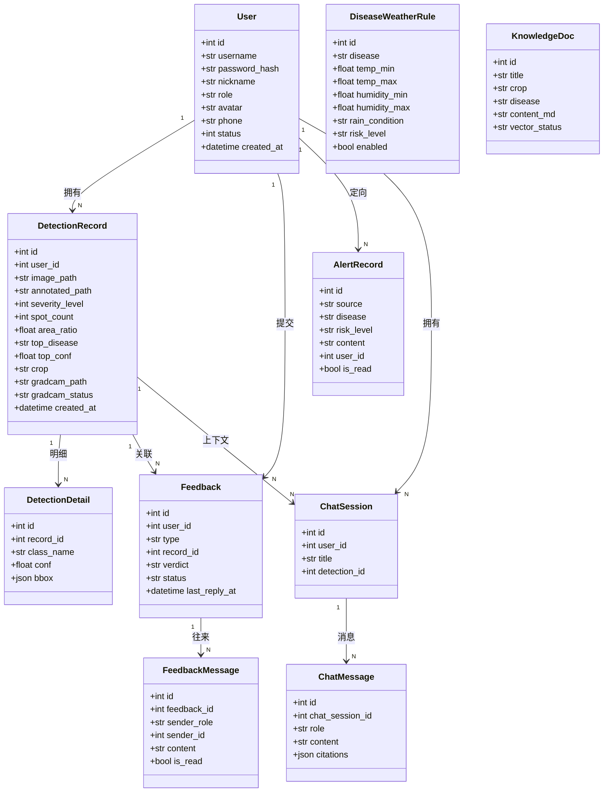
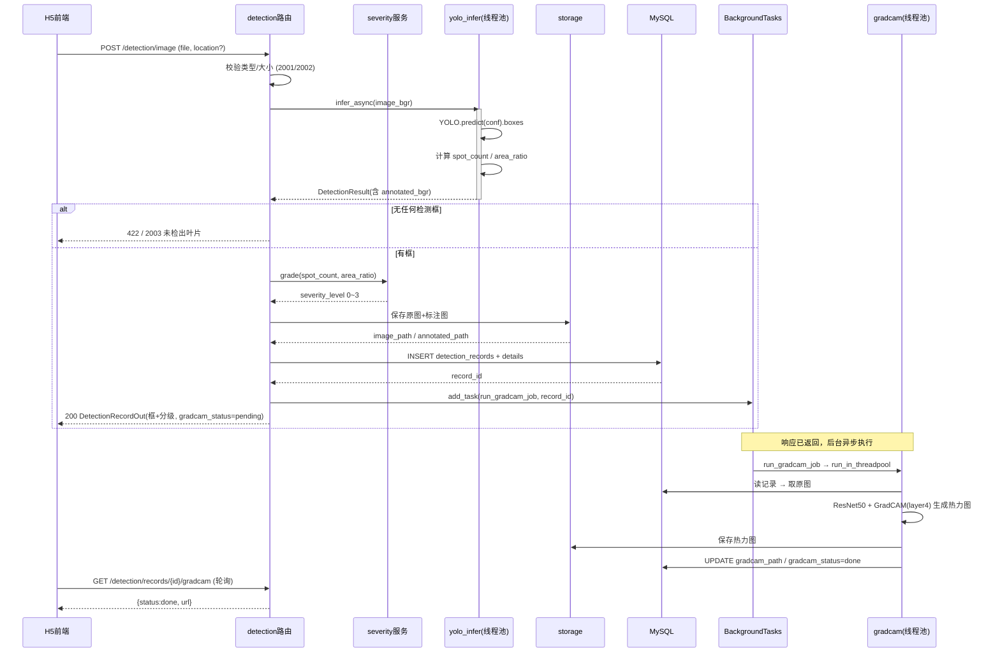
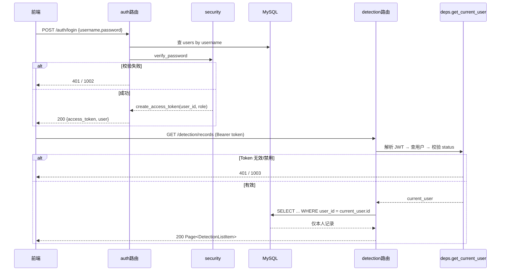

# 作物医生 CropDoctor · 后端实现级设计 v1（Phase 1）

> 状态：实现级设计（给工程师照写）
> 上游依据：`docs/architecture.md`（架构 v2.1，**已定稿，不推翻**）、`docs/ui-design.md`、`backend/requirements.txt`、`.env.example`
> 范围：**仅后端，仅 Phase 1** = 地基 + 数据模型 + 认证 + 检测主链路 + 天气服务
> 约定：本文档所有路径均为相对仓库根 `D:\Gpt\crop-doctor` 的相对路径；代码/注释一律简体中文。

---

## 1. 实现方案与选型说明

**只列落地决策，不复述 architecture.md。** 一条决策一行。

| # | 决策点 | 结论 | 一句话理由 |
|---|---|---|---|
| 1 | 应用形态 | 单 FastAPI 应用（模块化单体），入口 `backend/app/main.py`，`lifespan` 管理启动/关闭 | architecture 定稿 |
| 2 | 配置读取 | `pydantic-settings` 的 `BaseSettings`，直接映射 `.env` 的**既有大写键名**，`.env` 放**仓库根** | 键名复用，零重命名 |
| 3 | 配置单例 | 模块级 `settings = Settings()` + `get_settings()` | 避免重复解析 |
| 4 | 路径解析 | 以 `Path(__file__)` 向上回溯定位**仓库根**，权重/上传目录一律转绝对路径 | 兼容任意 CWD 启动 / Windows 中文路径 |
| 5 | ORM | SQLAlchemy 2.0 新式（`Mapped[]` + `mapped_column`，`DeclarativeBase`） | 版本已装，类型友好 |
| 6 | MySQL 驱动 | PyMySQL（`DATABASE_URL` 已含 `+pymysql`），`pool_pre_ping=True`、`pool_recycle=3600` | 长连接不假死 |
| 7 | 迁移 | Alembic：`backend/alembic.ini` + `backend/migrations/`；**10 张表一次性建全**（含 Phase 2 表） | 避免后续补表迁移 |
| 8 | 认证 | python-jose（HS256）+ passlib bcrypt；**JWT 签名密钥复用 `APP_SECRET_KEY`** | 不新增密钥环境变量 |
| 9 | bcrypt 兼容 | passlib 1.7.4 调 `bcrypt` 后端；若出现 72 字节截断告警，构造 `CryptContext(schemes=["bcrypt"], bcrypt__truncate_error=False)` | 已知 passlib/bcrypt 坑，先锁定行为 |
| 10 | Token 传递 | `Authorization: Bearer <token>`，`HTTPBearer` 安全方案（非表单 OAuth2 流） | 前端用 JSON 更顺手 |
| 11 | 统一响应 | 所有接口返回 `{code, message, data}` 信封；HTTP 状态码表达传输层语义 | 前后端约定统一 |
| 12 | 异常 | 自定义 `BusinessError(code, http_status, message)` + 全局 `exception_handler`，未知异常→9000 | 统一错误码 |
| 13 | YOLO 推理 | **同步链路**：`await run_in_threadpool(...)`，底层独立 `ThreadPoolExecutor(max_workers=2)` 限流 | CPU 推理数百 ms，不能阻塞事件循环，需限流保护 CPU |
| 14 | Grad-CAM | **异步链路**：`BackgroundTasks` 触发；任务体内再提交到同一线程池 | 响应先返回，重计算不占事件循环 |
| 15 | 异步框架选型 | **不用 Celery/RQ**（本机无 broker）；**不用裸 `asyncio.create_task`**（无生命周期/背压） | 结论：BackgroundTasks + 线程池即可 |
| 16 | 模型加载时机 | **YOLO 启动时加载一次**（放 `app.state`）；**ResNet50 首次 Grad-CAM 请求懒加载**（线程锁保护，之后常驻） | 主链路随时可用；旁支模型不拖慢启动、省启动内存 |
| 17 | 天气服务 | `httpx.AsyncClient` 直连和风，Redis 缓存 `WEATHER_CACHE_TTL`；**任何异常降级返回 `data=null`/`degraded=true`，不抛错** | 天气失败不得影响检测主链路 |
| 18 | 数据隔离 | detection 模块所有查询在 SQL 层强制 `where(user_id == current_user.id)`；越权取详情返回 2004 | architecture §6.9 |
| 19 | 时间格式 | **DB 存 UTC**（`DateTime`），JSON 序列化为 ISO-8601 带 `Z`，由 Pydantic 序列化器统一处理 | 单一事实口径 |
| 20 | 日志 | loguru，`core/logging.py` 统一配置 + 请求日志中间件；拦截 `uvicorn`/`sqlalchemy` 日志 | 一处配置 |
| 21 | 静态文件 | 上传产物挂载 `/static`（`StaticFiles`），原图/标注图/热力图分目录 | 前端直接出图 |
| 22 | 测试 | pytest + httpx（httpx 已装）；**pytest / pytest-asyncio 未安装，需先 pip install** | 见任务 T01 |

### 线程池与并发结论（重点）

- 统一在 `app/core/concurrency.py` 暴露一个 `ThreadPoolExecutor(max_workers=2)` 与包装函数 `run_in_pool(fn, *args)`（基于 `anyio.to_thread.run_sync` / Starlette `run_in_threadpool`）。
- 检测请求路径：`await run_in_threadpool(yolo.infer, img)` —— **请求会等待推理完成**（同步语义），但事件循环不阻塞。
- Grad-CAM：`background_tasks.add_task(run_gradcam_job, record_id)`；`run_gradcam_job` 内部 `await run_in_threadpool(...)` 执行重计算并回写 `gradcam_path`。
- 启动时 `torch.set_num_threads(min(4, os.cpu_count() or 2))`，避免 torch 与线程池争抢 CPU。

---

## 2. 完整文件清单

标注：`[P1]` = Phase 1 本期实现；`[P2]` = 后续阶段（本期只登记，不实现）。

### 2.1 后端 Phase 1

```
backend/
├── app/
│   ├── __init__.py                              [P1]
│   ├── main.py                                  [P1]  应用装配/CORS/路由/异常/静态/生命周期
│   ├── core/
│   │   ├── __init__.py                          [P1]
│   │   ├── config.py                            [P1]  Settings(pydantic-settings) + 路径解析
│   │   ├── database.py                          [P1]  engine / SessionLocal / Base / get_db
│   │   ├── redis_client.py                      [P1]  redis.asyncio 连接池 + get_redis
│   │   ├── security.py                          [P1]  bcrypt 哈希 + JWT 签发/校验
│   │   ├── deps.py                              [P1]  get_current_user / get_current_admin
│   │   ├── concurrency.py                       [P1]  ThreadPoolExecutor + run_in_pool
│   │   ├── exceptions.py                        [P1]  BusinessError + 全局异常处理器
│   │   ├── response.py                          [P1]  统一响应构造 + Page 封装
│   │   └── logging.py                           [P1]  loguru 配置 + 请求日志中间件
│   ├── models/
│   │   ├── __init__.py                          [P1]  汇总导入，供 Alembic autogenerate
│   │   ├── base.py                              [P1]  Base 再导出 + TimestampMixin
│   │   ├── user.py                              [P1]  users
│   │   ├── detection.py                         [P1]  detection_records / detection_details
│   │   ├── feedback.py                          [P1]  feedbacks / feedback_messages
│   │   ├── warning.py                           [P1]  disease_weather_rules / alert_records
│   │   ├── knowledge.py                         [P1]  knowledge_docs
│   │   └── chat.py                              [P1]  chat_sessions / chat_messages
│   ├── schemas/
│   │   ├── __init__.py                          [P1]
│   │   ├── common.py                            [P1]  Response / PageQuery / PageData
│   │   ├── auth.py                              [P1]  Register/Login/Token/UserOut/ProfileUpdate/PasswordChange
│   │   ├── detection.py                         [P1]  DetectionRecordOut/DetectionListItem/DetectionDetailOut/DetBox
│   │   ├── weather.py                           [P1]  NowWeatherOut/DailyForecast/SprayAdviceOut
│   │   ├── feedback.py                          [P2]
│   │   ├── warning.py                           [P2]
│   │   ├── knowledge.py                         [P2]
│   │   ├── chat.py                              [P2]
│   │   └── admin.py                             [P2]
│   ├── services/
│   │   ├── __init__.py                          [P1]
│   │   ├── yolo_infer.py                        [P1]  YoloDetector 单例 + infer_async
│   │   ├── severity.py                          [P1]  规则分级
│   │   ├── gradcam.py                           [P1]  GradCamService
│   │   ├── weather.py                           [P1]  WeatherService（缓存+降级+施药建议）
│   │   ├── weather_risk.py                      [P2]
│   │   ├── rag.py                               [P2]
│   │   ├── llm.py                               [P2]
│   │   ├── ticket.py                            [P2]
│   │   └── monitor.py                           [P2]
│   ├── api/
│   │   ├── __init__.py                          [P1]
│   │   └── v1/
│   │       ├── __init__.py                      [P1]
│   │       ├── router.py                        [P1]  汇总挂载各模块 router
│   │       ├── auth.py                          [P1]
│   │       ├── detection.py                     [P1]
│   │       ├── weather.py                       [P1]
│   │       ├── chat.py                          [P2]
│   │       ├── knowledge.py                     [P2]
│   │       ├── warning.py                       [P2]
│   │       ├── feedback.py                      [P2]
│   │       └── admin.py                         [P2]
│   └── utils/
│       ├── __init__.py                          [P1]
│       ├── image.py                             [P1]  中文路径读写 / ndarray↔bytes / bbox 面积
│       └── storage.py                           [P1]  上传目录管理 + 文件名生成 + URL 拼装
├── tests/
│   ├── __init__.py                              [P1]
│   ├── conftest.py                              [P1]  TestClient + 覆写 get_db / 依赖
│   ├── test_severity.py                         [P1]
│   ├── test_auth.py                             [P1]
│   ├── test_detection.py                        [P1]
│   └── test_weather.py                          [P1]
├── migrations/
│   ├── env.py                                   [P1]
│   ├── script.py.mako                           [P1]
│   └── versions/
│       └── 0001_initial_schema.py               [P1]
├── alembic.ini                                  [P1]
├── requirements.txt                             （已存在，追加 dev 依赖）
└── uploads/                                     [P1]  运行期生成，.gitignore
    ├── images/    原图
    ├── annotated/ 带框结果图
    └── gradcam/   Grad-CAM 热力图
```

### 2.2 前端 / 后续阶段（本期不实现，仅登记）

```
kb/diseases/     [P2]  一病一档源文档（RAG 与门户共用）
kb/faq/          [P2]  常见问答
frontend-h5/     [P2]  Vue3 + Vant4，5 Tab
frontend-pc/     [P2]  Vue3 + ElementPlus + ECharts，管理端
```

---

## 3. 数据模型细化

> 引擎 InnoDB / utf8mb4 / utf8mb4_unicode_ci。主键统一 `BIGINT UNSIGNED AUTO_INCREMENT`。所有时间列 `DATETIME`，**存 UTC**。
> 枚举用 MySQL 原生 `ENUM`（SQLAlchemy `Enum(...)`），取值集见 3.1。

### 3.1 枚举取值集合（权威定义，跨表统一）

| 枚举 | 取值 | 使用位置 |
|---|---|---|
| `role` | `user` \| `admin` | users.role |
| `user_status` | `1` 启用 \| `0` 禁用（TINYINT） | users.status |
| `severity_level` | `0` 无 \| `1` 轻微 \| `2` 中等 \| `3` 严重（TINYINT） | detection_records.severity_level |
| `gradcam_status` | `pending` \| `done` \| `failed` \| `skipped` | detection_records.gradcam_status |
| `feedback_type` | `question` \| `result_verdict` | feedbacks.type |
| `feedback_status` | `pending` \| `replied` \| `closed` | feedbacks.status |
| `verdict` | `correct` \| `wrong` \| `unsure` | feedbacks.verdict |
| `sender_role` | `user` \| `admin` | feedback_messages.sender_role |
| `rain_condition` | `any` \| `rain` \| `no_rain` | disease_weather_rules.rain_condition |
| `risk_level` | `high` \| `mid` \| `low` | disease_weather_rules / alert_records |
| `alert_source` | `weather` \| `detection` | alert_records.source |
| `vector_status` | `pending` \| `done` \| `failed` | knowledge_docs.vector_status |
| `chat_role` | `user` \| `assistant` | chat_messages.role |

### 3.2 表结构

#### users 用户表

| 字段 | 类型 | 可空 | 默认 | 索引/约束 | 说明 |
|---|---|---|---|---|---|
| id | BIGINT UNSIGNED | 否 | 自增 | PK | |
| username | VARCHAR(50) | 否 | — | UNIQUE `uq_users_username` | 登录名 |
| password_hash | VARCHAR(255) | 否 | — | | bcrypt |
| nickname | VARCHAR(50) | 是 | NULL | | 昵称（默认取 username） |
| role | ENUM('user','admin') | 否 | 'user' | IDX `ix_users_role` | 角色 |
| avatar | VARCHAR(255) | 是 | NULL | | 头像 URL |
| phone | VARCHAR(20) | 是 | NULL | | 预留（注册页验证码字段） |
| status | TINYINT | 否 | 1 | IDX `ix_users_status` | 1 启用 / 0 禁用 |
| created_at | DATETIME | 否 | CURRENT_TIMESTAMP | | UTC |
| updated_at | DATETIME | 否 | CURRENT_TIMESTAMP ON UPDATE | | UTC |

#### detection_records 检测记录（头）

| 字段 | 类型 | 可空 | 默认 | 索引/约束 | 说明 |
|---|---|---|---|---|---|
| id | BIGINT UNSIGNED | 否 | 自增 | PK | |
| user_id | BIGINT UNSIGNED | 否 | — | IDX `ix_det_user`；FK users.id | 数据隔离键 |
| image_path | VARCHAR(255) | 否 | — | | 原图相对路径 |
| annotated_path | VARCHAR(255) | 是 | NULL | | 带框图相对路径 |
| severity_level | TINYINT | 否 | 0 | IDX `ix_det_severity` | 0/1/2/3 |
| spot_count | INT | 否 | 0 | | 病斑框数 |
| area_ratio | FLOAT | 否 | 0 | | 病斑面积/图像面积 ∈ [0,1] |
| top_disease | VARCHAR(100) | 是 | NULL | IDX `ix_det_top_disease` | 最高置信度类别名 |
| top_conf | FLOAT | 是 | NULL | | 0~1 |
| crop | VARCHAR(50) | 是 | NULL | IDX `ix_det_crop` | 由 top_disease 前缀派生（PC 下钻用） |
| location | VARCHAR(50) | 是 | NULL | | 检测地定位（供天气建议） |
| gradcam_path | VARCHAR(255) | 是 | NULL | | 热力图相对路径（异步回填） |
| gradcam_status | ENUM(...) | 否 | 'pending' | IDX | 异步状态 |
| created_at | DATETIME | 否 | CURRENT_TIMESTAMP | IDX `ix_det_created` | UTC |

#### detection_details 检测明细（每框一行）

| 字段 | 类型 | 可空 | 默认 | 索引/约束 | 说明 |
|---|---|---|---|---|---|
| id | BIGINT UNSIGNED | 否 | 自增 | PK | |
| record_id | BIGINT UNSIGNED | 否 | — | IDX；FK detection_records.id ON DELETE CASCADE | |
| class_name | VARCHAR(100) | 否 | — | | YOLO 类别名 |
| conf | FLOAT | 否 | — | | 置信度 |
| bbox | JSON | 否 | — | | `[x1,y1,x2,y2]` 绝对像素 |
| created_at | DATETIME | 否 | CURRENT_TIMESTAMP | | |

#### feedbacks 反馈工单（头）

| 字段 | 类型 | 可空 | 默认 | 索引/约束 | 说明 |
|---|---|---|---|---|---|
| id | BIGINT UNSIGNED | 否 | 自增 | PK | |
| user_id | BIGINT UNSIGNED | 否 | — | IDX；FK users.id | 提交人 |
| type | ENUM('question','result_verdict') | 否 | — | IDX | 工单类型 |
| record_id | BIGINT UNSIGNED | 是 | NULL | IDX；FK detection_records.id ON DELETE SET NULL | 结果对错类工单关联记录 |
| verdict | ENUM('correct','wrong','unsure') | 是 | NULL | | 仅 result_verdict 用 |
| correct_disease | VARCHAR(100) | 是 | NULL | | 用户判定的正确病害名 |
| title | VARCHAR(200) | 否 | — | | 摘要标题 |
| status | ENUM('pending','replied','closed') | 否 | 'pending' | IDX | 状态机 |
| last_reply_at | DATETIME | 是 | NULL | | 最近回复时间 |
| created_at | DATETIME | 否 | CURRENT_TIMESTAMP | IDX | |
| updated_at | DATETIME | 否 | ON UPDATE | | |

#### feedback_messages 工单消息（多轮往来）

| 字段 | 类型 | 可空 | 默认 | 索引/约束 | 说明 |
|---|---|---|---|---|---|
| id | BIGINT UNSIGNED | 否 | 自增 | PK | |
| feedback_id | BIGINT UNSIGNED | 否 | — | IDX；FK feedbacks.id ON DELETE CASCADE | |
| sender_role | ENUM('user','admin') | 否 | — | | |
| sender_id | BIGINT UNSIGNED | 否 | — | FK users.id | |
| content | TEXT | 否 | — | | 消息正文 |
| is_read | TINYINT(1) | 否 | 0 | IDX | 收方已读标记 |
| created_at | DATETIME | 否 | CURRENT_TIMESTAMP | IDX | |

#### disease_weather_rules 病害-气象规则

| 字段 | 类型 | 可空 | 默认 | 索引/约束 | 说明 |
|---|---|---|---|---|---|
| id | BIGINT UNSIGNED | 否 | 自增 | PK | |
| disease | VARCHAR(100) | 否 | — | IDX | 病害名 |
| crop | VARCHAR(50) | 是 | NULL | | 作物（辅助筛选） |
| temp_min | FLOAT | 是 | NULL | | ℃ |
| temp_max | FLOAT | 是 | NULL | | ℃ |
| humidity_min | FLOAT | 是 | NULL | | % |
| humidity_max | FLOAT | 是 | NULL | | % |
| rain_condition | ENUM('any','rain','no_rain') | 否 | 'any' | | 降雨条件 |
| risk_level | ENUM('high','mid','low') | 否 | — | | 命中区间的风险等级 |
| advice | VARCHAR(500) | 是 | NULL | | 防治建议 |
| enabled | TINYINT(1) | 否 | 1 | IDX | 启用开关 |
| created_at | DATETIME | 否 | CURRENT_TIMESTAMP | | |
| updated_at | DATETIME | 否 | ON UPDATE | | |

#### alert_records 预警记录

| 字段 | 类型 | 可空 | 默认 | 索引/约束 | 说明 |
|---|---|---|---|---|---|
| id | BIGINT UNSIGNED | 否 | 自增 | PK | |
| source | ENUM('weather','detection') | 否 | 'weather' | IDX | 主链路为 weather |
| disease | VARCHAR(100) | 否 | — | IDX | |
| risk_level | ENUM('high','mid','low') | 否 | — | IDX | |
| content | VARCHAR(500) | 否 | — | | 预警文案 |
| user_id | BIGINT UNSIGNED | 是 | NULL | IDX；FK users.id | NULL=全局广播；非空=定向 |
| location | VARCHAR(50) | 是 | NULL | | 预警位置 |
| forecast_date | DATE | 是 | NULL | | 预警针对的预报日 |
| is_read | TINYINT(1) | 否 | 0 | IDX | H5 未读 |
| created_at | DATETIME | 否 | CURRENT_TIMESTAMP | IDX | |

#### knowledge_docs 知识文档

| 字段 | 类型 | 可空 | 默认 | 索引/约束 | 说明 |
|---|---|---|---|---|---|
| id | BIGINT UNSIGNED | 否 | 自增 | PK | |
| title | VARCHAR(200) | 否 | — | | |
| crop | VARCHAR(50) | 是 | NULL | IDX | |
| disease | VARCHAR(100) | 是 | NULL | IDX | |
| source_path | VARCHAR(255) | 是 | NULL | | kb 源文件路径 |
| content_md | MEDIUMTEXT | 否 | — | | Markdown 正文 |
| vector_status | ENUM('pending','done','failed') | 否 | 'pending' | IDX | 向量化状态 |
| created_at | DATETIME | 否 | CURRENT_TIMESTAMP | | |
| updated_at | DATETIME | 否 | ON UPDATE | | |

#### chat_sessions 会话

| 字段 | 类型 | 可空 | 默认 | 索引/约束 | 说明 |
|---|---|---|---|---|---|
| id | BIGINT UNSIGNED | 否 | 自增 | PK | |
| user_id | BIGINT UNSIGNED | 否 | — | IDX；FK users.id | |
| title | VARCHAR(100) | 是 | NULL | | 首条问题截断 |
| detection_id | BIGINT UNSIGNED | 是 | NULL | IDX；FK detection_records.id ON DELETE SET NULL | 携带的检测上下文 |
| created_at | DATETIME | 否 | CURRENT_TIMESTAMP | IDX | |
| updated_at | DATETIME | 否 | ON UPDATE | | |

#### chat_messages 消息

| 字段 | 类型 | 可空 | 默认 | 索引/约束 | 说明 |
|---|---|---|---|---|---|
| id | BIGINT UNSIGNED | 否 | 自增 | PK | |
| chat_session_id | BIGINT UNSIGNED | 否 | — | IDX；FK chat_sessions.id ON DELETE CASCADE | |
| role | ENUM('user','assistant') | 否 | — | | |
| content | MEDIUMTEXT | 否 | — | | |
| citations | JSON | 是 | NULL | | `[{doc_id,title,snippet}]` |
| created_at | DATETIME | 否 | CURRENT_TIMESTAMP | IDX | |

### 3.3 表间关系

- users **1 — N** detection_records（`detection_records.user_id`）
- detection_records **1 — N** detection_details（`ON DELETE CASCADE`）
- users **1 — N** feedbacks；feedbacks **1 — N** feedback_messages（`ON DELETE CASCADE`）
- detection_records **0/1 — N** feedbacks（可空外键，`ON DELETE SET NULL`）
- users **1 — N** alert_records（可空，NULL=全局）
- users **1 — N** chat_sessions；chat_sessions **1 — N** chat_messages（`ON DELETE CASCADE`）
- detection_records **0/1 — N** chat_sessions（可空，`ON DELETE SET NULL`）

---

## 4. 服务层接口签名

> 统一约定：所有「抛异常」均为 `app.core.exceptions.BusinessError` 或其子类；不吞编程错误。

### 4.1 `services/yolo_infer.py`

```python
@dataclass
class DetBox:
    cls_id: int          # 类别 id
    label: str           # 类别名（model.names）
    conf: float          # 0~1
    bbox: list[int]      # [x1,y1,x2,y2] 绝对像素

@dataclass
class DetectionResult:
    boxes: list[DetBox]
    top_label: str | None
    top_conf: float | None
    spot_count: int
    area_ratio: float            # 病斑面积和 / 图像面积，≤1
    annotated_bgr: np.ndarray    # res.plot() 结果图

class YoloDetector:
    def __init__(self) -> None: ...
    def load(self) -> None:
        """加载 YOLO(weights_path)；启动时调用一次。失败抛 ModelLoadError。"""
    @property
    def names(self) -> dict[int, str]: ...
    def infer(self, image_bgr: np.ndarray, conf: float | None = None) -> DetectionResult:
        """同步推理（CPU）。不在此处 await；由调用方 run_in_threadpool 包裹。"""

# 模块级单例 + 便捷入口
detector = YoloDetector()

async def infer_async(image_bgr: np.ndarray, conf: float | None = None) -> DetectionResult:
    """事件循环友好入口：内部 run_in_threadpool(detector.infer, ...)。"""

def is_loaded() -> bool: ...            # 健康检查用
```

抛错：`ModelLoadError`；推理期异常包为 `InferenceError`。
调用方式严格对齐 `scripts/test_yolo.py`：`YOLO(ckpt).predict(img, conf=..., verbose=False)[0]`，`res.boxes` 取 `.cls`/`.conf`，`res.plot()` 出标注图。

### 4.2 `services/severity.py`

```python
SEVERITY_LABELS = {0: "无", 1: "轻微", 2: "中等", 3: "严重"}

def grade(spot_count: int, area_ratio: float) -> int:
    """规则分级 → 0/1/2/3。阈值读 settings，纯函数无副作用。"""

def label_of(level: int) -> str: ...
```

分级伪代码（阈值取自 `.env`）：

```text
if spot_count <= 0: return 0
score = 0
if area_ratio >= SEVERITY_AREA_RATIO_SEVERE (0.15):      score = max(score, 3)
elif area_ratio >= SEVERITY_AREA_RATIO_MODERATE (0.05):  score = max(score, 2)
if spot_count >= SEVERITY_SPOT_COUNT_MODERATE (5):       score = max(score, 2)
elif spot_count >= SEVERITY_SPOT_COUNT_MINOR (2):        score = max(score, 1)
if score == 0: score = 1          # 检出即至少"轻微"
return score
```

### 4.3 `services/gradcam.py`

```python
@dataclass
class GradCamResult:
    overlay_bgr: np.ndarray
    label: str
    conf: float
    layer: str = "layer4"

class GradCamService:
    def __init__(self) -> None: ...
    def ensure_loaded(self) -> None:
        """懒加载 ResNet50 + GradCAM(target_layers=[model.layer4])；线程锁保护只加载一次。
           GRADCAM_ENABLED=false → 抛 GradCamDisabledError。"""
    def generate(self, image_bgr: np.ndarray) -> GradCamResult:
        """同步重计算（CPU 约 1~3s）。由调用方放线程池。"""
    def reset(self) -> None:
        """权重热切换时释放，下次 ensure_loaded 重载。"""

gradcam = GradCamService()

async def generate_to_file(image_bgr: np.ndarray, out_abs_path: str) -> GradCamResult:
    """线程池内生成 + 落盘（中文路径安全）。供 BackgroundTasks 调用。"""

async def run_gradcam_job(record_id: int) -> None:
    """后台任务：读记录 → 重新读原图 → generate → 写 gradcam_path/status；失败置 failed。"""
```

抛错：`GradCamDisabledError`、`GradCamError`。
预处理与 `scripts/test_model.py` 一致：`Resize((224,224))` → `ToTensor` → ImageNet 均值方差归一化；`torch.load(..., weights_only=False)` 取 `classes` + `state_dict`，`model.fc = nn.Linear(in_features, len(classes))` 后 `load_state_dict`。

### 4.4 `services/weather.py`

```python
@dataclass
class NowWeather:
    location: str; text: str; temp: float; humidity: float; wind_dir: str; wind_scale: str; updated_at: str

@dataclass
class DailyForecast:
    date: str; temp_max: float; temp_min: float; text_day: str; text_night: str
    humidity: float | None; precip: float | None

@dataclass
class SprayAdvice:
    advice: str                 # 施药时机建议文案
    next_rain_date: str | None  # 未来首个降雨日
    degraded: bool = False

class WeatherService:
    async def get_now(self, location: str | None = None) -> NowWeather | None: ...
    async def get_forecast(self, location: str | None = None, days: int = 3) -> list[DailyForecast]: ...
    async def get_spray_advice(self, location: str | None = None) -> SprayAdvice: ...

weather_service = WeatherService()
```

- 缓存键：`weather:now:{location}` / `weather:forecast:{location}`；TTL = `WEATHER_CACHE_TTL`。
- location 缺省用 `WEATHER_LOCATION`。
- 和风接口：`GET {WEATHER_BASE_URL}/v7/weather/now` 与 `/v7/weather/3d`，参数 `location`、`key=WEATHER_API_KEY`。
- **降级策略**：httpx 超时/非 200/解析失败 → 记 `warning` 日志 → 返回 `None` / `[]` / `SprayAdvice(degraded=True, advice="暂无天气数据")`，**绝不向调用方抛异常**。
- 未配置 `WEATHER_API_KEY` 直接走降级路径（不发起请求）。

---

## 5. API 契约

统一前缀 `/api/v1`。**响应信封** `{"code":int, "message":str, "data":any|null}`；`Authorization: Bearer <jwt>`；分页请求 `page`(默认1)/`page_size`(默认10，上限100)，分页响应 `data = {items,total,page,page_size,pages}`。

### 5.1 本期实现

#### auth

| Method | Path | 鉴权 | 请求 | 响应 data | 状态码 |
|---|---|---|---|---|---|
| POST | `/auth/register` | 无 | `{username, password, nickname?, phone?}` | `{id, username, role}` | 200 / 400(1001) |
| POST | `/auth/login` | 无 | `{username, password}` | `{access_token, token_type:"bearer", expires_in, user:UserOut}` | 200 / 401(1002) |
| GET | `/auth/profile` | 用户 | — | `UserOut` | 200 / 401(1003) |
| PUT | `/auth/profile` | 用户 | `{nickname?, avatar?}` | `UserOut` | 200 |
| PUT | `/auth/password` | 用户 | `{old_password, new_password}` | `null` | 200 / 400(1005) |

`UserOut` = `{id, username, nickname, role, avatar, phone, status, created_at}`。

#### detection（全部需登录，**强制 user_id 过滤**）

| Method | Path | 请求 | 响应 data | 状态码 |
|---|---|---|---|---|
| POST | `/detection/image` | multipart：`file`(必), `location`(选), `conf`(选,0~1) | `DetectionRecordOut` | 200 / 400(2001) / 413(2002) / 422(2003) |
| GET | `/detection/records` | query：`page,page_size,disease?,severity_level?,crop?,start?,end?` | `Page<DetectionListItem>` | 200 |
| GET | `/detection/records/{id}` | path id | `DetectionDetailOut` | 200 / 404(2004) |
| GET | `/detection/records/{id}/gradcam` | path id | `{status, url?}` | 200 / 404(2004) |
| DELETE | `/detection/records/{id}` | path id | `null` | 200 / 404(2004) |

- `DetectionRecordOut` = `{id, severity_level, severity_label, top_disease, top_conf, spot_count, area_ratio, image_url, annotated_url, gradcam_status, details:[{class_name,conf,bbox}], created_at}`。
- `DetectionListItem` = `{id, thumb_url, top_disease, severity_level, severity_label, created_at}`。
- `DetectionDetailOut` = `DetectionRecordOut` + `gradcam_url` + `crop` + `location`。
- 上传限制：仅 `image/jpeg|png|webp`，`≤10MB`；未检出任何框 → 422/2003（前端提示重拍）。
- 处理链：读图 → `infer_async` → `severity.grade` → 落盘（原图/标注图）→ 写 `detection_records` + `detection_details` → `BackgroundTasks` 触发 Grad-CAM → 返回。
- `thumb_url` 直接用原图 URL（Phase 1 不额外生成缩略图，避免多余 PIL 开销）。

#### weather

| Method | Path | 请求 | 响应 data | 状态码 |
|---|---|---|---|---|
| GET | `/weather/now` | query `location?` | `{...NowWeather, degraded:bool}` | 200 |
| GET | `/weather/forecast` | query `location?, days?(默认3)` | `{list:[DailyForecast], degraded:bool}` | 200 |
| GET | `/weather/spray-advice` | query `location?` | `SprayAdvice` | 200 |

> 天气接口降级时同样返回 200：`code=0`，`data=null` 或 `degraded=true`（由前端展示"暂无数据"）。

### 5.2 后续阶段端点组（状态更新 · 2026-09：五模块已实现）

| 模块 | 状态 | 端点组（均 `/api/v1` 前缀） |
|---|---|---|
| chat | ✅ 已实现 | `POST /chat/sessions` · `GET /chat/sessions` · `GET /chat/sessions/{id}/messages` · `POST /chat/sessions/{id}/messages`(SSE) · `POST /chat/ask`(SSE 一次性) · `DELETE /chat/sessions/{id}` |
| knowledge | ✅ 已实现 | `GET /knowledge/docs` · `GET /knowledge/docs/{id}` · `GET /knowledge/crops` · `GET /knowledge/search?q=` |
| warning | ✅ 已实现 | H5：`GET /warning/alerts` · `GET /warning/alerts/unread-count` · `POST /warning/alerts/{id}/read`；PC：`GET/POST/PUT/DELETE /warning/rules` · `GET /warning/overview` |
| feedback | ✅ 已实现 | H5：`POST /feedback` · `GET /feedback/mine` · `GET /feedback/{id}` · `POST /feedback/{id}/messages` · `GET /feedback/unread-count`；PC：`GET /admin/feedback` · `POST /admin/feedback/{id}/reply` · `POST /admin/feedback/{id}/close` |
| admin | ✅ 已实现 | `WS /admin/ws/monitor` · `GET /admin/stats/overview` · `GET /admin/stats/trend` · `GET /admin/detections` · `GET /admin/users` · `GET /admin/users/{id}` · `PUT /admin/users/{id}/status` · `POST /admin/users/{id}/reset-password` · `GET/POST/PUT/DELETE /admin/knowledge` · `GET/POST /admin/model` |
| detection(WS) | ⬜ 未实现 | `WS /detection/ws/realtime`（H5 前端抓帧 2-5fps → WebSocket → 前端画框） |

> **状态说明**：上表为本设计文档编写时的端点全貌规划；五个模块落地时在规划基础上做了细化与少量增补（如 monitor 独立为 `api/v1/monitor.py`（`/admin/ws/monitor` + `GET /admin/monitor/events`）、warning 增 `POST /warning/refresh` 与 admin 全量记录 `GET /warning/records`、feedback 增 `POST /feedback/{id}/read` 与 `GET /admin/feedback/unread-count`、knowledge 增 `POST /admin/knowledge/reindex`(+`/status`) 等）。**最终契约以实现代码与 `docs/impl-pc-admin-v1.md` §2 的 API 契约表为准**。

### 5.3 业务错误码

| code | HTTP | 含义 |
|---|---|---|
| 0 | 200 | 成功 |
| 1001 | 400 | 用户名已存在 |
| 1002 | 401 | 用户名或密码错误 |
| 1003 | 401 | 未登录 / Token 无效或过期 |
| 1004 | 403 | 权限不足（需管理员） |
| 1005 | 400 | 原密码错误 |
| 2001 | 400 | 图片格式不支持 |
| 2002 | 413 | 图片过大（>10MB） |
| 2003 | 422 | 未检出叶片 / 病害目标 |
| 2004 | 404 | 检测记录不存在或无权访问 |
| 3001 | 200 | 天气服务暂不可用（降级） |
| 4001 | 404 | 会话不存在或无权访问（防探测；对齐 2004 策略，不区分"不存在"与"无权"） |
| 4002 | 200 | 大模型服务不可用（已降级为知识库原文，HTTP 200） |
| 4003 | 400 | 问题为空或超长（>500 字；由 handler 层校验，**非** Pydantic 约束） |
| 5001 | 404 | 预警记录不存在或无权访问（防探测，HTTP 404） |
| 5002 | 404 | 预警规则不存在（HTTP 404） |
| 6001 | 404 | 工单不存在或无权访问（防探测，HTTP 404） |
| 6002 | 409 | 工单已关闭，不可继续回复（HTTP 409） |
| 6003 | 409 | 工单状态非法流转（HTTP 409） |
| 7001 | 404 | 知识文档不存在（HTTP 404） |
| 7002 | 409 | 知识文档已存在（slug 冲突，HTTP 409） |
| 8001 | 404 | 用户不存在（HTTP 404） |
| 8002 | 409 | 不允许的操作（禁用自己 / 禁用最后一个管理员，HTTP 409） |
| 8003 | 400 | 模型文件不存在或不可用（HTTP 400） |
| 9000 | 500 | 服务器内部错误 |

> 4001/4002/4003 为 **chat 模块**（RAG 问诊）新增，详见 `docs/impl-rag-chat-v1.md` §3.4。SSE 端点的 4003 在**建立流之前**返回普通 JSON 信封（非流内 error 帧）。
> 5001~5002（warning）/ 6001~6003（feedback 工单）/ 7001~7002（knowledge）/ 8001~8003（admin）为**本轮五模块**（PC 管理端配套后端）新增，常量与异常子类定义见 `backend/app/core/exceptions.py`（语义以其中注释为准），设计依据 `docs/impl-pc-admin-v1.md` §1.5。

---

## 6. 共享知识（跨文件约定）

1. **统一响应**：所有 HTTP 接口的成功/业务失败响应体均为 `{code, message, data}`，`code=0` 为成功。构造统一走 `core/response.py` 的 `ok(data)` / `fail(code, message)`；文件类接口（SSE / WS）除外。
2. **错误码**：见 §5.3；新增错误码必须回填该表。
3. **分页**：入参 `page`(≥1) / `page_size`(1~100)；返回 `{items,total,page,page_size,pages}`，`pages=ceil(total/page_size)`。
4. **时间**：DB 一律存 **UTC** 的 `DATETIME`；出参经 Pydantic 序列化为 **ISO-8601 带 `Z`**（如 `2025-06-01T03:00:00Z`）。`utils/time`（可并入 `utils/__init__.py`）提供 `utcnow()`、`to_iso()`。
5. **日志（loguru）**：`core/logging.py` 中 `logger.add(...)` 输出 stdout + `backend/logs/app.log`（按天轮转、保留 7 天）。请求中间件记录 `method path status cost_ms`。天气降级用 `warning`。
6. **配置命名**：`Settings` 字段小写，环境变量大写（pydantic-settings 自动映射）。**沿用 `.env.example` 全部既有键**；本期**追加**以下新键（不与既有键冲突，需同步补进 `.env.example`）：
   - `JWT_ALGORITHM`（默认 `HS256`）
   - `ACCESS_TOKEN_EXPIRE_MINUTES`（默认 `10080` = 7 天）
   - `UPLOAD_DIR`（默认 `backend/uploads`）
   - `MAX_UPLOAD_MB`（默认 `10`）
   > 既有键一律原样使用：`APP_ENV` `APP_SECRET_KEY` `MYSQL_ROOT_PASSWORD` `DATABASE_URL` `REDIS_URL` `DEEPSEEK_API_KEY` `DEEPSEEK_BASE_URL` `LLM_MODEL` `EMBEDDING_MODEL` `YOLO_WEIGHTS_PATH` `YOLO_CONF_THRESHOLD` `RESNET_WEIGHTS_PATH` `GRADCAM_ENABLED` `SEVERITY_SPOT_COUNT_MINOR` `SEVERITY_SPOT_COUNT_MODERATE` `SEVERITY_AREA_RATIO_MODERATE` `SEVERITY_AREA_RATIO_SEVERE` `WEATHER_API_KEY` `WEATHER_BASE_URL` `WEATHER_LOCATION` `WEATHER_CACHE_TTL`。
7. **依赖注入**：全部走 FastAPI `Depends`。
   - `get_db` —— `yield` 一个 `Session`，`finally` 关闭。
   - `get_current_user` —— 解析 Bearer → 校验 JWT → 查 `users` → 校验 `status==1`，返回 `User`；失败抛 `1003`。
   - `get_current_admin` —— 依赖 `get_current_user` 再校验 `role=='admin'`，否则抛 `1004`。
   - `get_redis` —— 返回共享的 `redis.asyncio.Redis` 客户端。
8. **异步任务结论**：**用 FastAPI `BackgroundTasks` 触发 + 线程池执行重计算**；不用 Celery/RQ（无 broker、无额外依赖），不用裸 `asyncio.create_task`（无生命周期与背压）。YOLO 推理虽同步返回，但必须经线程池，否则阻塞事件循环。
9. **模型加载时机**：**YOLO 启动时加载一次**（放 `app.state.yolo`，通过 lifespan 完成，主链路必须就绪）；**ResNet50 懒加载**（首次 Grad-CAM 请求 `ensure_loaded()`，线程锁保护，常驻内存）。理由：CPU 环境冷启动加载两个模型耗时且 ResNet50 仅旁支使用，懒加载降低启动延迟与内存占用峰值。
10. **路径与静态资源**：`UPLOAD_DIR` 下分 `images/annotated/gradcam`；DB 存**相对路径**，出参拼 `/static/...` 绝对 URL。`main.py` 挂载 `app.mount("/static", StaticFiles(directory=UPLOAD_DIR))`。仓库根通过 `Path(__file__).resolve().parents[3]` 定位（`backend/app/core/config.py` → 上溯 3 层到仓库根）。
11. **上传校验**：扩展名 + `content_type` 白名单，大小 ≤ `MAX_UPLOAD_MB`；文件名用 `uuid4().hex + 原扩展名`，防中文/冲突。
12. **数据隔离红线**：detection 模块任何列表/详情/删除，SQL 必须带 `user_id == current_user.id`；越权访问统一返回 2004（不区分"不存在"与"无权"，防探测）。

---

## 7. 任务列表（给工程师寇豆码的执行清单）

> 共 **5 个任务**。依赖关系：`T01 → T02 → {T03, T04, T05}`（T03/T04/T05 之间无依赖，可并行）。

### T01 · 项目基础设施与骨架

- **改动文件**：`backend/app/__init__.py`、`backend/app/core/{__init__,config,database,redis_client,security,deps,concurrency,exceptions,response,logging}.py`、`backend/app/utils/{__init__,image,storage}.py`、`backend/app/main.py`、`backend/app/api/__init__.py`、`backend/app/api/v1/{__init__,router}.py`、`backend/alembic.ini`、`backend/migrations/{env.py,script.py.mako}`、`backend/tests/{__init__,conftest}.py`、`backend/requirements.txt`（追加 `pytest`、`pytest-asyncio`）、根目录 `.env`（由 `.env.example` 复制）、`.env.example`（补 4 个新键）、`.gitignore`（忽略 `.env`、`backend/uploads`、`backend/logs`、`__pycache__`）。
- **做什么**：配置读取、DB 会话、Redis 客户端、JWT/passlib、公共依赖、线程池、异常与响应封装、loguru、FastAPI 装配（CORS + `/api/v1` 挂载 + `/static` + lifespan + `/health` 探活）。
- **验收标准**：
  1. `cd backend && ../.venv/Scripts/python.exe -m uvicorn app.main:app --reload` 启动无报错；`GET /health` 返回 `{code:0,...}`。
  2. 启动日志可见 YOLO 权重加载（若 T04 未完成则暂以占位日志说明，见下）。
  3. `python -c "from app.core.config import settings; print(settings.database_url)"` 正确读到 `.env`。
  4. Redis `ping()` 成功。
- **依赖**：无 · **优先级** P0
- **注**：`main.py` 的 lifespan 中 `detector.load()` 在 T04 落地前可先留 TODO；T04 完成后回填调用。

### T02 · 数据模型与 Alembic 初始迁移

- **改动文件**：`backend/app/models/{__init__,base,user,detection,feedback,warning,knowledge,chat}.py`、`backend/app/schemas/{__init__,common}.py`、`backend/migrations/versions/0001_initial_schema.py`。
- **做什么**：按 §3 定义 10 张表 ORM（含枚举、索引、外键、级联）；`schemas/common.py` 定义 `Response`、`PageQuery`、`PageData`；生成并执行初始迁移。
- **验收标准**：
  1. `alembic upgrade head` 成功；`SHOW TABLES` 恰好 10 张业务表。
  2. `alembic downgrade base && alembic upgrade head` 可往返。
  3. 字段类型/可空/默认/索引与 §3 一致（`SHOW CREATE TABLE` 抽查 users / detection_records / alert_records）。
  4. `PageQuery` 校验 `page≥1`、`1≤page_size≤100`。
- **依赖**：T01 · **优先级** P0

### T03 · 认证模块

- **改动文件**：`backend/app/schemas/auth.py`、`backend/app/api/v1/auth.py`、`backend/tests/test_auth.py`（+ 在 `api/v1/router.py` 挂载 auth）。
- **做什么**：注册（用户名唯一、bcrypt 哈希、默认 role=user）、登录（签发 JWT）、`GET/PUT /auth/profile`、`PUT /auth/password`；首管理员由注册脚本或手工 SQL 预置（见待明确事项）。
- **验收标准**：
  1. 注册→登录→带 token 访问 `/auth/profile` 全链路 200。
  2. 重复用户名 → 400/1001；错误密码 → 401/1002；无 token → 401/1003；改密后旧密码失效。
  3. `pytest tests/test_auth.py` 全绿。
- **依赖**：T02 · **优先级** P0

### T04 · 检测主链路（YOLO + 分级 + Grad-CAM 异步 + 记录）

- **改动文件**：`backend/app/services/{yolo_infer,severity,gradcam}.py`、`backend/app/schemas/detection.py`、`backend/app/api/v1/detection.py`、`backend/tests/{test_severity,test_detection}.py`（+ lifespan 回填 `detector.load()`；`api/v1/router.py` 挂载 detection）。
- **做什么**：实现推理/分级/热力图服务；`POST /detection/image` 同步返回框+分级，写头表+明细；后台任务异步生成 Grad-CAM 并回填；`GET /detection/records`（**强制 user_id 过滤**）、`GET /detection/records/{id}`、`/{id}/gradcam`、`DELETE`。
- **验收标准**：
  1. 上传真实叶片图 → 返回 `top_disease`/`severity_level`/`image_url`/`annotated_url`；DB 落 `detection_records` + 对应 `detection_details`。
  2. 稍后 `gradcam_status` 由 `pending` 变 `done`，`gradcam_path` 有值且文件存在。
  3. 用户 A 查询记录**看不到**用户 B 的数据；越权取 B 的详情 → 404/2004。
  4. 图片过大 → 413/2002；非图片 → 400/2001；全背景图（无框）→ 422/2003。
  5. `pytest tests/test_severity.py tests/test_detection.py` 全绿。
- **依赖**：T02 · **优先级** P0
- **注**：CPU 环境实测推理数百 ms，确认未阻塞事件循环（并发两个检测请求，`/health` 仍秒回）。

### T05 · 天气服务与整体联调

- **改动文件**：`backend/app/services/weather.py`、`backend/app/schemas/weather.py`、`backend/app/api/v1/weather.py`、`backend/tests/test_weather.py`（+ `api/v1/router.py` 挂载 weather）。
- **做什么**：和风 now/3d 代理 + Redis 缓存（TTL 1h）+ 失败降级 + 施药建议；三个 GET 端点。
- **验收标准**：
  1. 配置有效 `WEATHER_API_KEY` 时 `/weather/now` 返回实时数据，二次调用命中 Redis（日志可见 cache hit）。
  2. 断网或密钥置空时接口仍 200、`degraded=true`、`data=null`，**服务不 500**。
  3. `/weather/spray-advice` 结合预报给出未来降雨窗口文案。
  4. `pytest tests/test_weather.py` 全绿（用 `httpx.MockTransport` 或 monkeypatch 桩掉外部调用）。
- **依赖**：T02 · **优先级** P1

---

## 8. 待明确事项

1. **首管理员账号来源**：现有设计不提供管理员自助注册（PC 端无注册入口）。需确认预置方式 —— 推荐**新增一次性脚本 `scripts/seed_admin.py`**（读 `.env` 或参数创建 `role=admin` 用户），或由用户在 T03 后手工执行 SQL 插入。请拍板其一。
2. **`.env` 新键是否接受**：本期需追加 `JWT_ALGORITHM` / `ACCESS_TOKEN_EXPIRE_MINUTES` / `UPLOAD_DIR` / `MAX_UPLOAD_MB` 四个键（与既有键不冲突）。如要求"零新增键"，则这四个改为 `core/config.py` 内的代码常量（不落 `.env`）——请确认采用哪种。
3. **Token 有效期**：默认 7 天（`10080` 分钟）。若答辩希望演示"过期"效果，可改为更短；请确认取值。
4. **jose 算法**：`python-jose` 3.5.0 在 Python 3.14 的兼容性需在 T03 首次运行时实测；若报错，回退方案是用 `cryptography` 手写 HS256 或改用 `PyJWT`（需加依赖）。此为**风险项**，非阻塞待办。

> 除上述 4 点外：无。

---

## 附录 A · 类图（classDiagram）



## 附录 B · 图片检测调用时序（sequenceDiagram）



## 附录 C · 认证与数据隔离时序（sequenceDiagram）


