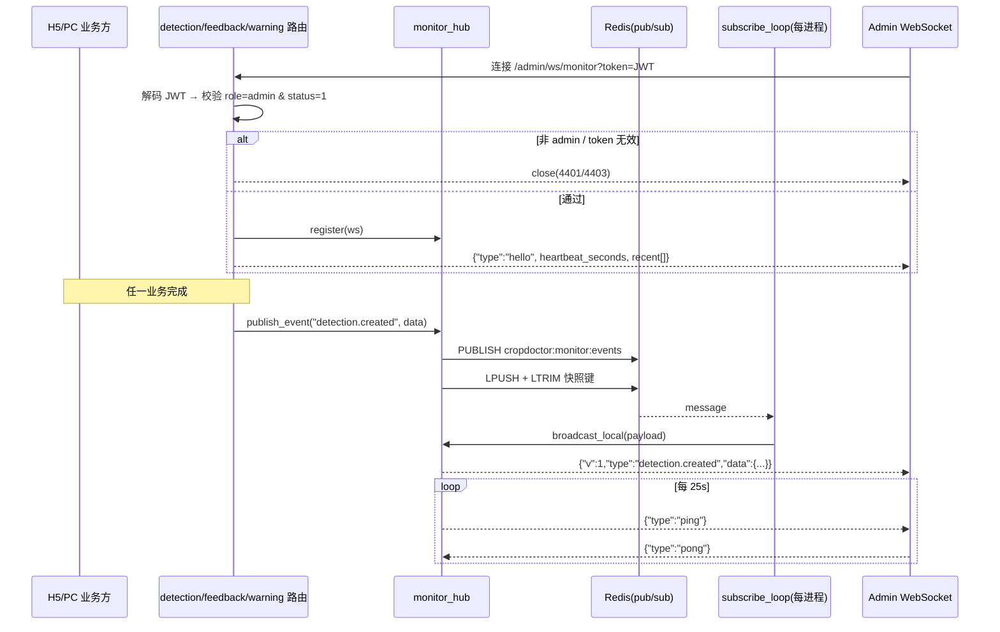
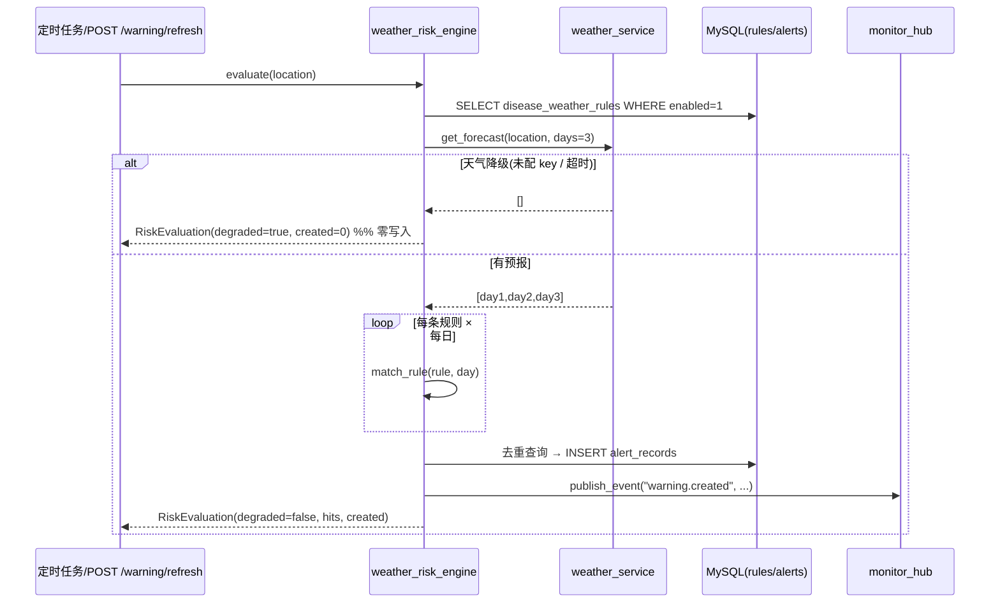
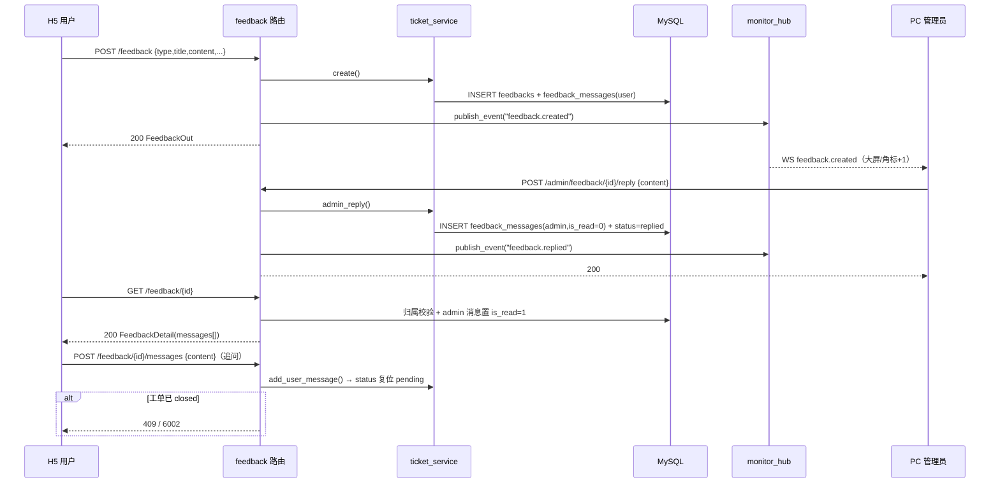
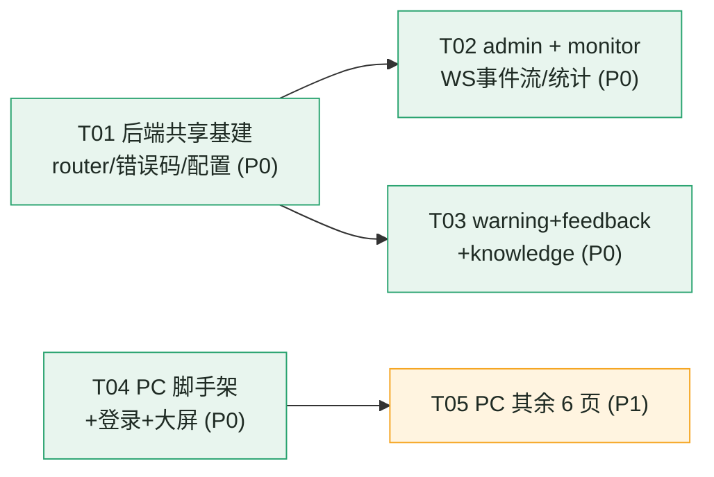
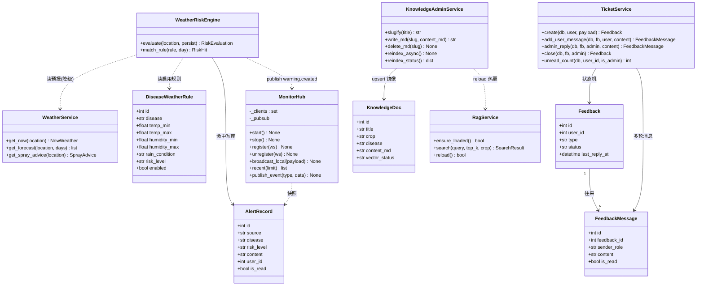

# 作物医生 CropDoctor · 后端剩余五模块 + PC 管理端 实现级设计 v1（增量）

> 状态：实现级设计（给工程师照写）
> 上游定稿：`docs/architecture.md`（架构 v2.1）、`docs/ui-design.md`（UI 规范 v1）、`docs/impl-backend-v1.md`（后端 Phase 1，已落地）、`docs/impl-rag-chat-v1.md`（RAG+chat+H5 增量，已落地）
> 性质：**增量设计**。不推翻上述任何决策；只新增 `admin / monitor / warning / feedback / knowledge` 五模块与 `frontend-pc/` 全部前端。
> 约定：路径均为相对仓库根 `D:\Gpt\crop-doctor`；代码/注释一律**简体中文**；**不产出独立 `.mermaid` 文件，图内嵌**。
> 已核实环境：Python 3.14.6（`D:\Gpt\crop-doctor\.venv\Scripts\python.exe`）；MySQL `127.0.0.1:3306`(root/devpass) 库 `crop_doctor` **10 张表已建齐**；Redis `127.0.0.1:6379` 运行中；`kb/index/meta.json` 当前 `count=30`；`kb/diseases/` 当前 **5 篇**；`ml/exports/` 有 `yolo11s-plantvillage38-v1.pt`(18.3MB)、`resnet50-plantvillage39-v1.pt`(90.3MB)、`eval-report-yolo11s-plantvillage38-v1.txt`；`WEATHER_API_KEY` **为空**；LLM 为 Moonshot/Kimi（`kimi-k2.6`，推理模型，账号 **max RPM=3**）。

---

## 0. 本轮范围与不做什么

| | 内容 |
|---|---|
| **做** | 后端 `admin`（统计/全局检测/用户/模型）、`monitor`（WebSocket 事件流 + Redis Pub/Sub + 事件总线）、`warning`（天气风险引擎 + 规则 CRUD + 概览 + 预警查询）、`feedback`（工单状态机 + 多轮 + 未读）、`knowledge`（门户 + admin 管理 + 重新向量化）；PC 管理端 8 个页面（登录/监控大屏/工单中心/用户管理/预警中心/检测记录管理/知识库管理/模型管理） |
| **不做** | 视频/摄像头实时检测（H5 已定稿）；不改 10 张表结构；不改既有 4 模块（`auth/detection/weather/chat`）的接口契约与语义；不新增第三方库（**Redis 8.1.0 / ECharts 走 npm，后端零新 pip 依赖**） |
| **只加不改的最小侵入点** | `api/v1/router.py`（条件挂载）、`core/exceptions.py`（追加错误码常量）、`core/config.py`（追加配置键）、`api/v1/detection.py`（**仅追加 1 处** monitor 事件发射）、`frontend-h5/` 只读参照 |

**关键前提确认（代码事实，已核对）**：
- 五张目标表已存在且字段够用：`disease_weather_rules` / `alert_records`（`models/warning.py`）、`feedbacks` / `feedback_messages`（`models/feedback.py`）、`knowledge_docs`（`models/knowledge.py`）——**无需 Alembic 迁移**。
- 统一信封 `{code,message,data}` 走 `core/response.py` 的 `ok()`/`fail()`/`page_data()`；业务异常 `core/exceptions.py::BusinessError`；鉴权 `core/deps.py::get_current_user` / `get_current_admin`；Redis 走 `core/redis_client.py::get_redis()`（`redis.asyncio`，`decode_responses=True`）。
- `frontend-h5/` 为可参照范例：`api/request.js`（拆信封 + 1003 跳登录）、`router/index.js`（hash 路由 + `meta.requiresAuth` 守卫）、`stores/user.js`、`styles/tokens.css`、`.npmrc`（腾讯云源）。PC 端**对齐这些约定**，但**不修改 H5 任何文件**。

---

# 第一部分 · 后端五模块

## 1. 模块划分、文件清单与选型

### 1.1 新增文件清单（全部 `backend/` 下）

```
backend/app/
├── api/v1/
│   ├── admin.py            [新]  统计/全局检测/用户/模型（管理员）
│   ├── monitor.py          [新]  WS /admin/ws/monitor + 事件快照 REST
│   ├── warning.py          [新]  H5 预警查询 + PC 规则CRUD/概览/刷新
│   ├── feedback.py         [新]  H5 工单 + PC 工单处理（admin_router）
│   ├── knowledge.py        [新]  门户(公开) + admin 管理（admin_router）
│   └── router.py           [改]  条件挂载（见 §1.3）
├── schemas/
│   ├── admin.py            [新]  StatsOverview/StatsTrend/AdminUser*/AdminDetection*/Model*
│   ├── monitor.py          [新]  MonitorEvent 帧模型 + 事件 payload 模型
│   ├── warning.py          [新]  RuleIn/RuleOut/AlertItem/WarningOverview/RiskEvaluation
│   ├── feedback.py         [新]  FeedbackCreate/FeedbackOut/FeedbackDetail/MessageOut/Admin*
│   └── knowledge.py        [新]  KnowledgeItem/KnowledgeDetail/AdminKnowledge*/Reindex*
├── services/
│   ├── monitor.py          [新]  MonitorHub（Redis Pub/Sub + 本地扇出）+ publish 便捷函数
│   ├── weather_risk.py     [新]  WeatherRiskEngine（规则 × 预报 → alert_records）
│   ├── ticket.py           [新]  TicketService（工单状态机 + 未读）
│   └── knowledge_admin.py  [新]  KnowledgeAdminService（md 读写 + 重新向量化触发）
├── core/
│   ├── exceptions.py       [改]  追加 5001~5003 / 6001~6003 / 7001~7002 / 8001~8003 常量
│   └── config.py           [改]  追加 §1.4 配置键
└── tests/
    ├── test_admin.py       [新]  统计/用户/模型（桩掉全局聚合）
    ├── test_monitor.py     [新]  WS 鉴权 + 事件扇出（TestClient websocket）
    ├── test_warning.py     [新]  风险匹配 + 降级（monkeypatch weather）
    ├── test_feedback.py    [新]  状态机流转 + 未读
    └── test_knowledge.py   [新]  门户查询 + 管理 CRUD（tmp_path 隔离 kb）
```
> `api/v1/detection.py` **仅 1 处追加**：`detect_image` 落库 `db.commit()` 之后、`background_tasks.add_task(run_gradcam_job, ...)` 之后，追加一行 `background_tasks.add_task(_emit_detection_event, record.id, current_user.id)`（见 §3.2）。不改动其余逻辑。

### 1.2 服务层职责与选型

| 服务 | 职责 | 关键设计 | 一句话理由 |
|---|---|---|---|
| `services/monitor.py` | 事件总线：生产→汇入→扇出 | **Redis Pub/Sub** 单频道 `cropdoctor:monitor:events` + **本地扇出兜底**；`LTRIM` 环形快照键供断线补拉 | 多 worker 可扩展；Redis 掉线时单实例仍可用 |
| `services/weather_risk.py` | 病害气象风险引擎 | 规则 × 3 日预报逐日区间求交 → 命中则写 `alert_records`；**预报不可用整体降级、零写入** | 事前预测主链路，天气缺失不得 500 |
| `services/ticket.py` | 工单状态机 | 纯函数状态迁移 + `feedback_messages` 多轮 + 未读标记 | 状态机集中一处，便于测试 |
| `services/knowledge_admin.py` | 知识库运营 | `kb/diseases/*.md` 为事实源；写 md → upsert `knowledge_docs`(pending) → 重建 FAISS → `rag_service.reload()` | 一份数据两个出口（门户/RAG），不双写 |
| `services/` 复用 | — | `weather_service`（含降级）、`rag_service`（含 `reload()`）、`severity`、`storage`、`yolo_infer.detector` | 零重复实现 |

### 1.3 `router.py` 条件挂载（**关键：解决并行期间的“模块未落地”启动失败**）

现有 `router.py` 硬 `import` 五个模块会因文件尚未创建而启动失败。改为**条件导入**，使 T01 一次性定稿后，各模块工程师**只需新建自己的文件**即可自动挂载，全程 `app` 可启动：

```python
# backend/app/api/v1/router.py（重写为条件挂载）
from importlib import import_module
from fastapi import APIRouter
from loguru import logger

api_router = APIRouter()

# (模块名, 前缀, 标签) —— 与 architecture.md §3 端点组一致
_MODULES: list[tuple[str, str, str]] = [
    ("auth", "/auth", "认证"),
    ("detection", "/detection", "检测"),
    ("weather", "/weather", "天气"),
    ("chat", "/chat", "问诊"),
    ("knowledge", "/knowledge", "知识库"),      # 门户（公开）
    ("warning", "/warning", "预警"),            # H5 + PC 规则
    ("feedback", "/feedback", "反馈"),          # H5 工单
    ("admin", "/admin", "管理"),                # 统计/全局检测/用户/模型
    ("monitor", "/admin", "监控"),              # /admin/ws/monitor
]
# 模块内额外 admin 子路由（避免与上面的前缀重复挂载）
_EXTRA: list[tuple[str, str, str, str]] = [           # (module, attr, prefix, tag)
    ("feedback", "admin_router", "/admin/feedback", "工单管理"),
    ("knowledge", "admin_router", "/admin/knowledge", "知识库管理"),
]

for name, prefix, tag in _MODULES:
    try:
        mod = import_module(f"app.api.v1.{name}")
        api_router.include_router(mod.router, prefix=prefix, tags=[tag])
    except ModuleNotFoundError as exc:
        if exc.name != f"app.api.v1.{name}":   # 内部依赖缺失 → 真错误，向上抛
            raise
        logger.warning(f"路由模块暂未落地，跳过：{name}")

for name, attr, prefix, tag in _EXTRA:
    try:
        mod = import_module(f"app.api.v1.{name}")
        sub = getattr(mod, attr, None)
        if sub is not None:
            api_router.include_router(sub, prefix=prefix, tags=[tag])
    except ModuleNotFoundError as exc:
        if exc.name != f"app.api.v1.{name}":
            raise
        logger.warning(f"子路由暂未落地，跳过：{name}.{attr}")
```
> 真路径示例：`monitor.router` 内 `@router.websocket("/ws/monitor")` + 前缀 `/admin` ⇒ 全路径 `/api/v1/admin/ws/monitor`（**与 architecture §3 一致**）。

### 1.4 新增环境变量（**沿用既有键名风格；需落 `.env` 与 `.env.example`**）

| 键 | 默认 | 归属 | 说明 |
|---|---|---|---|
| `WARNING_ENABLED` | `true` | warning | 定时刷新总开关 |
| `WARNING_REFRESH_INTERVAL_MINUTES` | `360` | warning | 后台刷新周期（6h） |
| `WARNING_FORECAST_DAYS` | `3` | warning | 参与评估的预报天数（≤3） |
| `MONITOR_REDIS_CHANNEL` | `cropdoctor:monitor:events` | monitor | Pub/Sub 频道 |
| `MONITOR_RECENT_KEY` | `cropdoctor:monitor:recent` | monitor | 事件快照 LIST 键 |
| `MONITOR_RECENT_MAX` | `50` | monitor | 快照保留条数 |
| `MONITOR_HEARTBEAT_SECONDS` | `25` | monitor | 服务端心跳间隔 |
| `MONITOR_MAX_CONNECTIONS` | `20` | monitor | 单进程最大 WS 连接数 |
| `KB_REINDEX_TIMEOUT_SECONDS` | `300` | knowledge | 重建索引超时 |
> 既有键原样复用，**不新增任何 pip 依赖**（Redis/MQ/JSON 均已具备）。

### 1.5 新增错误码（追加到 `core/exceptions.py`，并回填 `impl-backend-v1.md §5.3`）

| code | HTTP | 含义 | 模块 |
|---|---|---|---|
| 5001 | 404 | 预警记录不存在或无权访问（防探测） | warning |
| 5002 | 404 | 预警规则不存在 | warning |
| 6001 | 404 | 工单不存在或无权访问（防探测） | feedback |
| 6002 | 409 | 工单已关闭，不可继续回复 | feedback |
| 6003 | 409 | 工单状态非法流转 | feedback |
| 7001 | 404 | 知识文档不存在 | knowledge |
| 7002 | 409 | 知识文档已存在（slug 冲突） | knowledge |
| 8001 | 404 | 用户不存在 | admin |
| 8002 | 409 | 不允许的操作（禁用自己 / 禁用最后一个管理员） | admin |
| 8003 | 400 | 模型文件不存在或不可用 | admin |

```python
# core/exceptions.py 追加（常量风格与既有 CODE_* 一致）
CODE_ALERT_NOT_FOUND = 5001
CODE_RULE_NOT_FOUND = 5002
CODE_TICKET_NOT_FOUND = 6001
CODE_TICKET_CLOSED = 6002
CODE_TICKET_BAD_STATE = 6003
CODE_KB_DOC_NOT_FOUND = 7001
CODE_KB_DOC_EXISTS = 7002
CODE_USER_NOT_FOUND = 8001
CODE_USER_OP_FORBIDDEN = 8002
CODE_MODEL_UNAVAILABLE = 8003
```

---

## 2. API 契约总表

> 统一前缀 `/api/v1`；响应信封 `{code,message,data}`；分页入参 `page`(≥1)/`page_size`(1~100)，返回 `{items,total,page,page_size,pages}`；时间出参 ISO-8601 带 `Z`。鉴权列：`公开`=无需登录，`用户`=普通用户 token，`admin`=`get_current_admin`。

### 2.1 admin（`api/v1/admin.py`，前缀 `/admin`）

| Method | Path | 鉴权 | 请求 | 响应 data | 状态码 |
|---|---|---|---|---|---|
| GET | `/admin/stats/overview` | admin | — | `StatsOverview` | 200 |
| GET | `/admin/stats/trend` | admin | `days?(7,1~30)` | `StatsTrend` | 200 |
| GET | `/admin/detections` | admin | `page,page_size,user_id?,disease?,severity_level?,crop?,start?,end?,has_feedback?` | `Page<AdminDetectionItem>` | 200 |
| GET | `/admin/detections/{id}` | admin | path | `AdminDetectionDetail` | 200 / 404(2004) |
| GET | `/admin/users` | admin | `page,page_size,keyword?,role?,status?` | `Page<AdminUserItem>` | 200 |
| GET | `/admin/users/{id}` | admin | path | `AdminUserDetail` | 200 / 404(8001) |
| PUT | `/admin/users/{id}/status` | admin | `{status:0|1}` | `AdminUserItem` | 200 / 404(8001) / 409(8002) |
| POST | `/admin/users/{id}/reset-password` | admin | `{new_password?}` | `{username,new_password}` | 200 / 404(8001) |
| GET | `/admin/model` | admin | — | `{items:[ModelInfo], active, loaded}` | 200 |
| POST | `/admin/model/activate` | admin | `{filename}` | `ModelInfo` | 200 / 400(8003) |

```python
class StatsOverview(BaseModel):
    today_detections: int
    today_new_users: int
    total_users: int
    total_detections: int
    today_healthy_rate: float          # 今日健康率（severity_level==0 占比）
    today_avg_conf: float              # 今日平均置信度（准确率的代理指标，见 §7 限制）
    warnings_active: int               # 当前生效预警数（近 24h 的 alert_records，未读+全局）
    pending_feedbacks: int             # status='pending' 工单数

class StatsTrend(BaseModel):
    days: list[str]                    # ["2026-09-11", ...]（按 UTC 日期）
    detections: list[int]
    healthy: list[int]
    warnings: list[int]
    disease_rank: list[dict]           # [{disease,disease_cn,count}] Top10
    severity_dist: list[dict]          # [{level,label,count}] 0..3
    by_crop: list[dict]                # [{crop,crop_cn,count}]（大屏“按作物下钻”）

class AdminUserItem(BaseModel):
    id: int; username: str; nickname: str | None
    role: str; status: int; created_at: UtcDatetime
    detection_count: int; feedback_count: int

class ModelInfo(BaseModel):
    filename: str; size_mb: float; modified_at: UtcDatetime; is_active: bool
```
- `AdminDetectionItem` = `DetectionListItem` + `{user_id, username, severity_label, top_conf, feedback_status}`。
- `AdminDetectionDetail` = `DetectionDetailOut` + `{user_id, username}`（**admin 可查任意用户**，这是与 detection 模块的隔离红线**唯一**的合法越权入口）。
- **不做 LLM 辅助功能**（RPM=3 会被封）：`StatsOverview`/`trend` 全部为 SQL 聚合，不触发任何大模型调用。

### 2.2 monitor（`api/v1/monitor.py`，前缀 `/admin`）

| Method | Path | 鉴权 | 请求 | 响应 | 状态码 |
|---|---|---|---|---|---|
| WS | `/admin/ws/monitor` | admin（`?token=`） | 见 §3 协议 | 事件帧（JSON 文本） | 握手 101 / `close(4401|4403)` |
| GET | `/admin/monitor/events` | admin | `limit?(50,1~100)` | `{items:[MonitorEvent]}` | 200 |

### 2.3 warning（`api/v1/warning.py`，前缀 `/warning`）

| Method | Path | 鉴权 | 请求 | 响应 data | 状态码 |
|---|---|---|---|---|---|
| GET | `/warning/alerts` | 用户 | `page,page_size,risk_level?,unread_only?` | `Page<AlertItem>` | 200 |
| GET | `/warning/alerts/unread-count` | 用户 | — | `{count}` | 200 |
| POST | `/warning/alerts/{id}/read` | 用户 | — | `null` | 200 / 404(5001) |
| GET | `/warning/rules` | admin | `page,page_size,enabled?,disease?` | `Page<RuleOut>` | 200 |
| POST | `/warning/rules` | admin | `RuleIn` | `RuleOut` | 200 |
| PUT | `/warning/rules/{id}` | admin | `RuleIn`（可部分） | `RuleOut` | 200 / 404(5002) |
| DELETE | `/warning/rules/{id}` | admin | — | `null` | 200 / 404(5002) |
| GET | `/warning/overview` | admin | `location?` | `WarningOverview` | 200 |
| POST | `/warning/refresh` | admin | `{location?}` | `RiskEvaluation` | 200 |
| GET | `/warning/records` | admin | `page,page_size,risk_level?,source?,location?,start?,end?` | `Page<AlertItem>` | 200 |

> **命名说明**：H5 用 `/warning/alerts`（**本人 + 全局**，受 `user_id` 约束）；PC 预警记录列表用 **`/warning/records`**（admin 全量），避免同路径双语义冲突（对 architecture §3 的细化）。
> `RuleIn` = `{disease, crop?, temp_min?, temp_max?, humidity_min?, humidity_max?, rain_condition(any|rain|no_rain), risk_level(high|mid|low), advice?, enabled}`。
> `AlertItem` = `{id, source, disease, disease_cn, risk_level, content, location, forecast_date, is_read, for_me(bool), created_at}`（`for_me` = `user_id IS NULL or user_id==me`，H5 用）。
> `WarningOverview` = `{degraded, location, now:{...}|null, forecast:[...], current_risks:[{disease,disease_cn,risk_level,forecast_date,advice}], stats:{high,mid,low}, last_refresh_at}`。
> `RiskEvaluation` = `{degraded, evaluated_rules, matched, created, alerts:[AlertItem]}`。

### 2.4 feedback（`api/v1/feedback.py`）

| Method | Path | 鉴权 | 请求 | 响应 data | 状态码 |
|---|---|---|---|---|---|
| POST | `/feedback` | 用户 | `FeedbackCreate` | `FeedbackOut` | 200 / 404(2004 关联记录无权) |
| GET | `/feedback/mine` | 用户 | `page,page_size,status?,type?` | `Page<FeedbackItem>` | 200 |
| GET | `/feedback/{id}` | 用户 | path | `FeedbackDetail` | 200 / 404(6001) |
| POST | `/feedback/{id}/messages` | 用户 | `{content}` | `FeedbackMessageOut` | 200 / 404(6001) / 409(6002) |
| POST | `/feedback/{id}/read` | 用户 | — | `null` | 200 / 404(6001) |
| GET | `/feedback/unread-count` | 用户 | — | `{count}` | 200 |
| GET | `/admin/feedback` | admin | `page,page_size,status?,type?,keyword?,unread_only?` | `Page<AdminFeedbackItem>` | 200 |
| GET | `/admin/feedback/{id}` | admin | path | `AdminFeedbackDetail` | 200 / 404(6001) |
| POST | `/admin/feedback/{id}/reply` | admin | `{content}` | `FeedbackMessageOut` | 200 / 404(6001) / 409(6002) |
| POST | `/admin/feedback/{id}/close` | admin | — | `FeedbackOut` | 200 / 404(6001) / 409(6003) |
| GET | `/admin/feedback/unread-count` | admin | — | `{count}` | 200 |

> `feedback.py` 内定义 **两个 router**：`router`（H5，前缀 `/feedback`）与 `admin_router`（PC，前缀 `/admin/feedback`），由 §1.3 的 `_EXTRA` 挂载。

### 2.5 knowledge（`api/v1/knowledge.py`）

| Method | Path | 鉴权 | 请求 | 响应 data | 状态码 |
|---|---|---|---|---|---|
| GET | `/knowledge/crops` | 公开 | — | `{items:[{crop_cn,crop_en,disease_count}]}` | 200 |
| GET | `/knowledge/docs` | 公开 | `crop?,disease?,q?,page,page_size` | `Page<KnowledgeItem>` | 200 |
| GET | `/knowledge/docs/{id}` | 公开 | path | `KnowledgeDetail` | 200 / 404(7001) |
| GET | `/knowledge/search` | 公开 | `q,top_k?(4,1~20)` | `{items:[KnowledgeHit], mode:"semantic"｜"keyword"}` | 200 |
| GET | `/admin/knowledge/docs` | admin | 同门户 + `vector_status?` | `Page<AdminKnowledgeItem>` | 200 |
| POST | `/admin/knowledge/docs` | admin | multipart `file`(.md) 或 JSON `{title,crop?,disease?,content_md,slug?}` | `KnowledgeDetail` | 200 / 409(7002) |
| PUT | `/admin/knowledge/docs/{id}` | admin | `{title?,crop?,disease?,content_md?}` | `KnowledgeDetail` | 200 / 404(7001) |
| DELETE | `/admin/knowledge/docs/{id}` | admin | — | `null` | 200 / 404(7001) |
| POST | `/admin/knowledge/reindex` | admin | — | `{accepted:true, running:bool}` | 200 |
| GET | `/admin/knowledge/reindex/status` | admin | — | `{running,last_built_at,count,error}` | 200 |

> `knowledge.py` 内同样定义 `router`（门户）与 `admin_router`（`/admin/knowledge`）。**`/admin/knowledge` 全部归属 knowledge 模块**，`admin.py` 不再重复实现（消除 architecture §3 中 admin 组的 knowledge 条目与 knowledge 模块的重叠）。

---

## 3. monitor：WebSocket 事件流（本轮技术含量最高）

### 3.1 架构与数据流

```
检测完成(detection) ┐
反馈创建/回复(feedback) ├─► MonitorHub.publish(type,data)
预警生成(warning)     ┘        │
                               ▼
                   Redis Publish  channel=cropdoctor:monitor:events
                               │            └─► LPUSH+LTRIM 快照键(断线补拉)
                               ▼
           [每进程] 订阅协程 redis_subscribe() ──► 本地连接池 fanout
                               ▼
                   Admin WebSocket 客户端（仅 role=admin）
```

- **事件从哪来**：
  1. **检测完成**：`detection.py::detect_image` 落库后追加 `background_tasks.add_task(_emit_detection_event, record.id, current_user.id)`。
  2. **反馈创建 / 管理员回复**：`feedback.py` 对应 handler 落库后 `await monitor.publish_event(...)`（不需要 BackgroundTasks，publish 本身极轻）。
  3. **预警生成**：`weather_risk.py` 每条新建 `alert_records` 后发布。
- **如何汇入**：统一走 `services/monitor.py::publish_event()` —— 先 `redis.publish(channel, json)`；**Redis 不可用时兜底为本地扇出**（单实例仍可用）。所有事件的 `data` 只含**非敏感摘要**（不含图片二进制、密码等）。
- **进程内订阅**：`main.py::lifespan` 启动一个 `asyncio.create_task(monitor.subscribe_loop())`（守护），进程关闭时取消；该协程 `pubsub.subscribe(channel)`，收到消息 → `hub.broadcast_local(payload)`。
- **快照**：`publish_event` 同时 `LPUSH recent_key` + `LTRIM 0..max-1`（TTL 24h），供 `GET /admin/monitor/events` 与断线补拉。

### 3.2 事件协议（**前后端冻结契约 v1**）

**信封（所有事件统一）**
```json
{ "v": 1, "type": "<事件名>", "ts": "2026-09-17T03:00:00Z", "data": { } }
```

| type | 触发 | data 字段 |
|---|---|---|
| `hello` | 握手成功（服务端首帧） | `{server:"cropdoctor", heartbeat_seconds:25, recent:[<最近≤5条事件>]}` |
| `detection.created` | 检测完成 | `{record_id, user_id, username, nickname, top_disease, disease_cn, crop, crop_cn, severity_level, severity_label, top_conf, thumb_url, created_at}` |
| `feedback.created` | 新建工单 / 用户追问 | `{feedback_id, type, title, user_id, username, record_id, status, created_at}` |
| `feedback.replied` | 管理员回复 | `{feedback_id, admin_id, admin_name, to_user_id, title, replied_at}` |
| `warning.created` | 新增预警记录 | `{alert_id, source, disease, disease_cn, risk_level, location, forecast_date, content, created_at}` |
| `ping` / `pong` | 心跳 | `{ts}` |

> `disease_cn` / `crop_cn` 由 `kb/class-map.json` **后端派生**（复用 `chat.py` 的 `_class_map_index()` 思路，建议抽到 `services/classmap.py` 供复用；缺失时回退原始类名）。前端不得复制映射表。

**客户端 → 服务端**：仅支持 `{"type":"pong"}`（回应心跳）与 `{"type":"ping"}`（服务端回 `pong`）。服务端对未知帧忽略并记 debug。

**心跳 / 断线**：服务端每 `MONITOR_HEARTBEAT_SECONDS`(25s) 发 `ping`；前端若 **60s 内无任何帧**判定掉线并重连（指数退避 1→2→4→8→…→30s，带 ±20% 抖动），连接成功以服务端 `hello` 为准。

**鉴权（WS 如何带 JWT）**：浏览器 WebSocket 无法自定义头，采用 **query 参数**：`ws(s)://<host>/api/v1/admin/ws/monitor?token=<jwt>`。
- 握手前服务端：`decode_access_token(token)` → 查 `users` → 校验 `status==1 && role=='admin'`；
- 失败：`await websocket.close(code=4401)`（未授权）/ `close(code=4403)`（非管理员），**不 accept**。
- 超过 `MONITOR_MAX_CONNECTIONS` → `close(code=4429)`。

**只推给 admin 的权限校验**：即上述握手校验（一次鉴权、全生命周期有效）；频道广播内容对所有 admin 一致，无需逐条过滤。前端在 WS 断开且收到 `1003/1004` 时清态跳登录。

### 3.3 `services/monitor.py` 接口签名

```python
class MonitorHub:
    """进程内连接池 + 事件扇出；跨进程经 Redis Pub/Sub。"""

    def __init__(self) -> None: ...
    async def start(self) -> None: ...        # 订阅协程（lifespan 调用）
    async def stop(self) -> None: ...         # 取消订阅、关闭连接（lifespan 调用）
    def register(self, ws: WebSocket) -> None: ...   # 加入本地池（握手通过后）
    def unregister(self, ws: WebSocket) -> None: ...
    async def broadcast_local(self, payload: dict) -> None:
        """向本地所有连接发送文本帧；失败连接自动摘除。"""
    async def recent(self, limit: int) -> list[dict]:
        """读快照（Redis LIST）；Redis 不可用返回 []。"""

    async def publish_event(self, event_type: str, data: dict) -> None:
        """统一发布：Redis publish + 快照；失败则本地扇出兜底。"""

monitor_hub = MonitorHub()

async def publish_event(event_type: str, data: dict) -> None:
    """模块级便捷入口（供 detection/feedback/warning 调用）。"""

def make_event(event_type: str, data: dict) -> dict:
    """构造 {v,type,ts,data} 信封（ts 用 utcnow→ISO-8601 Z）。"""

async def _emit_detection_event(record_id: int, user_id: int) -> None:
    """BackgroundTasks 任务：查记录 + 派生中文名 → publish_event('detection.created', ...)。
    任何异常仅记日志，绝不影响检测主链路。"""
```

### 3.4 时序图 · 事件生产与推送



---

## 4. warning：天气风险引擎与预警运营

### 4.1 `services/weather_risk.py` 接口签名

```python
@dataclass
class RiskHit:
    rule_id: int
    disease: str
    disease_cn: str | None
    crop: str | None
    risk_level: str            # high | mid | low
    advice: str | None
    forecast_date: str         # YYYY-MM-DD
    matched: dict              # {temp: bool, humidity: bool, rain: bool} 命中依据（可解释）

@dataclass
class RiskEvaluation:
    degraded: bool
    location: str | None
    evaluated_rules: int
    matched: int
    created: int                       # 新写入 alert_records 条数
    hits: list[RiskHit]
    alerts: list[dict]                 # 新建的 AlertItem 快照

class WeatherRiskEngine:
    async def evaluate(self, location: str | None = None, *, persist: bool = True) -> RiskEvaluation:
        """读天气预报 → 读启用规则 → 逐日逐规则匹配 → 去重后写 alert_records → 发 monitor 事件。
        预报不可用（降级）→ 直接返回 RiskEvaluation(degraded=True)，**零写入、零事件**。"""

    def match_rule(self, rule, day) -> RiskHit | None:
        """单规则 × 单日 的匹配判定（纯函数，便于单测）。"""

weather_risk_engine = WeatherRiskEngine()
```

**匹配规则（硬性）**：
| 维度 | 判定 |
|---|---|
| 温度 | 区间求交：`(rule.temp_min is None or day.temp_max >= rule.temp_min) and (rule.temp_max is None or day.temp_min <= rule.temp_max)`；任一边界为 `None` 视为不约束 |
| 湿度 | `rule.humidity_min/max` 均空 → 不约束；有约束且 `day.humidity is None` → **忽略该约束（不判否）**，避免因缺数据漏报；有值则区间包含 |
| 降雨 | `any`→通过；`rain`→`_is_rainy(day)`；`no_rain`→`not _is_rainy(day)`（复用 `services/weather.py::_is_rainy` 语义） |
| 启用 | 仅 `enabled==1` 的规则参与 |

**命中后写库**：`AlertRecord(source="weather", disease=rule.disease, risk_level=rule.risk_level, content=文案, location=loc, forecast_date=day.date, user_id=None(全局), is_read=0)`。
- **去重**：写入前按 `(disease, forecast_date, location, risk_level)` 查当天是否已有同键记录，有则跳过（避免定时任务重复刷屏）。
- **文案**：`f"{crop_cn or ''}{disease_cn or rule.disease} 在未来 {forecast_date} 有{风险中文}爆发风险。{advice or ''}"`，风险中文 = `high:高 / mid:中 / low:低`。

### 4.2 `WEATHER_API_KEY` 为空时的降级行为（**必须写清**）

| 场景 | 引擎行为 | HTTP | 前端表现 |
|---|---|---|---|
| `WEATHER_API_KEY` 为空 → `weather_service.get_forecast()` 返回 `[]` | `evaluate()` **立即返回** `RiskEvaluation(degraded=True, evaluated_rules=N, matched=0, created=0, hits=[], alerts=[])`；**不写任何 `alert_records`、不发任何 monitor 事件** | `POST /warning/refresh` **200**（`code=0`，`data.degraded=true`）；`GET /warning/overview` **200**（`degraded=true`，`now=null`、`forecast=[]`） | PC 预警中心顶部灰条「天气服务未配置，风险引擎降级运行」；规则表照常可读/可改；风险总览为空态 |
| 天气接口超时/非 200 | 同上（`weather_service` 内部已降级为 `[]`） | 同上 | 同上 |
| 无启用规则 | `degraded=false, evaluated_rules=0` | 200 | 「暂无启用规则」空态 |
| 正常 | 写库并推事件 | 200 | 概览 + 记录刷新 |

> **红线**：预警模块任何路径**不得因天气不可用而 500**（对齐 `impl-backend-v1 §4.4` 与 `impl-rag-chat-v1 §12.3` 的“降级不抛错”原则）。

### 4.3 定时刷新（无 Celery）

`main.py::lifespan` 内：`WARNING_ENABLED=true` 时启动守护 `asyncio` 任务，循环 `await asyncio.sleep(WARNING_REFRESH_INTERVAL_MINUTES*60)` 后调用 `weather_risk_engine.evaluate()`；**首轮延迟 60s** 执行（错峰）。任务体整体 `try/except` 吞异常并记 warning，绝不影响启动与主链路。PC 端「刷新」按钮调 `POST /warning/refresh` 立即评估（**注意：RPM=3 限制只针对 LLM，天气接口不受限**）。

### 4.4 时序图 · 风险引擎（含降级）



---

## 5. feedback：工单状态机

### 5.1 状态迁移表（`services/ticket.py`，纯函数）

| 当前状态 | 事件 | 目标状态 | 触发端点 | 备注 |
|---|---|---|---|---|
| —（新建） | 用户创建工单 | `pending` | `POST /feedback` | 落 1 条 `sender_role=user` 消息；`title` 必填 |
| `pending` | 管理员回复 | `replied` | `POST /admin/feedback/{id}/reply` | 落 `sender_role=admin` 消息（`is_read=0`）；置 `last_reply_at=utcnow()` |
| `replied` | 用户追问 | `pending` | `POST /feedback/{id}/messages` | 落 `sender_role=user` 消息（`is_read=0`），重新进入待回复 |
| `pending`/`replied` | 管理员关闭 | `closed` | `POST /admin/feedback/{id}/close` | `closed` 为**终态** |
| `closed` | 任何回复/追问 | ❌ 拒绝 | 上述两端点 | 抛 `409 / 6002`（工单已关闭） |

```python
class TicketService:
    def create(self, db, user, payload) -> Feedback: ...
    def add_user_message(self, db, feedback, user, content) -> FeedbackMessage:
        """pending/replied → 追加消息并把 status 复位为 pending；closed → 6002。"""
    def admin_reply(self, db, feedback, admin, content) -> FeedbackMessage:
        """pending/replied → 追加 admin 消息、status=replied、last_reply_at=now；closed → 6002。"""
    def close(self, db, feedback, admin) -> Feedback:
        """pending/replied → closed；closed → 6003（非法流转）。"""
    def unread_count(self, db, *, user_id: int | None, is_admin: bool) -> int: ...

ticket_service = TicketService()
```

### 5.2 未读标记

- `feedback_messages.is_read` 语义 = **收方已读**：用户发的消息对 **admin** 未读；admin 发的消息对 **用户** 未读。
- **用户未读数** `GET /feedback/unread-count` = 本人工单中 `sender_role='admin' AND is_read=0` 的条数。
- **管理员未读数** `GET /admin/feedback/unread-count` = 全部工单中 `sender_role='user' AND is_read=0` 的条数（PC 导航角标取此值，另可叠加 `status='pending'` 计数）。
- **置已读**：用户打开工单详情 `GET /feedback/{id}` → 自动把该工单内 `sender_role='admin'` 的消息置 `is_read=1`；管理员打开 `GET /admin/feedback/{id}` → 自动把 `sender_role='user'` 的消息置 `is_read=1`。另提供显式 `POST /feedback/{id}/read`。

### 5.3 多轮往来
`feedback_messages` 按 `feedback_id` 全量升序返回（`FeedbackDetail.messages`），前端左灰（user）/ 右绿（admin）渲染（对齐 `ui-design.md §4.3` ⑥）。`result_verdict` 类工单详情附 `record`（含 `annotated_url` + `thumb_url` + 分级）供管理员核对样本。

### 5.4 时序图 · 工单答疑闭环



---

## 6. knowledge：门户 + 运营 + 重新向量化

### 6.1 三者关系（谁是事实来源）

```
kb/diseases/*.md  ──(ingest_kb.py 灌入)──►  knowledge_docs 表  ──(build_index.py 构建)──►  kb/index/* (FAISS)
   【事实来源·人工审校】                        【DB 索引镜像·metadata】                 【检索产物·可重建】
        ▲                                                                                     │
        └────────────────── admin 上传/编辑（写 md + upsert 表 + 触发重建）──────────────────────┘
```

| 角色 | 事实来源？ | 说明 |
|---|---|---|
| `kb/class-map.json` + `kb/diseases/*.md` | ✅ **唯一事实来源** | 元数据在 class-map.json；md 只存正文（对齐 `impl-rag-chat-v1 §12.1`） |
| `knowledge_docs` 表 | 镜像 / 检索元数据 | 门户浏览与 admin 管理读此表；由 md 灌入，**不手工双写** |
| `kb/index/*`（faiss/chunks/meta） | 产物 | 由 `scripts/build_index.py` 从 kb 重建；`rag_service.reload()` 热更 |

- **重新向量化怎么触发**：`POST /admin/knowledge/reindex` → `BackgroundTasks` 提交 `knowledge_admin.reindex_async()`：① 子进程调用 `scripts/build_index.py`（原子写 `.tmp` → `os.replace`，见既有脚本）；② 成功后把所有 `knowledge_docs.vector_status` 置 `done`、失败置 `failed`；③ `rag_service.reload()` 热更；④ 维护模块级状态 `{running,last_built_at,count,error}`。前端轮询 `GET /admin/knowledge/reindex/status`。
- **扩容友好（5 篇 → 38 篇）**：门户「作物分类」由 `class-map.json` 聚合动态生成，**不写死**；列表/搜索分页；`/knowledge/crops` 的 `disease_count` 取 `knowledge_docs` 实时计数。**`count` 从 30 → ~200 由脚本自动重建，代码零改动。**

### 6.2 `services/knowledge_admin.py` 接口签名

```python
class KnowledgeAdminService:
    def slugify(self, title: str) -> str: ...
    def write_md(self, slug: str, content_md: str) -> str:
        """写 kb/diseases/<slug>.md（中文安全），返回相对路径。"""
    def delete_md(self, slug: str) -> None: ...
    def reindex_async(self) -> None:
        """后台：子进程 build_index.py → 更新 vector_status → rag_service.reload()。"""
    def reindex_status(self) -> dict: ...

knowledge_admin_service = KnowledgeAdminService()
```
- 门户 `GET /knowledge/search`：优先 `rag_service.search(q, top_k=top_k)`（语义，`mode="semantic"`），未就绪/空索引时回退 SQL `LIKE`（`title/disease/content_md`，`mode="keyword"`）；**始终返回结果集，不抛错**（对齐“降级不抛错”）。
- `POST /admin/knowledge/docs`：multipart 上传 `.md` → 解析首行 H1 作 title（缺省用文件名）→ `slugify` → 写 `kb/diseases/` → upsert `knowledge_docs(vector_status='pending')`；`slug` 冲突 → `409 / 7002`。

---

# 第二部分 · PC 管理端前端

## 7. 技术栈与工程结构

**技术栈**：Vue 3（`<script setup>`）+ Element Plus + ECharts 5 + Pinia + Vue Router 4 + axios + Vite 5。与 `frontend-h5/` 同底座，**不同组件库**（Element Plus 取代 Vant）。Node 走**腾讯云 npm 镜像**（`https://mirrors.cloud.tencent.com/npm/`）。

### 7.1 环境变量（`frontend-pc/.env.development` / `.env.production`）

```ini
VITE_API_BASE_URL=http://127.0.0.1:8000/api/v1
VITE_STATIC_BASE_URL=http://127.0.0.1:8000
VITE_WS_BASE_URL=ws://127.0.0.1:8000/api/v1/admin/ws/monitor
# 生产：改为 https://<域名>/...
```

### 7.2 完整文件清单（相对仓库根）

```
frontend-pc/
├── .npmrc                        # registry=腾讯云镜像
├── .env.development
├── .env.production
├── index.html
├── package.json
├── vite.config.js                # @vitejs/plugin-vue + '@' 别名
└── src/
    ├── main.js                   # createApp + Pinia + Router + ElementPlus(含暗色样式) + ECharts 按需
    ├── App.vue                   # <router-view/> + 主题 class 绑定
    ├── router/index.js           # hash 路由 + 守卫(meta.requiresAuth / meta.requiresAdmin) + 8 路由
    ├── api/
    │   ├── request.js            # axios 封装（拆信封 / Bearer / 1003 跳登录）——对齐 H5
    │   ├── auth.js               # login / profile
    │   ├── admin.js              # 统计/趋势/全局检测/用户/模型（Dashboard 与 T05 共用，T04 写全）
    │   ├── monitor.js            # GET /admin/monitor/events（断线补拉）
    │   ├── warning.js            # 预警 alerts/rules/overview/refresh/records
    │   ├── feedback.js           # H5 与 admin 工单端点
    │   └── knowledge.js          # 门户 + admin 知识库端点
    ├── utils/
    │   ├── ws.js                 # WebSocket 封装（重连退避 + 心跳看门狗 + 单例）
    │   ├── echarts.js            # ECharts 按需注册（Bar/Line/Pie + Tooltip/Grid/Legend）+ 暗/亮主题色板
    │   └── theme.js              # 主题读写（localStorage: cd_pc_theme）+ html.dark 切换
    ├── stores/
    │   ├── user.js               # token/user（键名 cd_pc_token / cd_pc_user）
    │   ├── theme.js              # 当前主题 + 切换动作
    │   └── monitor.js            # WS 连接态 + 事件环形缓冲(50) + 计数
    ├── styles/
    │   ├── tokens.css            # PC 色板（暗/亮两套）+ 圆角/字号 token
    │   ├── element-dark.css      # Element Plus 暗色变量覆盖（对齐 PC 色板）
    │   └── index.css             # 全局基础样式（table/panel/滚动条）
    ├── layouts/
    │   └── AdminLayout.vue       # 左导航(el-menu 深色) + 顶栏(用户/主题切换) + <router-view>
    ├── components/
    │   ├── common/
    │   │   ├── StatCard.vue       # 大屏 4 统计卡（图标+数值+语义色）
    │   │   ├── SeverityTag.vue    # 分级标签（0-3 语义色，带文字）
    │   │   ├── RiskTag.vue        # 风险标签（high/mid/low + ⚠）
    │   │   ├── PageHeader.vue     # 页标题 + 操作区插槽
    │   │   └── ThemeToggle.vue    # 暗/亮切换按钮
    │   ├── charts/
    │   │   ├── BaseChart.vue      # ECharts 通用封装（props: option/height/theme）
    │   │   ├── TrendBarChart.vue  # 检测量趋势柱状
    │   │   ├── HealthLineChart.vue# 健康率走势折线
    │   │   ├── DiseaseRankChart.vue # 患病率排行（横向条形）
    │   │   ├── SeverityPieChart.vue # 严重度分布（饼/环）
    │   │   ├── CropDrillChart.vue # 按作物下钻（条形/饼）
    │   │   └── WeatherPanel.vue   # 天气面板（now + 3 日预报小卡）
    │   └── monitor/
    │       ├── EventStream.vue    # 实时事件流容器（自动滚动、新事件置顶）
    │       └── EventItem.vue      # 单条事件（彩色圆点：绿=检测/红=预警/琥珀=工单）
    └── views/
        ├── LoginPage.vue          # §4.2 PC 登录（左右分栏）
        ├── DashboardPage.vue      # ⑤ 实时监控大屏
        ├── FeedbackPage.vue       # ⑥ 反馈工单中心
        ├── UsersPage.vue          # 用户管理
        ├── WarningPage.vue        # 预警中心
        ├── DetectionsPage.vue     # 检测记录管理
        ├── KnowledgePage.vue      # 知识库管理
        └── ModelPage.vue          # 模型管理
```

### 7.3 与 H5 对齐的约定（照抄）
- `api/request.js`：`baseURL=VITE_API_BASE_URL`；请求拦截注入 `Authorization: Bearer`；响应拦截**拆 `{code,message,data}` 信封**（`code===0` 返回 `data`）；`code===1003` 清 token 跳登录；其余 `ElMessage.error(message)`。**本地存储键改为 `cd_pc_token` / `cd_pc_user`**（与 H5 隔离，避免同机冲突）。
- 路由用 `createWebHashHistory`；守卫：`meta.requiresAuth` 无 token → `/login`；`meta.requiresAdmin` 且 `user.role!=='admin'` → 提示并回登录（PC 仅管理员）。8 路由全部指向 §7.2 的 views（T04 一次性写全，T05 落地对应 view 文件）。
- `_class_name → 中文名` 全部由后端派生，**前端不复制 `class-map.json`**（对齐 `impl-rag-chat-v1 §1.4.6`）。

### 7.4 暗色主题与亮色切换（Element Plus 落地）

- **暗色（默认）**：`main.js` 引入 `element-plus/theme-chalk/dark/css-vars.css`；`html` 加 `class="dark"` 即启用 Element Plus 暗色。`styles/tokens.css` 定义 PC 暗色 token（`bg #0F1419` / `panel #1A222B` / `nav #141C24` / `text #E4E9EE` / `text-muted #7C8A96`，见 `ui-design.md §2.1`），`styles/element-dark.css` 用这些值覆盖 `--el-bg-color`/`--el-text-color-primary`/`--el-fill-color-blank`/`--el-border-color` 等。
- **亮色（答辩投影）**：`:root`（无 `.dark`）定义亮色 token；`ThemeToggle.vue` → `stores/theme.toggle()` → `theme.js` `document.documentElement.classList.toggle('dark')` + `localStorage.setItem('cd_pc_theme', ...)`；首屏在 `main.js` 读取并应用，避免闪白。
- **ECharts 跟随主题**：`utils/echarts.js` 导出 `getChartTheme(mode)`（暗/亮两套文本/轴线/分割线色）；`BaseChart.vue` `watch` 主题变化 → `setOption(option, {notMerge:true})` 重绘。

### 7.5 ECharts 图表清单（页面 → 图表 → 数据源）

| 页面 | 图表/组件 | 数据来源端点 | 说明 |
|---|---|---|---|
| 大屏 Dashboard | `TrendBarChart`（检测量趋势） | `GET /admin/stats/trend` `detections[]` | 近 7 日柱状 |
| 大屏 Dashboard | `HealthLineChart`（健康率走势） | `GET /admin/stats/trend` `healthy[]` | 折线 |
| 大屏 Dashboard | `DiseaseRankChart`（患病率排行） | `GET /admin/stats/trend` `disease_rank[]` | 横向条形 Top10 |
| 大屏 Dashboard | `SeverityPieChart`（严重度分布） | `GET /admin/stats/trend` `severity_dist[]` | 环图 |
| 大屏 Dashboard | `CropDrillChart`（按作物下钻） | `GET /admin/stats/trend` `by_crop[]`（点击联动筛选） | 条形/饼 |
| 大屏 Dashboard | `StatCard`×4 | `GET /admin/stats/overview` | 今日检测/健康率/预警中/待回复工单（语义色） |
| 大屏 Dashboard | `WeatherPanel` | `GET /weather/now` + `GET /weather/forecast` | 降级显示「暂无天气数据」 |
| 大屏 Dashboard | `EventStream` | **WS** `/admin/ws/monitor`（补拉 `GET /admin/monitor/events`） | 实时滚动 |
| 预警中心 | `RiskTag` 总览 + `SeverityPieChart`（风险等级分布） | `GET /warning/overview` `stats{high,mid,low}` | 当前风险总览 |
| 预警中心 | `el-table` 规则表 + `el-table` 预警记录 | `GET /warning/rules` / `GET /warning/records` | 支持筛选/导出 |
| 预警中心 | 天气面板 | `GET /warning/overview` `now/forecast` | 与天气服务同源 |
| 检测记录管理 | `BaseChart`（检测异常趋势线） | `GET /admin/stats/trend` `detections[]` | 异常趋势监测 |
| 用户管理 / 工单中心 / 知识库 / 模型 | 无图表（表格 + 抽屉/对话 + 状态标记） | 各自端点 | — |

### 7.6 监控大屏实时数据接入（WS 如何驱动）

- `stores/monitor.js`：`connect()` → `utils/ws.js` 单例连接 `VITE_WS_BASE_URL + '?token=' + token`；收到帧 → 校验 `v` → `events.unshift(evt)` 并 `events.length>50 && events.pop()`；`connected` 布尔驱动「● LIVE」标记；`EventStream.vue` 渲染 `events`（新事件**顶部插入**并高亮，避免自动滚动打断阅读）。
- **实时驱动**：`detection.created` → 今日检测卡 +1、事件流插一条绿点；`warning.created` → 预警中卡 +1、红点；`feedback.created`/`replied` → 待回复工单卡与导航角标刷新、琥珀点。
- **聚合类数据不做 WS**：趋势/排行/分布仍由 REST 轮询（`setInterval` 30s，页面卸载清除）；WS 仅承载**事件流**与**增量计数**。理由：聚合 SQL 成本高、WS 推聚合会造成 N 客户端 N 次重算。
- **断线**：看门狗 60s 无帧 → 重连（退避）；重连成功以 `hello.recent` 补齐最近事件，再 `GET /admin/monitor/events` 兜底补拉。

---

## 8. 8 个页面：组件拆分与数据流

| # | 页面 | 主要组件 | 数据流 / 交互 |
|---|---|---|---|
| 1 | **登录** `LoginPage.vue` | 左品牌区 + 右表单卡（`ui-design.md §4.2`） | `POST /auth/login` → `stores/user.setAuth` → 校验 `role==='admin'`（非管理员提示无权限）→ 跳 `/dashboard`；无 token 访问受保护页 → 守卫跳回 |
| 2 | **监控大屏** `DashboardPage.vue` | `StatCard`×4 + `TrendBarChart`/`HealthLineChart`/`DiseaseRankChart`/`SeverityPieChart`/`CropDrillChart` + `WeatherPanel` + `EventStream` | REST：`overview`/`trend`（30s 轮询）+ `weather`；WS：事件流 + 增量计数；`CropDrillChart` 点击 → 下钻筛选（跳检测记录页带 `crop` query） |
| 3 | **工单中心** `FeedbackPage.vue` | 左 `el-table`（待回复置顶）+ 右对话区（气泡）+ 底部回复框 + `result_verdict` 样本查看 | `GET /admin/feedback`（筛选 status/type）→ 选中 `GET /admin/feedback/{id}`（自动置已读）→ `POST .../reply` / `.../close`；回复成功刷新列表与角标 |
| 4 | **用户管理** `UsersPage.vue` | `el-table` + `el-drawer` 详情（检测/反馈/预警三 tab）+ 操作按钮 | `GET /admin/users`（keyword/role/status）→ `GET /admin/users/{id}` → `PUT .../status`（禁用需二次确认，禁自己/最后管理员被拒）→ `POST .../reset-password`（返回新密码一次性弹窗） |
| 5 | **预警中心** `WarningPage.vue` | 规则表(`el-table`+`el-dialog` 表单) + 风险总览(`RiskTag`+`SeverityPieChart`) + 预警记录表 + 天气面板 | `GET /warning/rules` CRUD；`GET /warning/overview`（含 `degraded` 灰条）；`GET /warning/records`；`POST /warning/refresh` 手动评估 |
| 6 | **检测记录管理** `DetectionsPage.vue` | 全局 `el-table`（缩略/用户/病害/分级/置信度/时间/反馈状态）+ `el-drawer` 详情（含热力图）+ 异常趋势线 | `GET /admin/detections`（多筛选）→ `GET /admin/detections/{id}`；支持导出 CSV |
| 7 | **知识库管理** `KnowledgePage.vue` | `el-table`（标题/作物/病害/向量状态）+ 上传/编辑对话框 + 重新向量化按钮 + 状态轮询 | `GET /admin/knowledge/docs`；`POST/PUT/DELETE /admin/knowledge/docs`；`POST /admin/knowledge/reindex` → 轮询 `GET .../reindex/status` |
| 8 | **模型管理** `ModelPage.vue` | 权重版本 `el-table`（文件名/大小/时间/当前生效标记）+ 上传 + 切换 | `GET /admin/model` → `POST /admin/model/activate {filename}`（热切换，见 §9 限制） |

---

## 9. 已知限制 / 风险（对 PC 端功能的影响）

1. **`WEATHER_API_KEY` 为空** → 预警中心「风险总览/引擎刷新」降级（灰条），规则 CRUD 正常；大屏天气面板显示「暂无天气数据」。**不 500**（已设计降级路径）。
2. **LLM RPM=3（Moonshot/Kimi）** → **PC 管理端全程不做任何频繁 LLM 功能**；工单回复为管理员**人工**输出，不接自动生成；统计全部 SQL 聚合。避免触发限流封号。
3. **知识库当前 5 篇（目标 38 篇）** → 门户/搜索/大屏「知识库」相关展示偏空；设计为**动态聚合**，其余 33 篇入库后自动生效，代码零改动；重建耗时随 chunk 增至 ~200 仍为秒级（CPU）。
4. **无 GPU** → `POST /admin/model/activate` 热切换会触发 YOLO 权重重载（CPU，数秒），接口置于后台/加 loading；**切换仅进程内生效，不写 `.env`（重启回退默认权重）**——见待明确事项。
5. **“准确率”无真值** → 大屏「准确率」卡以 **今日平均置信度**（`today_avg_conf`）与**健康率**替代展示，取名为「平均置信度」，避免误导（答辩口径见待明确事项）。
6. **单进程 WS** → 多 worker 需 Redis Pub/Sub（已支持）；Redis 不可用时仅同进程内推送（单实例开发仍可用，已兜底）。
7. **`monitor` 事件快照** 走 Redis LIST + TTL 24h；Redis 清空后断线补拉不可用（事件流从空开始，不影响实时）。

---

# 第三部分 · 任务分解

> 共 **5 个任务**（硬性上限）；每任务 ≥3 文件；T01 为地基。**并行**：`T01 → {T02 ∥ T03}`，`T04 → T05`，四者文件集**零重叠**。

## 10. 任务列表（有序 · 含依赖 · 标注并行）

### T01 · 后端共享基建（router 条件挂载 + 错误码 + 配置键）
- **改动文件**：`backend/app/api/v1/router.py`（重写为 §1.3 条件挂载）、`backend/app/core/exceptions.py`（追加 §1.5 常量）、`backend/app/core/config.py`（追加 §1.4 键）、`.env.example`（同步新键）。
- **做什么**：条件挂载路由；追加错误码常量；追加配置键与派生属性；`.env.example` 补键。
- **验收标准**：
  1. 重启后端**无报错**（未落地模块仅打 warning 跳过）；`GET /health` 仍 `{code:0}`。
  2. `python -c "from app.core.config import settings;print(settings.monitor_redis_channel,settings.warning_refresh_interval_minutes)"` 读到默认值。
  3. `python -c "from app.core.exceptions import CODE_TICKET_CLOSED;print(CODE_TICKET_CLOSED)"` → `6002`。
  4. `.env.example` 含 §1.4 全部 9 个新键。
- **依赖**：无 · **优先级** P0 · **可并行**：先于 T02/T03（**关键路径，须最快完成**）

### T02 · 后端 admin + monitor 模块（WS 事件流 + 统计 + 用户/模型）
- **改动文件**：`backend/app/services/monitor.py`、`backend/app/api/v1/monitor.py`、`backend/app/api/v1/admin.py`、`backend/app/schemas/monitor.py`、`backend/app/schemas/admin.py`、`backend/app/api/v1/detection.py`（**仅追加 1 行 emit 钩子 + 1 个 `_emit_detection_event` 薄封装**）、`backend/app/main.py`（lifespan 启停 `monitor_hub.start()/stop()`；可选抽 `services/classmap.py` 复用派生）、`backend/tests/test_admin.py`、`backend/tests/test_monitor.py`。
- **做什么**：MonitorHub（Redis Pub/Sub + 本地扇出 + 快照）；WS 端点（query token 鉴权、`hello`/心跳/事件帧、close 码）；`GET /admin/monitor/events`；统计 overview/trend；全局检测列表/详情；用户列表/详情/启停/重置密码；模型列表/热切换；detection 完成事件发射。
- **验收标准**：
  1. `wscat`/TestClient 以 **admin token** 连 `/api/v1/admin/ws/monitor?token=...` → 首帧 `hello`；**普通用户 token → `close(4401)`**；无 token → `close(4401)`。
  2. 用 admin token 触发一次检测（或直接 `publish_event`）→ WS 收到 `detection.created`，`data` 含 `disease_cn/crop_cn/severity_label/thumb_url`；Redis 不通时**本地仍收到**。
  3. `GET /admin/stats/overview`/`trend` 返回结构完整、数值与库一致（对比 SQL）；**不触发任何 LLM 调用**。
  4. 用户 A 禁用自己 → `409 / 8002`；禁用最后一个 admin → `409 / 8002`；重置密码后新密码可登录。
  5. `pytest tests/test_admin.py tests/test_monitor.py` 全绿。
- **依赖**：T01 · **优先级** P0 · **可并行**：与 T03、T04 并行

### T03 · 后端 warning + feedback + knowledge 模块
- **改动文件**：`backend/app/services/weather_risk.py`、`backend/app/services/ticket.py`、`backend/app/services/knowledge_admin.py`、`backend/app/api/v1/warning.py`、`backend/app/api/v1/feedback.py`、`backend/app/api/v1/knowledge.py`、`backend/app/schemas/warning.py`、`backend/app/schemas/feedback.py`、`backend/app/schemas/knowledge.py`、`backend/app/main.py`（**仅追加** warning 定时刷新协程）+ `backend/tests/{test_warning,test_feedback,test_knowledge}.py`。
  > ⚠️ 与 T02 的唯一交叉文件是 `main.py`：**T02 只加 monitor 启停、T03 只加 warning 定时任务**，各自独立代码块，避免互改同一行（若并行派单，建议由 T02 先落 `lifespan` 骨架、T03 追加独立 try 块）。
- **做什么**：风险引擎（匹配 + 去重 + 降级零写入 + 事件）；工单状态机（创建/追问/回复/关闭 + 未读 + 置已读）；知识库门户 + admin 管理 + 重新向量化触发；warning 定时刷新协程。
- **验收标准**：
  1. **预警降级**：`WEATHER_API_KEY` 为空时 `POST /warning/refresh` → **HTTP 200**、`data.degraded=true`、`created=0`，且 `SELECT COUNT(*) FROM alert_records` **无新增**，服务不 500；配好 key（或 mock 预报）时命中规则并写入 `alert_records`。
  2. **规则 CRUD**：增改查删全通；`PUT /warning/rules/99999` → `404 / 5002`。
  3. **工单状态机**：用户创建 → `pending`；管理员回复 → `replied`；用户追问 → `pending`；管理员关闭 → `closed`；对 `closed` 回复/追问 → `409 / 6002`；`GET /feedback/{id}` 后 admin 消息 `is_read=1`。
  4. **知识库**：`GET /knowledge/crops` 由 `class-map.json` 动态聚合（**不写死 5 篇**）；`GET /knowledge/docs?q=` 语义/关键字双模式均返回；`POST /admin/knowledge/docs` 上传 `.md` 后 `knowledge_docs` 新增且 `vector_status='pending'`；`POST /admin/knowledge/reindex` → 轮询 status 至 `running=false` 且 `count` 增长、`rag_service.is_ready()` 为真。
  5. **越权**：用户 A 访问他人工单 → `404 / 6001`；非 admin 调 `/admin/feedback` → `403 / 1004`。
  6. `pytest tests/test_warning.py tests/test_feedback.py tests/test_knowledge.py` 全绿（kb 目录用 `tmp_path` 隔离）。
- **依赖**：T01 · **优先级** P0 · **可并行**：与 T02、T04 并行

### T04 · PC 脚手架 + 登录页 + 监控大屏（含全部共享基础设施）
- **改动文件（独占共享基建）**：`frontend-pc/{package.json,.npmrc,.env.development,.env.production,index.html,vite.config.js}`、`frontend-pc/src/{main.js,App.vue,router/index.js}`、`frontend-pc/src/api/{request.js,auth.js,admin.js,monitor.js}`（**admin.js 一次写全所有 admin 端点，供 T05 只读复用**）、`frontend-pc/src/utils/{ws.js,echarts.js,theme.js}`、`frontend-pc/src/stores/{user.js,theme.js,monitor.js}`、`frontend-pc/src/styles/{tokens.css,element-dark.css,index.css}`、`frontend-pc/src/layouts/AdminLayout.vue`、`frontend-pc/src/components/common/*`、`frontend-pc/src/components/charts/*`、`frontend-pc/src/components/monitor/*`、`frontend-pc/src/views/{LoginPage.vue,DashboardPage.vue}`。
- **做什么**：工程脚手架与依赖安装（腾讯云源）；PC design token（暗/亮两套）+ Element Plus 暗色接入 + 主题切换；axios 封装；hash 路由 + admin 守卫（**8 条路由一次写全**）；`AdminLayout`（左导航 + 角标 + 主题切换）；WS 封装（退避重连 + 心跳看门狗）；大屏 8 图表/卡 + 事件流；PC 登录页（§4.2）。
- **验收标准**：
  1. `cd frontend-pc && npm install`（走腾讯云镜像）成功；`npm run dev` 可访问。
  2. 登录页符合 `ui-design.md §4.2`（左品牌渐变 + 右深面板表单）；**管理员账号**登录成功 → 跳大屏；**普通用户**登录被拒并提示「非管理员」；未登录访问 `/dashboard` → 跳 `/login`。
  3. 大屏：4 统计卡 + 5 图表 + 天气面板 + 事件流渲染正常；**WS 连接成功**（● LIVE）；触发一次检测后事件流顶部插入绿点、今日检测卡 +1。
  4. **亮/暗切换**生效（`html.dark` 与 ECharts 配色同步）；刷新后主题保持（localStorage）。
  5. 断网/停后端 → WS 自动重连；恢复后事件继续。
- **依赖**：无（可全程并行，仅按 API 契约对接）· **优先级** P0 · **可并行**：与 T01/T02/T03 并行

### T05 · PC 其余 6 页面（工单/用户/预警/检测记录/知识库/模型）
- **改动文件（独占页面与专属组件）**：`frontend-pc/src/api/{warning.js,feedback.js,knowledge.js}`、`frontend-pc/src/views/{FeedbackPage.vue,UsersPage.vue,WarningPage.vue,DetectionsPage.vue,KnowledgePage.vue,ModelPage.vue}`、`frontend-pc/src/components/{feedback,users,warning,detections,knowledge,model}/*.vue`（各页专属组件；图表用 T04 的 `components/charts/BaseChart.vue` 组合）。
  > ⚠️ **零重叠保证**：T05 **不修改** `router/index.js`、`api/request.js`、`api/admin.js`、`styles/*`、`stores/*`、`components/common|charts|monitor/*`——这些均为 T04 独占。T05 仅**新增自己的 view/组件/api 文件**。
- **做什么**：6 个页面的表格/抽屉/对话/表单/上传/状态轮询与筛选导出；对接各自后端端点。
- **验收标准**：
  1. **工单中心**：列表待回复置顶；进详情自动置已读、用户未读数减少；回复后状态变 `replied`；已关闭工单回复被拒（toast `6002`）；`result_verdict` 工单能看样本图。
  2. **用户管理**：筛选 + 详情三 tab 数据正确；禁用/启用生效；禁用自己/最后管理员被拒（`8002`）；重置密码返回新密码弹窗。
  3. **预警中心**：规则增删改查；天气降级时顶部灰条、总览空态，**页面不报错**；`POST /warning/refresh` 后记录刷新。
  4. **检测记录管理**：全局记录可见（含其他用户）；筛选/导出 CSV；详情含热力图（异步未完成显示占位）。
  5. **知识库管理**：列表 + 上传/编辑；「重新向量化」触发并轮询状态至完成；状态标记随 `vector_status` 更新。
  6. **模型管理**：版本列表与当前生效标记正确；切换后 `loaded` 状态更新（CPU 热加载，接口加 loading）。
  7. 所有表格支持筛选；空状态有引导文案；亮/暗主题下文字对比度达标。
- **依赖**：T04（共享脚手架与 `api/admin.js` 就绪后即可开工；建议 T04 先交付 scaffold 再各自推进）· **优先级** P1

### 10.1 并行/文件集边界核对（**结论：零重叠，可并行派 4 人**）

| 工程师 | 任务 | 独占文件集 | 与他人的重叠 |
|---|---|---|---|
| A · 后端监控与管理 | T02 | `services/monitor.py`、`api/v1/{monitor,admin}.py`、`schemas/{monitor,admin}.py`、`services/classmap.py`(可选)、`tests/{test_admin,test_monitor}.py`、`api/v1/detection.py`(1 行)、`main.py`(monitor 启停块) | ⚠️ `main.py` 与 T03 各占独立代码块，**禁互改对方块** |
| B · 后端预警/工单/知识 | T03 | `services/{weather_risk,ticket,knowledge_admin}.py`、`api/v1/{warning,feedback,knowledge}.py`、`schemas/{warning,feedback,knowledge}.py`、`tests/test_{warning,feedback,knowledge}.py`、`main.py`(warning 定时块) | ⚠️ 同上（`main.py`） |
| C · PC 脚手架/登录/大屏 | T04 | `frontend-pc/` 根配置 + `src/{main.js,App.vue,router,api/*,utils/*,stores/*,styles/*,layouts/*,components/{common,charts,monitor}/*,views/{LoginPage,DashboardPage}.vue}` | 无（`src/views` 其余文件归 D，`src/api/{warning,feedback,knowledge}.js` 归 D） |
| D · PC 其余页面 | T05 | `src/api/{warning,feedback,knowledge}.js`、`src/views/{Feedback,Users,Warning,Detections,Knowledge,Model}Page.vue`、`src/components/{feedback,users,warning,detections,knowledge,model}/*` | 无（不改 C 的任何文件） |

> **唯一需协调的两处**：① `backend/app/main.py`（T02/T03 各加独立代码块）；② `frontend-pc` 的 scaffold 交付时序（T05 依赖 T04 的 `router/index.js`/`api/admin.js`/`components/common`，**不依赖** `DashboardPage.vue`）。

## 11. 任务依赖图


> `T02 ∥ T03 ∥ T04` 三方并行；`T05` 待 `T04` 交付 scaffold 后与其它任务尾部并行。

---

## 12. 共享知识（跨文件约定）

1. **统一信封**：五模块所有 HTTP 接口返回 `{code,message,data}`，`code=0` 成功；构造走 `core/response.py`；分页 `{items,total,page,page_size,pages}`。WS 除外（自定义帧协议，见 §3.2）。
2. **错误码**：§1.5 新增 5001~5003/6001~6003/7001~7002/8001~8003，**必须回填 `impl-backend-v1.md §5.3`**；不滥用 9000。
3. **时间**：DB 存 UTC；出参经 `UtcDatetime`（`schemas/common.py`）序列化为 ISO-8601 带 `Z`；monitor 事件 `ts` 同口径。
4. **鉴权**：HTTP 走 `Depends(get_current_admin)`；**WS 走 query `token` 手动校验**（§3.2）。普通用户命中 admin 端点 → `1004`。
5. **数据隔离红线**：H5 侧查询（`/warning/alerts`、`/feedback/*`）强制 `user_id==current_user.id`；越权统一 404 防探测（`5001`/`6001`）。**仅 `admin` 模块可查全局**（这是与 detection/chat 隔离红线的唯一合法越权入口）。
6. **降级不抛错**：天气缺失（warning）、RAG 未就绪（knowledge 搜索）、Redis 不可用（monitor 本地兜底）、LLM 一律不参与 admin —— 全部**降级返回**，HTTP 200，服务不得 500。
7. **事实来源单一**：知识库元数据以 `kb/class-map.json` 为准、正文以 `kb/diseases/*.md` 为准；`knowledge_docs` 为镜像；**禁止前端复制映射表**，`class_name → 中文名` 一律后端派生。
8. **零新增后端依赖**：Redis（Pub/Sub）已具备；`requirements.txt` 无需新增。
9. **前端 API 前缀**：全走 `import.meta.env.VITE_API_BASE_URL`；静态图 = `VITE_STATIC_BASE_URL + image_url`；WS = `VITE_WS_BASE_URL`；axios SSE/WS 不用 EventSource。
10. **PC 与 H5 存储键隔离**：PC 用 `cd_pc_token`/`cd_pc_user`/`cd_pc_theme`，**不得复用** H5 的 `cd_token` 等键。

### 12.1 工程师注意事项（本机沙箱硬约束，务必遵守）

- **Bash 每条命令开头**：`export PATH="/usr/bin:/bin:/c/Windows/System32:$PATH"`；`sc.exe`/`reg.exe` 禁用；PowerShell 不回传 stdout。
- **禁止 `rm -rf node_modules`/`dist`**：单次工具调用累计删除 > 50 文件会被强制中断（`SystemExit: 1`）；`npm install` 产物上万文件，**只用覆盖安装，不删除**。
- **npm 源**：必须 `https://mirrors.cloud.tencent.com/npm/`（`.npmrc`），官方源仅 28 KB/s。pip 若需装包走 aliyun 源、单包 `--no-build-isolation --no-deps`，**禁跑 `pip install -r requirements.txt`**、**禁升级 bcrypt**。
- **Bash 里 `/dev/null` 不可写**（`curl -o /dev/null` 会 exit 23）；改用 `-o /tmp/x` 或 `--head`。
- **pytest 必须加 `--basetemp=<项目内目录>`**（如 `backend/.pytest-tmp`），否则临时目录 GC 撞删除守卫、`-q` 汇总行被吞；权威计数用 `--junitxml`。
- ⚠️ **同一条 assistant 消息里对同一文件发多条 Edit 会丢掉除最后一条外的改动且不报错** —— 必须**逐条 Edit、逐条确认**，或一次 Edit 覆盖完整区间。
- **海外源约 2.5 KB/s**：模型/依赖一律走镜像（hf-mirror / 腾讯云 npm / aliyun）。
- **venv**：`D:\Gpt\crop-doctor\.venv\Scripts\python.exe`；启动后端 `cd backend && ../.venv/Scripts/python.exe -m uvicorn app.main:app --reload`。

---

## 13. 待明确事项

1. **“准确率”口径**：无真值标签，大屏「准确率」卡拟以**今日平均置信度**（`today_avg_conf`）或**健康率**替代，取名为「平均置信度 / 健康率」。**请确认**采用哪个口径与命名（影响答辩表述）。
2. **模型热切换是否持久化**：`POST /admin/model/activate` 当前**仅进程内生效**（重启回退 `YOLO_WEIGHTS_PATH` 默认权重）。**请确认**是否需要把生效文件名持久化（如写 `ml/exports/active_yolo.txt`，或允许改 `.env`）——若不持久化即可，维持现方案。
3. **知识库门户鉴权**：`/knowledge/*` 门户读端点拟**公开（无需登录）**（对齐 architecture「公开浏览」）。**请确认**公开是否 OK，或统一要求登录。
4. **定时刷新等待时间**：默认每 6h（`WARNING_REFRESH_INTERVAL_MINUTES=360`）且首轮延迟 60s。**请确认**答辩演示是否需要一个更短周期（如 30min）以便现场看到自动刷新效果。
5. **WS 心跳/重连参数**：服务端 25s 心跳、前端 60s 看门狗。如投影环境网络抖动大，可调大；**请确认**是否需固定为某值。

> 除上述 5 点外：无。

---

## 14. 本轮对既有文档的增量影响（需同步更新）

| 文档 | 需同步内容 |
|---|---|
| `impl-backend-v1.md §5.3` | 追加 §1.5 的 10 个错误码（5001~8003） |
| `impl-backend-v1.md §5.2` | 五模块端点由「后续阶段」标记为「本轮已实现」；`knowledge` 门户、`warning`、`feedback`、`admin`、`monitor` 落表 |
| `.env.example` | 追加 §1.4 的 9 个键 |
| `backend/requirements.txt` | **无新增** |
| `architecture.md` | **无需改**（与 v2.1 完全一致，本文仅细化端点命名 `/warning/records`） |
| `README.md` | 增补「PC 管理端已实现」「实时监控大屏 WS 事件协议」小节；如实标注 §9 已知限制 |

---

## 附录 A · 类图（classDiagram）



## 附录 B · WebSocket 事件流时序图

（同 §3.4，此处不重复。）

## 附录 C · 预警风险引擎时序图

（同 §4.4，此处不重复。）

## 附录 D · 工单答疑闭环时序图

（同 §5.4，此处不重复。）

---

> **设计自检**：① 五模块文件清单齐备、零新增 pip 依赖 ✅；② 端点与 architecture §3 对齐（`/warning/records` 为消歧细化）✅；③ WS 协议（事件名/payload/版本/心跳/重连/query-token 鉴权/仅 admin）冻结 ✅；④ 天气 key 为空 → 零写入 + HTTP 200 降级闭环 ✅；⑤ 工单状态机含终态与终态拒绝 ✅；⑥ knowledge 三者关系（md 事实源 / 表镜像 / FAISS 产物）+ 重建触发明确 ✅；⑦ PC 8 页组件拆分 + ECharts 图表→端点映射齐备 ✅；⑧ 暗/亮主题 Element Plus 落地方式明确 ✅；⑨ 大屏 WS 驱动 + 聚合 REST 轮询边界明确 ✅；⑩ 任务 ≤5、每任务 ≥3 文件、T01 为地基、4 人文件集零重叠 ✅；⑪ 沙箱硬约束与「同文件多 Edit 丢改动」已写入工程师注意事项 ✅；⑫ 待明确 5 项、已知限制 7 项登记在案 ✅。