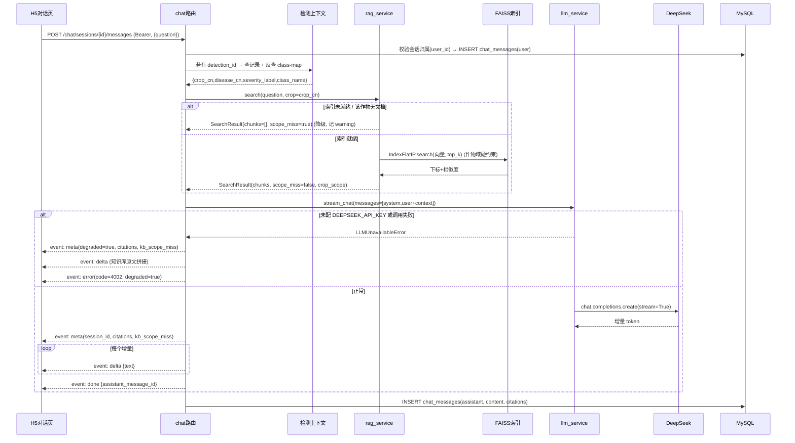
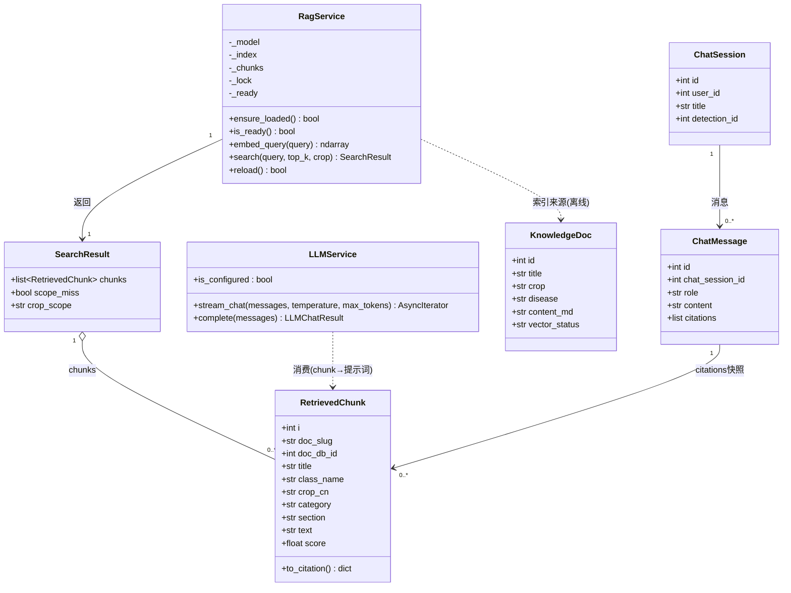
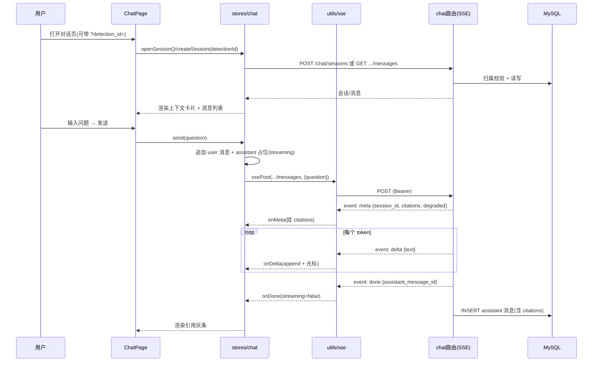
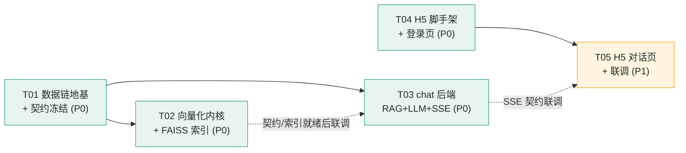

# 作物医生 CropDoctor · RAG 数据链路 + chat 后端 + H5 对话页 实现级设计 v1（增量）

> 状态：实现级设计（给工程师照写）
> 上游定稿：`docs/architecture.md`（架构 v2.1）、`docs/impl-backend-v1.md`（后端 Phase 1，**已实现并通过 QA**）、`docs/ui-design.md`（UI 规范 v1）
> 性质：**增量设计**。不推翻上述任何既有决策；新增部分只扩展，不改既有接口与表结构。
> 约定：路径均为相对仓库根 `D:\Gpt\crop-doctor` 的相对路径；代码/文档一律**简体中文**。
> 本机环境已核实：Python 3.14.6（`D:\Gpt\crop-doctor\.venv\Scripts\python.exe`）；`faiss-cpu==1.15.0`、`sentence-transformers==6.0.1`、`huggingface_hub==1.31.0`、`openai==3.14.0`、`httpx==0.28.1`、`numpy==2.5.3`。`faiss.IndexFlatIP` 与 `HF_ENDPOINT=hf-mirror` 已冒烟通过（见 §1.5）。

---

## 0. 本轮范围与不做什么

| | 内容 |
|---|---|
| **做** | 38 类映射表；`kb/diseases/` 一病一档文档规范与采集方案；切分 + bge 向量化 + FAISS 索引；`services/rag.py`、`services/llm.py`、`api/v1/chat.py`、`schemas/chat.py`；H5 工程脚手架 + 登录页 + 对话页 |
| **不做** | `knowledge/*` 门户只读端点（下轮）；PC 管理端；feedback / warning / monitor 模块；视频/实时检测 |
| **不改** | 既有 10 张表结构（`knowledge_docs` / `chat_sessions` / `chat_messages` **已有且够用**）；既有 API 契约；既有错误码语义 |

**关键前提确认（代码事实）**：
- `knowledge_docs` 现有字段：`id, title, crop, disease, source_path, content_md, vector_status`（`vector_status ∈ pending|done|failed`）——本轮**新增记录**即填充，无需迁移。
- `chat_sessions`：`id, user_id, title, detection_id(可空 FK SET NULL), created_at, updated_at`。
- `chat_messages`：`id, chat_session_id, role(user|assistant), content, citations(JSON), created_at`——`citations` 结构沿用注释 `[{doc_id,title,snippet}]`。
- 统一响应信封、错误码、JWT 依赖（`get_current_user`）、`ok()/page_data()`、`storage.url_of()` 全部复用 Phase 1 已有实现。

---

# 第一部分 · 知识库数据链路

## 1. 实现方案与选型

| # | 决策点 | 结论 | 一句话理由 |
|---|---|---|---|
| 1 | 元数据载体 | **`kb/class-map.json`（单一事实来源）**；md 只存正文 | 零新增依赖（stdlib json）、避免 front-matter 与 json 双写不一致 |
| 2 | 文档粒度 | **一病一档**，`kb/diseases/<slug>.md`，共 38 个文件 | architecture §6.7「一份数据两个出口」 |
| 3 | 抓取引擎 | **httpx**（已装），同步 + `ThreadPoolExecutor(max_workers=2)` | 与后端同源，不引新依赖 |
| 4 | HTML 解析 | **`lxml` + `cssselect` 可不引**；用 stdlib `html.parser` 或 `re` 抽正文（**优先保留原始 HTML 落 `kb/_raw/` 供人工阅读**） | 权威源页面结构简单，不引 bs4 |
| 5 | Embedding 模型 | `BAAI/bge-small-zh-v1.5`（**512 维**），CPU | `.env` 既有 `EMBEDDING_MODEL` |
| 6 | 模型下载源 | **`HF_ENDPOINT=https://hf-mirror.com`**（huggingface.co 完全不可达） | 见 §1.5，硬约束 |
| 7 | 向量索引 | **`faiss.IndexFlatIP`**（精确内积，非 IVF/HNSW） | 38 篇 ≈ 120~200 chunk，暴力检索微秒级，无需近似 |
| 8 | 归一化 | `normalize_embeddings=True` → L2 归一化 → IP ≡ 余弦 | 归一化后期望分数可直接当相似度阈值 |
| 9 | 切分粒度 | **按 H2 标题切分** + 上下文头，超长再按句切（见 §4） | 一病一档结构清晰，标题边界语义完整 |
| 10 | 持久化 | `kb/index/faiss.index` + `chunks.json` + `meta.json`（三者同版本） | 索引与元数据必须可校验一致 |
| 11 | 加载时机 | **进程启动不加载**；**首次检索懒加载**（线程锁单例） | 不拖慢启动、不常驻占内存 |
| 12 | 空索引行为 | `search()` **返回 `[]` 并记 warning**，绝不抛错 | 前端「空检索」演示路径 |
| 13 | 索引重建 | **全量重建**（秒级）；`scripts/build_index.py` 写临时目录后原子替换 | 增量收益为零，徒增复杂度 |
| 14 | 合规 | 并发 ≤2、随机间隔 1.5~3s、遵守 robots、UA 标识、失败重试 3 次指数退避 | 见 §3.4 |
| 15 | 人工卡点 | 采集产出 `kb/_review/*.draft.md` + `report.json`；**人工确认后才移入 `kb/diseases/` 并置 `reviewed_by/reviewed_at`** | 毕设诚信红线：知识库不是大模型编的 |

## 1.1 已核实的 38 类权威清单（根数据，逐字照抄）

> 来源：`ml/exports/eval-report-yolo11s-plantvillage38-v1.txt`。**评测报告含第 39 项 `Background_without_leaves`（背景类），不属于 38 类病害知识范围，映射表须显式标注 `ignore`，采集脚本必须跳过。**

**结构核对结论：38 类 = 26 病害/虫害 + 12 健康；作物 14 种。按病原类型细分：真菌 17 · 细菌 3 · 卵菌 2 · 病毒 2 · 虫害 1 · 检疫性 1 · 健康 12 = 38。** ✅ 与 team-lead 判定一致，本轮补充「病原类型」列。

> ⚠️ **原始类名逐字准确性**：`Corn___Cercospora_leaf_spot Gray_leaf_spot`（含空格）、`Pepper,_bell___Bacterial_spot`（含逗号）、`Tomato___Spider_mites Two-spotted_spider_mite`（含空格）、`Grape___Esca_(Black_Measles)`、`Grape___Leaf_blight_(Isariopsis_Leaf_Spot)`、`Orange___Haunglongbing_(Citrus_greening)`（注意 **Haunglongbing 是原始拼写，不改成 Huanglongbing**）。

## 1.2 `kb/class-map.json` 规范（38 行 + 1 忽略行）

JSON 为**数组**，每行一个对象；字段定义：

| 字段 | 类型 | 必填 | 说明 |
|---|---|---|---|
| `class_name` | str | ✅ | **模型原始英文类名，逐字照抄**（含空格/逗号/括号） |
| `disease_cn` | str | ✅ | 中文病害名/状态名（健康类为「XX健康叶」） |
| `crop_en` | str | ✅ | 作物英文（`Tomato` / `Pepper,_bell` 等，取自类名前缀，用于知识库分组） |
| `crop_cn` | str | ✅ | 作物中文（番茄 / 甜椒 / 柑橘…） |
| `category` | enum | ✅ | `真菌` \| `细菌` \| `卵菌` \| `病毒` \| `虫害` \| `检疫性` \| `健康` \| `背景` |
| `pathogen_cn` | str\|null | ✅(病害) | 病原中文名；健康类/背景类为 `null` |
| `pathogen_sci` | str\|null | ✅(病害) | 病原拉丁学名（意大利体斜杠可选）；健康/背景为 `null` |
| `doc_type` | enum | ✅ | `disease` \| `healthy` \| `ignore` |
| `slug` | str | ✅ | 文件名主体，规则见下 |
| `aliases` | str[] | ✅ | 别名/异名（提升检索召回，如「晚疫病」） |
| `is_quarantine` | bool | ✅ | 是否检疫性（仅 `Orange___Haunglongbing_(Citrus_greening)` 为 `true`） |
| `sources` | obj[] | ✅ | `[{title,url,grade,fetched_at}]`，采集后回填；`grade ∈ A/B/C`（见 §1.4.4） |
| `reviewed_by` | str\|null | ✅ | 人工审校人；未审校为 `null`（入库脚本拒绝 `null`） |
| `reviewed_at` | str\|null | ✅ | 审校日期 `YYYY-MM-DD` |
| `version` | int | ✅ | 文档版本，初始 `1` |

**`slug` 生成规则**（脚本实现，勿手写）：`class_name` → 去掉括号内容保留词 → `___` 与空格/逗号/`(`/`)` → `-` → 转小写 → 合并连续 `-` → 去首尾 `-`。
例：`Corn___Cercospora_leaf_spot Gray_leaf_spot` → `corn-cercospora-leaf-spot-gray-leaf-spot`。

### 完整 38 行映射表（权威）

| # | class_name（逐字） | disease_cn | crop_cn | pathogen_cn | pathogen_sci | category | doc_type | slug |
|---|---|---|---|---|---|---|---|---|
| 1 | `Apple___Apple_scab` | 苹果黑星病 | 苹果 | 苹果黑星病菌 | *Venturia inaequalis* | 真菌 | disease | apple-apple-scab |
| 2 | `Apple___Black_rot` | 苹果黑腐病 | 苹果 | 苹果黑腐病菌 | *Botryosphaeria obtusa* | 真菌 | disease | apple-black-rot |
| 3 | `Apple___Cedar_apple_rust` | 苹果锈病 | 苹果 | 苹果锈菌 | *Gymnosporangium yamadae* | 真菌 | disease | apple-cedar-apple-rust |
| 4 | `Apple___healthy` | 苹果健康叶 | 苹果 | — | — | 健康 | healthy | apple-healthy |
| 5 | `Blueberry___healthy` | 蓝莓健康叶 | 蓝莓 | — | — | 健康 | healthy | blueberry-healthy |
| 6 | `Cherry___Powdery_mildew` | 樱桃白粉病 | 樱桃 | 樱桃白粉菌 | *Podosphaera clandestina* | 真菌 | disease | cherry-powdery-mildew |
| 7 | `Cherry___healthy` | 樱桃健康叶 | 樱桃 | — | — | 健康 | healthy | cherry-healthy |
| 8 | `Corn___Cercospora_leaf_spot Gray_leaf_spot` | 玉米灰斑病 | 玉米 | 玉米尾孢菌 | *Cercospora zeae-maydis* | 真菌 | disease | corn-cercospora-leaf-spot-gray-leaf-spot |
| 9 | `Corn___Common_rust` | 玉米普通锈病 | 玉米 | 玉米柄锈菌 | *Puccinia sorghi* | 真菌 | disease | corn-common-rust |
| 10 | `Corn___Northern_Leaf_Blight` | 玉米大斑病 | 玉米 | 玉米大斑病菌 | *Exserohilum turcicum* | 真菌 | disease | corn-northern-leaf-blight |
| 11 | `Corn___healthy` | 玉米健康叶 | 玉米 | — | — | 健康 | healthy | corn-healthy |
| 12 | `Grape___Black_rot` | 葡萄黑腐病 | 葡萄 | 葡萄球座菌 | *Guignardia bidwellii* | 真菌 | disease | grape-black-rot |
| 13 | `Grape___Esca_(Black_Measles)` | 葡萄埃斯卡病（黑麻疹） | 葡萄 | 木质部真菌复合体 | *Phaeomoniella chlamydospora* 等 | 真菌 | disease | grape-esca-black-measles |
| 14 | `Grape___Leaf_blight_(Isariopsis_Leaf_Spot)` | 葡萄叶枯病 | 葡萄 | 葡萄褐斑病菌 | *Pseudocercospora vitis* | 真菌 | disease | grape-leaf-blight-isariopsis-leaf-spot |
| 15 | `Grape___healthy` | 葡萄健康叶 | 葡萄 | — | — | 健康 | healthy | grape-healthy |
| 16 | `Orange___Haunglongbing_(Citrus_greening)` | 柑橘黄龙病 | 柑橘 | 亚洲韧皮部杆菌 | *Candidatus* Liberibacter asiaticus | **检疫性** | disease | orange-haunglongbing-citrus-greening |
| 17 | `Peach___Bacterial_spot` | 桃细菌性穿孔病 | 桃 | 桃黄单胞菌 | *Xanthomonas arboricola* pv. *pruni* | 细菌 | disease | peach-bacterial-spot |
| 18 | `Peach___healthy` | 桃健康叶 | 桃 | — | — | 健康 | healthy | peach-healthy |
| 19 | `Pepper,_bell___Bacterial_spot` | 甜椒细菌性斑点病 | 甜椒 | 辣椒斑点病黄单胞菌 | *Xanthomonas euvesicatoria* | 细菌 | disease | pepper-bell-bacterial-spot |
| 20 | `Pepper,_bell___healthy` | 甜椒健康叶 | 甜椒 | — | — | 健康 | healthy | pepper-bell-healthy |
| 21 | `Potato___Early_blight` | 马铃薯早疫病 | 马铃薯 | 茄链格孢 | *Alternaria solani* | 真菌 | disease | potato-early-blight |
| 22 | `Potato___Late_blight` | 马铃薯晚疫病 | 马铃薯 | 致病疫霉 | *Phytophthora infestans* | **卵菌** | disease | potato-late-blight |
| 23 | `Potato___healthy` | 马铃薯健康叶 | 马铃薯 | — | — | 健康 | healthy | potato-healthy |
| 24 | `Raspberry___healthy` | 树莓健康叶 | 树莓 | — | — | 健康 | healthy | raspberry-healthy |
| 25 | `Soybean___healthy` | 大豆健康叶 | 大豆 | — | — | 健康 | healthy | soybean-healthy |
| 26 | `Squash___Powdery_mildew` | 南瓜白粉病 | 南瓜 | 南瓜白粉菌 | *Podosphaera xanthii* | 真菌 | disease | squash-powdery-mildew |
| 27 | `Strawberry___Leaf_scorch` | 草莓叶枯病（蛇眼病） | 草莓 | 草莓蛇眼病菌 | *Diplocarpon earlianum* | 真菌 | disease | strawberry-leaf-scorch |
| 28 | `Strawberry___healthy` | 草莓健康叶 | 草莓 | — | — | 健康 | healthy | strawberry-healthy |
| 29 | `Tomato___Bacterial_spot` | 番茄细菌性斑点病 | 番茄 | 番茄斑点病黄单胞菌 | *Xanthomonas* spp. | 细菌 | disease | tomato-bacterial-spot |
| 30 | `Tomato___Early_blight` | 番茄早疫病 | 番茄 | 茄链格孢 | *Alternaria solani* | 真菌 | disease | tomato-early-blight |
| 31 | `Tomato___Late_blight` | 番茄晚疫病 | 番茄 | 致病疫霉 | *Phytophthora infestans* | **卵菌** | disease | tomato-late-blight |
| 32 | `Tomato___Leaf_Mold` | 番茄叶霉病 | 番茄 | 褐孢霉 | *Passalora fulva* | 真菌 | disease | tomato-leaf-mold |
| 33 | `Tomato___Septoria_leaf_spot` | 番茄斑枯病 | 番茄 | 番茄壳针孢 | *Septoria lycopersici* | 真菌 | disease | tomato-septoria-leaf-spot |
| 34 | `Tomato___Spider_mites Two-spotted_spider_mite` | 番茄二斑叶螨（虫害） | 番茄 | 二斑叶螨 | *Tetranychus urticae* | **虫害** | disease | tomato-spider-mites-two-spotted-spider-mite |
| 35 | `Tomato___Target_Spot` | 番茄靶斑病 | 番茄 | 番茄棒孢菌 | *Corynespora cassiicola* | 真菌 | disease | tomato-target-spot |
| 36 | `Tomato___Tomato_Yellow_Leaf_Curl_Virus` | 番茄黄化曲叶病毒病 | 番茄 | 番茄黄化曲叶病毒 | *Tomato yellow leaf curl virus* | **病毒** | disease | tomato-tomato-yellow-leaf-curl-virus |
| 37 | `Tomato___Tomato_mosaic_virus` | 番茄花叶病毒病 | 番茄 | 番茄花叶病毒 | *Tomato mosaic virus* | **病毒** | disease | tomato-tomato-mosaic-virus |
| 38 | `Tomato___healthy` | 番茄健康叶 | 番茄 | — | — | 健康 | healthy | tomato-healthy |
| — | `Background_without_leaves` | 背景（非叶片） | — | — | — | 背景 | **ignore** | background-without-leaves |

**按作物统计（14 种）**：Apple 4 · Blueberry 1 · Cherry 2 · Corn 4 · Grape 4 · Orange 1 · Peach 2 · Pepper,_bell 2 · Potato 3 · Raspberry 1 · Soybean 1 · Squash 1 · Strawberry 2 · Tomato 10 = **38**。

**设计影响（务必落到文档模板分叉）**：
- 🚫 **病毒病（2 篇）**：无有效杀菌剂 → 模板**不含「药剂防治」**，改「媒介防控 + 抗病品种 + 拔除病株」。
- 🚫 **虫害（1 篇）**：叶螨用**杀螨剂**（作用机理、抗性轮换），农事逻辑与真菌病不同。
- 🚫 **检疫性（1 篇）**：防治 = **防控柑橘木虱 + 砍除病株 + 苗木检疫**（引用农业农村部检疫公告），**不写「喷药治病」**。
- 🚫 **健康类（12 篇）**：模板**不含「防治方法」**，改「健康识别要点 / 易混淆相似病害 / 保持健康农事建议」。
- ⚠️ **Blueberry / Raspberry / Soybean 仅 healthy 一类**：无病害内容可采，文档只能是健康状态说明（映射表已体现）。

## 1.3 `kb/diseases/` 文档字段规范

**文件**：`kb/diseases/<slug>.md`；**首行 H1 标题**，正文用 `##` 二级标题固定分节。
**元数据不写在 md 里**（避免与 `class-map.json` 双写不一致），由入库脚本按 slug 关联。

### 模板 A · 真菌 / 细菌 / 卵菌（21 篇）

```markdown
# 番茄晚疫病

## 一、病害概述
病原为致病疫霉（*Phytophthora infestans*），属卵菌……主要危害叶片、茎和果实，
流行速度快，是番茄生产上的重要毁灭性病害。

## 二、症状识别
- 叶片：初期叶尖、叶缘出现暗绿色水渍状斑点，后扩大为褐色不规则大斑，湿度大时叶背边缘出现白色霉层。
- 茎：出现黑褐色条斑，严重时植株易折断。
- 果实：出现油浸状褐色硬斑，表面不平，一般不软腐。

## 三、发病条件
温度 18~22℃、相对湿度 95% 以上、多雨多雾、昼夜温差大易流行；病原孢子借风雨、灌溉水传播。

## 四、防治方法
### 4.1 农业防治
选用抗病品种；合理密植，及时整枝打叶，改善通风透光；避免大水漫灌，雨后及时排水。
### 4.2 药剂防治
发病初期可选用登记于番茄晚疫病的药剂，如 ……（注：此处**仅填写来源资料中明确出现的登记药剂**，
记录**有效成分 / 剂型 / 安全间隔期**，不得凭经验添加）。
### 4.3 抗病品种
选用对晚疫病抗性较好的品种。

## 五、易混淆病害与鉴别要点
与早疫病（*Alternaria solani*）区别：早疫病病斑有同心轮纹、边缘清晰，晚疫病病斑无轮纹、水渍状。
与叶霉病区别：叶霉病叶背有灰褐色至橄榄色绒状霉层。

## 六、用药安全与注意
严格按农药标签使用，采收前遵守安全间隔期；不同作用机理药剂轮换使用，延缓抗性。
```

### 模板 B · 病毒（2 篇）——**无「药剂防治」节**

```markdown
# 番茄黄化曲叶病毒病

## 一、病害概述
由番茄黄化曲叶病毒（TYLCV）引起，主要通过**烟粉虱**持久性传播，是番茄重要病毒病害。

## 二、症状识别
植株矮化，顶部叶片变小、边缘上卷、黄化，叶片增厚变脆；坐果少、果实小，发病早则严重减产。

## 三、发病条件
媒介烟粉虱虫口密度高、高温干旱、田间管理粗放时高发；带毒苗与带毒媒介是主要初侵染源。

## 四、防治方法
> ⚠️ **病毒病无有效治疗药剂，防治以切断传播途径与预防为主。**
### 4.1 媒介防控（核心）
防虫网覆盖育苗，黄板诱杀烟粉虱，及时喷施登记杀虫剂压低媒介虫口。
### 4.2 选用抗病品种与壮苗
种植抗 TYLCV 品种，培育无虫无病壮苗。
### 4.3 拔除病株
发现早期病株及时拔除并带出田外销毁，减少毒源。

## 五、易混淆病害与鉴别要点
与营养失调（缺素黄化）区别：病毒病伴随叶片卷曲增厚与植株矮化；缺素一般无卷曲增厚。

## 六、用药安全与注意
杀虫剂针对**媒介害虫**登记使用，注意安全间隔期与轮换用药。
```

### 模板 C · 虫害（1 篇）——杀螨剂逻辑

```markdown
# 番茄二斑叶螨（虫害）

## 一、发生概述
二斑叶螨（*Tetranychus urticae*）以成螨、若螨在叶背刺吸汁液，高温干旱时繁殖极快。

## 二、识别要点（虫体与为害状）
叶背可见微小红色/黄绿色螨体及细密蛛网；叶面出现密集失绿黄白小点，严重时叶片焦枯脱落。

## 三、发生条件
温度 25~30℃、相对湿度低、久旱不雨、周边杂草多时易暴发；大量使用广谱杀虫剂杀伤天敌后易反弹。

## 四、防治方法
### 4.1 农业与生物防治
清除田边杂草；保护利用捕食螨、瓢虫等天敌；适时灌溉增湿抑制螨害。
### 4.2 药剂防治（杀螨剂）
点片发生时即挑治，选用登记杀螨剂（……来源资料中的登记药剂，标注**作用机理**）；
**注意轮换不同作用机理药剂以防抗性**，重点喷施叶背。
## 五、易混淆与鉴别要点
与生理性失绿区别：叶螨为害常伴随叶背螨体与蛛网。
## 六、用药安全与注意
严格遵守安全间隔期；避免花期伤害传粉昆虫。
```

### 模板 D · 检疫性（1 篇）——**黄龙病**

```markdown
# 柑橘黄龙病

## 一、病害概述
由亚洲韧皮部杆菌（*Candidatus* Liberibacter asiaticus）引起，**属检疫性有害生物**，
通过柑橘木虱传播与带毒苗木调运传播，**尚无有效治疗手段**。

## 二、症状识别
叶片斑驳黄化（黄绿不均、不对称）、叶脉栓化；新梢黄化直立；果实小、畸形、着色不均（红鼻果），种子败育。

## 三、发病条件
田间存在带毒木虱与带毒苗木时快速扩散；温暖湿润柑橘产区常年可发生。

## 四、防治方法
### 4.1 防控传播媒介（木虱）
统一防治柑橘木虱（放梢期重点施药），压低媒介虫口是核心措施。
### 4.2 检疫与清除病株
严格执行苗木产地检疫与调运检疫；**发现病株（或疑似病株）及时挖除并销毁**，清除传染源；
遵守农业农村部关于柑橘黄龙病的检疫公告与防控要求。
### 4.3 使用无病毒苗木
从无病苗圃采购经检疫的容器苗，禁止使用来源不明苗木。

## 五、易混淆与鉴别要点
与缺素黄化区别：黄龙病黄化呈斑驳不对称、伴叶脉栓化；缺素黄化多沿叶脉对称、补素后可恢复。

## 六、用药安全与注意
药剂仅针对媒介木虱，**无治疗黄龙病的药剂**；严格执行检疫规定。
```

### 模板 E · 健康（12 篇）

```markdown
# 番茄健康叶

## 一、健康状态说明
本次检测未发现病害特征，叶片处于健康状态。

## 二、健康叶片识别要点
叶形完整、舒展，叶色均匀翠绿，叶脉清晰且无黄化或镂空，叶面平整洁净、无斑点霉层、无虫体蛛网。

## 三、易混淆的相似病害（早期预警）
- 早疫病早期：出现褐色小点并有同心轮纹趋势 —— 需与叶面灰尘/机械损伤区分。
- 叶霉病早期：叶背出现淡黄斑点、后生橄榄色霉层 —— 注意翻看叶背。
建议发现异常时重新拍照复检。

## 四、保持健康的农事建议
合理水肥、避免偏施氮肥；保证通风透光与合理密植；及时清除病残体；轮作与田园清洁。
```

> 章节以 `## ` 开头（H2）是**切分锚点**（见 §4.1），工程师不得改动标题层级。

## 1.4 采集方案

### 1.4.1 目标源与优先级（可达性以 QA 独立复测为准，🔺= 本轮修订）

> ⚠️ **本轮事实订正**：原设计对 P0 源的「可达」判断**过乐观**，QA 独立 curl 复测推翻了其中两条。以下为**订正后的权威结论**（详细限制见 §17）。

| 优先级 | 源 | 域名 | 实测（QA 独立复测） | 用途 | 可信度 |
|---|---|---|---|---|---|
| P0 | 农业农村部 | `www.moa.gov.cn` | ✅ **200 正常** | **检疫性病害公告（黄龙病）、禁限用农药公告** | A |
| P0 | 中国农科院植保所 | `www.ippcaas.cn` | ✅ 200（根页可达；比原判断宽松） | 病原学名、发病规律、权威防治 | A |
| 🔺 | ~~中国农药信息网~~ | `www.chinapesticide.org.cn` | ❌ **HTTPS 连接失败/超时，HTTP 403 —— 不可达** | ~~农药登记、安全间隔期~~ → **改用替代源**（见下） | — |
| 🔺 | ~~全国农技推广服务中心~~ | `www.natesc.org.cn` | ❌ **证书已过期（`SEC_E_CERT_EXPIRED`）→ 307 → 403 —— 不可达** | ~~症状、发生条件~~ → **改用替代源**（见下） | — |
| P1 | 百度百科 | `baike.baidu.com` | ✅ 200 | 症状补充、别名（**仅作线索，不作唯一来源**） | B |
| ❌ | huggingface.co / 维基百科 | — | ❌ 不可达 | **禁用** | — |

**🔺 替代源（省市县级 `.gov.cn` 植保站 / 农技推广站）**：原 P0 两条不可达后，症状与发病条件改由**省市级农业农村/植保站官网**采集，仍属 A 级（`.gov.cn`）。此类站点较多、单站覆盖不全，故改为**多站聚合**：每类至少 2 个不同 `*.gov.cn` 来源。代价见 §17。

### 1.4.2 每类抓取策略

| 步骤 | 说明 |
|---|---|
| S1 | 用 `disease_cn` + `aliases` 作为检索词，在 P0 源站内检索，取前 3 条结果页 URL |
| S2 | 抓正文 HTML → 落 `kb/_raw/<slug>/<n>_<host>.html`（供人工阅读，`.gitignore`） |
| S3 | 抽取文本 → 落 `kb/_raw/<slug>/<n>_<host>.txt` |
| S4 | 按 category 选模板（§1.3）→ 生成 `kb/_review/<slug>.draft.md`（**留 `【待补充】` 占位，不编造**） |
| S5 | 写 `kb/_review/report.json`：每类抓到的来源数、缺失字段、来源可信度分级 |
| S6 | **人工审校**（见 §1.4.4）→ 定稿移入 `kb/diseases/<slug>.md`，回填 `class-map.json.sources/reviewed_by/reviewed_at` |

### 1.4.3 限速与合规（硬性）

| 项 | 结论 |
|---|---|
| 并发 | `ThreadPoolExecutor(max_workers=2)`，**同域名串行** |
| 间隔 | 每次请求前随机 `sleep(uniform(1.5, 3.0))` |
| 超时 | 连接 10s / 读 30s（`httpx.Timeout(30.0, connect=10.0)`） |
| 重试 | 失败重试 **3** 次，指数退避 `1s → 2s → 4s`；最终失败写 `report.json.failed` |
| User-Agent | `CropDoctorBot/1.0 (毕业设计，非商业；联系方式见 README)` |
| robots | 启动时读取目标域 `robots.txt`，`Disallow` 路径一律跳过，并记日志 |
| 频控开关 | 支持 `--dry-run`（只生成 URL 清单不抓取）与 `--limit N`（每类最多 N 页） |
| 总预算 | 38 类 × ≤3 页 ≈ ≤114 次请求，单次调用分域分批执行（规避沙箱单次工具调用限制） |

### 1.4.4 去重与可信度分级

- **URL 归一化去重**：去 fragment / 常用跟踪参数（`utm_*`）、统一小写 host。
- **内容去重**：正文取前 200 字做指纹（`hashlib.md5`），撞指纹则丢弃后到者。
- **可信度分级**（写入 `sources[].grade`）：
  - `A` = 官方/权威（gov、农技推广中心、农科院植保所、农药信息网）
  - `B` = 权威百科（百度百科）
  - `C` = 其他（一般不采，仅线索）
- **可信度使用**：入库脚本对「**无 A 级来源**」的文档置 `vector_status=pending` 并拒绝进入索引，人工核实后可豁免（在 `report.json` 记 `override:true`）。

### 1.4.5 人工审校卡点（毕设诚信红线，**必须显式保留**）

1. 采集脚本**只产出草稿**到 `kb/_review/`，**绝不直接写 `kb/diseases/`**。
2. 人工（用户本人）逐篇核对：症状描述、病原学名、药剂与安全间隔期是否与来源一致；删除任何**无来源支撑**的语句。
3. 审校通过后回填 `class-map.json`：`reviewed_by` / `reviewed_at` / `sources`，并把 md 移入 `kb/diseases/`。
4. **入库脚本 `scripts/ingest_kb.py` 强制校验 `reviewed_by != null` 且 `sources` 含 ≥1 个 A 级**，否则跳过该文档并报错退出（可 `--force` 仅用于本地调试）。
   > ⚠️ **QA 实测：该闸门只能拦 `null`，不具备区分「占位值」与「真人审校」的能力**（填任意字符串 `"x"` 即通过）。加固方案见 **§16（待用户拍板）**。

### 1.4.6 检索的「作物域约束」（🔺 取代原「同 class_name 软过滤补足」策略）

> **问题（QA 实测 P1）**：仅靠 `rag_min_score=0.35` 阈值**拦不住库外问题**——「苹果黑星病怎么治」→ 0.5254 命中*番茄*晚疫病、「水稻稻瘟病用什么药」→ 0.5648 命中*番茄*黄化曲叶病毒病；而**域内 0.53~0.80、域外 0.42~0.56 区间重叠**，调阈值无法分离。
> **旧策略的缺陷**：原 §2.1 的「先取 top_k×3 候选，优先保留同 `class_name`，不足则用其它候选补足」会导致**「检测出马铃薯晚疫病却引用番茄资料」**（跨作物污染），已**废弃**。

**冻结接口（工程师 A 实现，B 按同一契约调用）**：

```python
@dataclass
class SearchResult:
    chunks: list[RetrievedChunk]
    scope_miss: bool = False        # True = 请求的作物在知识库中没有任何文档
    crop_scope: str | None = None   # 实际生效的作物约束（回显给调用方/前端）

def search(self, query: str, top_k: int | None = None, crop: str | None = None) -> SearchResult: ...
```

**规则（硬性）**：

| `crop` 入参 | 知识库中该作物有文档 | 行为 |
|---|---|---|
| 非空 | 是 | **只在该作物范围内检索**；返回 `SearchResult(chunks=[...], crop_scope=crop)` |
| 非空 | 否 | **`chunks=[]` + `scope_miss=True`，且不回退捞别的作物**（宁可空，不可跨作物污染） |
| 空 | — | 用 `class-map.json` 的 `crop_cn`/`aliases` 在 query 中识别作物：<br>· 识别到但库中无该作物文档 → `scope_miss=True`（`chunks` 仍按全库结果给，供降级参考）<br>· 未识别出作物 → 走全库 + `rag_min_score` 阈值（原行为） |

**与旧策略的关系**：**完全取代**「class_name 软过滤 + 补足」。`min_score` **保留**为兜底阈值（未识别作物时用），但**不再是跨作物污染的主防线**；主防线是**作物域硬约束**。

**🔒 派生分层（class-map 单一事实来源，硬性）**：

- **`class_name → crop_cn` 的派生只在后端做**：由 `rag.py` 暴露派生函数（如 `crop_of(class_name) -> str | None`，内部查 `kb/class-map.json` 的内存缓存）。
- **前端不得复制映射表**：检测记录返回的是 `class_name`（如 `Tomato___Late_blight`），`crop_cn`（番茄）是**派生值**；前端只需**原样回传 `class_name`**，作物名由后端派生——避免把映射逻辑复制到前端（对齐 §12.1）。
- **两条问诊入口统一收敛**：① 请求带 `class_name` → 后端派生 `crop_cn`；② 请求带 `detection_id` → 查记录取 `top_disease`（即 `class_name`）→ **同一条派生路径** → 均以派生出的 `crop_cn` 调 `search(crop=...)`。
- **API 契约不变**：请求字段名**保持 `class_name`**，**无破坏性变更**（B 已交付、QA 已验证）。

**下游影响**：① `search()` 返回值由 `list[RetrievedChunk]` 变为 `SearchResult`（B 需同步改调用点）；② `scope_miss` 经 SSE `meta.kb_scope_miss` 透传前端（§3.2）；③ 检测上下文与 `class_name` 入参**统一由后端派生 `crop_cn`** 后作为 `crop` 入参（§3.3）。

## 1.5 切分与向量化

### 1.5.1 切分策略（结论：**按 H2 标题切分 + 上下文头**）

| 项 | 结论 | 理由 |
|---|---|---|
| 边界 | 以 `## `（H2）为 chunk 边界；文首 H1 与 `>` 引用块作为该文档公共上下文 | 一病一档结构清晰，"症状/发病条件/防治"是天然独立可检索单元 |
| 超长处理 | 单节 > `RAG_CHUNK_MAX_CHARS`(默认 600 字) 时，按中文句号/分号再切，相邻段 `overlap=60` 字 | 避免单 chunk 过长稀释语义 |
| 过短处理 | 单节 < 40 字时与相邻同级节合并 | 避免噪声 chunk |
| **上下文头** | 每个 chunk 文本前**拼接**：`【作物】【病害】` + `## 章节标题` + 换行 + 正文 | 短 query 命中率关键（chunk 内自带主题词） |
| 不切 | H1 与文档级引用块仅作元数据，不进 chunk | 减少重复 |

**为什么不选定长切分**：定长会切断「症状 ↔ 防治」边界，使检索结果把"防治"切到别的 chunk，污染答案；本文档集合是强结构化的，标题切分更优。

### 1.5.2 `bge-small-zh-v1.5` 用法

| 项 | 结论 |
|---|---|
| 维度 | **512**（写入 `meta.json` 校验） |
| 加载 | `SentenceTransformer(settings.embedding_model, device="cpu")`，**懒加载 + 线程锁单例** |
| 编码 | `.encode(texts, normalize_embeddings=True, batch_size=32, show_progress_bar=False)` → `float32` |
| **query 指令前缀** | ✅ **query 侧加 `为这个句子生成表示以用于检索相关文章：`，passage 侧不加**（BGE 中文 s2p 推荐）。开关 `RAG_QUERY_INSTRUCTION`（默认该前缀，可置空关闭）。⚠️ 与不加前缀的检索差异**待实测 A/B**（见 §5 待明确） |
| 归一化 | `normalize_embeddings=True`（L2），配合 `IndexFlatIP` 即余弦相似度 |
| 38 篇耗时估算 | 约 150 chunk × 512 维，CPU 上 **< 60s**（待实测；超时则降 `batch_size`） |

### 1.5.3 `HF_ENDPOINT` 落地方式（结论：**双保险**）

1. **写入 `.env`（并在 `.env.example` 同步）**：`HF_ENDPOINT=https://hf-mirror.com` —— 便于用户更改。
2. **代码里在导入 `sentence_transformers` 之前 `setdefault`**：

```python
# backend/app/services/rag.py 顶部（必须在 import sentence_transformers 之前）
import os
from app.core.config import settings

os.environ.setdefault("HF_ENDPOINT", settings.hf_endpoint or "https://hf-mirror.com")
os.environ.setdefault("HF_HUB_DISABLE_TELEMETRY", "1")

import faiss  # noqa: E402
import numpy as np  # noqa: E402
from sentence_transformers import SentenceTransformer  # noqa: E402  ← 放最后
```

> 理由：`huggingface_hub` 在 **import 时**读取 `HF_ENDPOINT`；不 setdefault 则 `SentenceTransformer("BAAI/bge-small-zh-v1.5")` 会卡死在 huggingface.co。`config.py` 是所有模块最早导入者，故 setdefault 放在 `rag.py` 顶部即可（`settings` 此时已就绪）。
> **已实测**：`HF_ENDPOINT=https://hf-mirror.com` 时 `huggingface_hub 1.31.0` 能读到该变量 ✅。

## 1.6 FAISS 索引设计

| 项 | 结论 |
|---|---|
| 索引类型 | **`faiss.IndexFlatIP(dim)`**（精确内积）。量级：38 篇 ≈ **120~200** 个向量、512 维 → 暴力检索微秒级；**不用 IVF/HNSW**（小数据近似索引纯属负担，且需训练） |
| 相似度 | L2 归一化后 IP ≡ 余弦，分数 ∈ [-1,1] |
| 持久化路径 | `kb/index/faiss.index`（`faiss.write_index`）+ `kb/index/chunks.json` + `kb/index/meta.json` |
| `chunks.json` 结构 | `[{ "i":0, "doc_slug":"tomato-late-blight", "doc_db_id":12, "title":"番茄晚疫病", "class_name":"Tomato___Late_blight", "crop_cn":"番茄", "category":"卵菌", "section":"二、症状识别", "text":"<上下文头+正文>", "source_path":"kb/diseases/tomato-late-blight.md" }]`（**下标 `i` 必须与 FAISS 向量顺序一致**） |
| `meta.json` 结构 | `{ "embedding_model":"BAAI/bge-small-zh-v1.5", "dim":512, "count":152, "query_instruction":"为这个句子生成表示以用于检索相关文章：", "built_at":"2025-09-16T08:00:00Z", "kb_version":1 }` |
| 一致性校验 | 加载时校验 `meta.dim == index.d == len(向量)` 且 `meta.count == len(chunks)` 且 `meta.embedding_model == settings.embedding_model`；不一致 → **视为空索引**（降级）并记 error |
| 加载时机 | 启动**不加载**；`RagService.ensure_loaded()` 首次检索时加载（线程锁），失败置 `_ready=False` |
| **空索引行为** | 索引/模型缺失 → `search()` 返回 `[]`（记 warning），**不抛异常**；chat 侧走"无资料"分支 |
| 重建策略 | **全量重建**。`scripts/build_index.py`：写入 `kb/index/.tmp/` → 校验 → 原子 `os.replace` 到 `kb/index/`，避免读到半成品 |

**空索引 4 种来源**（均须返回 `[]`）：① `kb/index/` 不存在 ② `meta.json` 校验失败 ③ 模型未下载 ④ `chunks.json` 为空。

---

# 第二部分 · chat 后端设计

## 2. 服务层接口签名

### 2.1 `backend/app/services/rag.py`

```python
# -*- coding: utf-8 -*-
"""RAG 检索服务：bge 向量化 + FAISS 精确检索 + 空索引降级。

加载时机：懒加载单例（首次 search 触发）。任何缺失一律降级为「空结果」，绝不抛错。
"""
from dataclasses import dataclass, field

@dataclass
class RetrievedChunk:
    i: int                       # FAISS 下标
    doc_slug: str
    doc_db_id: int | None
    title: str                   # 文档标题（disease_cn）
    class_name: str | None       # 模型原始类名（用于聚合/标注；**不用于检索过滤**，v1.1 起过滤由作物域约束负责）
    crop_cn: str | None
    category: str | None         # 真菌/细菌/卵菌/病毒/虫害/检疫性/健康
    section: str                 # 章节标题（如「二、症状识别」）
    text: str                    # 上下文头 + 正文
    score: float                 # 余弦相似度
    source_path: str | None

    def to_citation(self) -> dict:
        """→ chat_messages.citations 元素 {doc_id,title,snippet}。"""
        snippet = self.text[:120].replace("\n", " ")
        return {"doc_id": self.doc_slug, "title": f"{self.title}·{self.section}", "snippet": snippet}


@dataclass
class SearchResult:
    """检索结果（v1.1 冻结契约，见 §1.4.6）。"""
    chunks: list[RetrievedChunk]
    scope_miss: bool = False        # True = 请求的作物在知识库中没有任何文档
    crop_scope: str | None = None   # 实际生效的作物约束


class RagService:
    """向量检索服务（线程安全懒加载）。"""

    def __init__(self) -> None: ...

    def ensure_loaded(self) -> bool:
        """懒加载 embedding 模型 + FAISS 索引 + chunks。
        Returns: True=就绪；False=降级（索引/模型缺失或校验失败）。线程锁保护，只执行一次。"""

    def is_ready(self) -> bool:
        """健康检查用；不触发加载。"""

    def embed_query(self, query: str) -> "np.ndarray | None":
        """query → 归一化向量 (1,512)；未就绪返回 None。"""

    def search(
        self,
        query: str,
        top_k: int | None = None,
        crop: str | None = None,
    ) -> SearchResult:
        """检索 Top-K（**作物域硬约束，见 §1.4.6**）。
        - top_k 缺省取 settings.rag_top_k
        - crop 非空 → 只在该作物范围内检索；该作物无文档 → chunks=[] + scope_miss=True，
          **不回退捞别的作物**（严禁跨作物污染）
        - crop 为空 → 用 class-map 的 crop_cn/aliases 在 query 内识别作物：
          · 识别到但库中无该作物文档 → scope_miss=True
          · 未识别出 → 全库检索 + min_score(settings.rag_min_score) 阈值兜底
        - 未就绪 / 索引为空 / query 为空 → SearchResult(chunks=[])（记 warning，不抛错）
        """

    def reload(self) -> bool:
        """显式重载（重建索引后热更用）。"""

# 模块级单例
rag_service = RagService()
```

### 2.2 `backend/app/services/llm.py`

```python
# -*- coding: utf-8 -*-
"""DeepSeek 客户端（OpenAI 兼容协议，SSE 流式），未配 key 时降级。"""
from collections.abc import AsyncIterator
from dataclasses import dataclass

@dataclass
class LLMChatResult:
    text: str
    finish_reason: str | None
    elapsed_ms: int

class LLMService:
    """DeepSeek 流式对话。"""

    @property
    def is_configured(self) -> bool:
        """settings.deepseek_api_key 非空。"""

    async def stream_chat(
        self,
        messages: list[dict],          # [{"role":"system|user|assistant","content":str}]
        *,
        temperature: float | None = None,
        max_tokens: int | None = None,
    ) -> AsyncIterator[str]:
        """流式产出**增量文本 token**。
        - 未配置 key → 抛 LLMUnavailableError（由调用方转降级文案）
        - 首包前（连接/建流）失败：连接超时/网络错误 → 重试 1 次，仍失败抛 LLMUnavailableError
        - 流式中途失败：不重试，抛出 LLMStreamError（调用方发 SSE error 事件，保留已产出文本）
        """

    async def complete(self, messages: list[dict], *, **kw) -> LLMChatResult:
        """非流式（用于生成会话标题等轻量场景，可选实现）。"""

llm_service = LLMService()
```

- 客户端：`from openai import AsyncOpenAI`；`AsyncOpenAI(api_key=..., base_url=settings.deepseek_base_url, timeout=httpx.Timeout(settings.llm_timeout_seconds, connect=10.0), max_retries=0)`（重试自行控制，避免与 openai 内置重试叠加）。
- 调用：`stream = await client.chat.completions.create(model=settings.llm_model, messages=messages, stream=True, temperature=..., max_tokens=...)`；`async for chunk in stream:` 取 `chunk.choices[0].delta.content`（可能为 `None`，需判空）。
- 异常映射：`openai.APIConnectionError` / `openai.APITimeoutError` → `LLMUnavailableError`；`openai.APIStatusError`（401/429/5xx）→ 记日志后 `LLMUnavailableError`。

### 2.3 **未配置 `DEEPSEEK_API_KEY` 的行为（结论：不报错，返回降级文案）**

| 场景 | 行为 |
|---|---|
| `DEEPSEEK_API_KEY` 为空 | **HTTP 200 + SSE 正常流**，`meta.degraded=true`；不建立 DeepSeek 连接 |
| 且**检索有命中** | 服务端**模板化拼装**（非大模型生成）：取 Top1~2 chunk 的「症状识别 / 防治方法」正文，按固定格式流式吐出，**逐字来自知识库**，并在文首声明 `【大模型服务未配置，以下为知识库检索原文】` |
| 且**检索无命中** | 固定提示流式吐出：`当前未配置大模型问答服务（DEEPSEEK_API_KEY 为空）。您可先查阅知识库，或联系当地植保站咨询；如需开启智能问答，请在 .env 配置 DEEPSEEK_API_KEY。` |
| 运行期 DeepSeek 不可用（超时/错误） | 与「检索有命中」同策略：**降级为知识库原文拼装** + `meta.degraded=true`（已产出部分保留，不足部分用检索原文补齐） |

> **理由**：① 对话页在开发/答辩环境下必须可用，空 key 是**已知常态**（`.env` 中该键为空）；② 让「检索链路」在无 LLM 时仍可演示，突出 RAG 而非依赖外部服务；③ 与 weather 服务的「降级不抛错」原则一致（impl-backend-v1 §4.4）。
> **不采用「直接报错」**：会破坏 H5 对话页可用性，且答辩现场若无网络将全场失效。

## 3. API 契约（`api/v1/chat.py`）

统一前缀 `/api/v1`，需登录（`Depends(get_current_user)`），**所有会话/消息查询强制 `user_id == current_user.id`**（越权统一 4001，防探测，对齐 detection 模块 2004 策略）。

### 3.1 端点清单

| Method | Path | 请求 | 响应 | 状态码 |
|---|---|---|---|---|
| POST | `/chat/sessions` | `{title?, detection_id?}` | `ChatSessionOut` | 200 / 400(4001 无权引用该检测) |
| GET | `/chat/sessions` | `page,page_size` | `Page<ChatSessionOut>` | 200 |
| GET | `/chat/sessions/{id}` | path | `ChatSessionDetailOut` | 200 / 404(4001) |
| GET | `/chat/sessions/{id}/messages` | `page,page_size`（按时间倒序分页，前端可反转为正序渲染） | `Page<ChatMessageOut>` | 200 / 404(4001) |
| POST | `/chat/sessions/{id}/messages` | `{question}` | **SSE** `text/event-stream` | 200 / 404(4001) / 400(4003) |
| POST | `/chat/ask` | `{question, session_id?, detection_id?, class_name?}` | **SSE**；`session_id` 为空则自动建会话；**`class_name` 由后端派生出 `crop_cn` 再检索**（§1.4.6） | 200 / 400(4001/4003) |
| DELETE | `/chat/sessions/{id}` | path | `null`（消息级联删除） | 200 / 404(4001) |

### 3.2 SSE 事件协议（**前后端冻结契约**）

响应头：`Content-Type: text/event-stream; charset=utf-8`、`Cache-Control: no-cache`、`Connection: keep-alive`、`X-Accel-Buffering: no`。
心跳：每 15s 发注释行 `: ping`（防代理断流）。

```
event: meta
data: {"session_id":12,"user_message_id":34,"citations":[{"doc_id":"tomato-late-blight","title":"番茄晚疫病·二、症状识别","snippet":"…"}],"degraded":false,"class_filter":"Tomato___Late_blight","crop_scope":"番茄","kb_scope_miss":false}

event: delta
data: {"text":"番茄晚疫病"}

event: delta
data: {"text":"由致病疫霉引起…"}

event: done
data: {"assistant_message_id":35,"finish_reason":"stop","elapsed_ms":1832}

# 异常时（替代 done）
event: error
data: {"code":4002,"message":"大模型服务暂不可用，已返回知识库原文","degraded":true}
```

- `meta` 必为**第一帧**；前端据此拿到 `session_id`（`/chat/ask` 自动建会话时必需）与引用来源。
- 🔺 **v1.1 新增字段（向后兼容：仅新增、不改既有字段）**：
  | 字段 | 类型 | 说明 |
  |---|---|---|
  | `kb_scope_miss` | bool | **必带**。`true` = 请求的作物在知识库中无任何文档 → 前端提示「知识库暂无该作物资料」（对应 `SearchResult.scope_miss`，§1.4.6） |
  | `crop_scope` | str\|null | 实际生效的作物约束（回显 `SearchResult.crop_scope`） |
  > 注：`class_filter` 为 v1 遗留字段，**保留以兼容**；软过滤策略已于 v1.1 废弃（§1.4.6），其语义由 `crop_scope` 承担，后续版本可移除。
- `delta` 可 0..N 帧；`done` 或 `error` 为**最后一帧**。
- 会话消息**落库时机**：`user` 消息在建立流**之前**写入；`assistant` 消息在流**正常结束**后写入（含 `citations`）。若中途 `error`，**已产出部分文本仍落库**（`citations` 照记），保证会话历史连续。

### 3.3 检测上下文注入

**两条入口统一**：`detection_id`（检测上下文）与 `class_name`（前端显式传）都归一到**同一条后端派生路径** —— `class_name → crop_cn`（查 `class-map.json`），再调 `search(crop=crop_cn)`。**前端不得自行派生作物名**（§1.4.6）。

`detection_id` 非空时：
1. 按 `id + user_id` 查 `detection_records`（越权/不存在 → 4001）；
2. 取 `crop / top_disease / top_conf / severity_level`；
3. 以 `top_disease`（即 `class_name`）经 `class-map.json` 反查（**内存缓存**，复用 `rag.py` 的派生函数）得到 `disease_cn / category / crop_cn`；
4. 组装上下文块注入 user 提示词（见 §5.2）；
5. 检索时**以派生出的 `crop_cn` 作为 `search(crop=...)` 入参**（**作物域硬约束**，§1.4.6）；**不再**用 `top_disease` 做软过滤（该策略已废弃，防跨作物污染）。

`class_name` 非空且无 `detection_id` 时：直接以 `class_name` 走第 3~5 步（派生 `crop_cn` → 检索），不注入检测上下文块。

### 3.4 错误码（新增，回填 impl-backend-v1 §5.3 表）

| code | HTTP | 含义 |
|---|---|---|
| 4001 | 404 | 会话不存在或无权访问（防探测） |
| 4002 | 200 | 大模型服务不可用（已降级为知识库原文） |
| 4003 | 400 | 问题为空或超长（>500 字） |

**🔺 4003 校验层级（本轮裁决，务必遵守）**：空 / 纯空白 / 超长（>500 字）一律返回 **`400 / 4003`**，**校验在 handler 层显式完成**，**不使用 Pydantic 的 `min_length`/`max_length` 约束**。
> **原因（QA 实测）**：原设计 §4 把约束写在 Pydantic schema 上，导致 `question=""`→422/9000、501 字→422/9000，**§3.4 的 400/4003 分支根本不可达**，与用户契约矛盾。现裁决：**以 §3.4 用户契约为准**，schema 退化为无约束 `str`，由 handler 判空/判长后抛 `BusinessError(4003, ..., 400)`。
>
> **SSE 场景补充**：`POST /chat/sessions/{id}/messages` 与 `POST /chat/ask` 的该校验发生在**建立 SSE 流之前**，因此失败时返回的是**普通 JSON `{code:4003,...}` 的 HTTP 400**，**不是流内的 `error` 帧**（流内 `error` 帧仅用于 LLM 运行期故障，见 §3.2）。前端须按「HTTP 非 200 → 读 JSON 信封」处理，不能只依赖 SSE 事件。

## 4. `schemas/chat.py`

```python
# -*- coding: utf-8 -*-
"""chat 相关请求/响应模型。"""
from pydantic import BaseModel, ConfigDict, Field
from app.schemas.common import UtcDatetime

class CitationOut(BaseModel):
    doc_id: str
    title: str
    snippet: str

class ChatSessionCreate(BaseModel):
    title: str | None = Field(default=None, max_length=100)
    detection_id: int | None = None

class ChatSessionOut(BaseModel):
    model_config = ConfigDict(from_attributes=True)
    id: int
    title: str | None = None
    detection_id: int | None = None
    created_at: UtcDatetime
    updated_at: UtcDatetime

class ChatSessionDetailOut(ChatSessionOut):
    message_count: int = 0
    detection_context: "DetectionContextOut | None" = None   # 复用检测上下文卡片数据

class DetectionContextOut(BaseModel):
    detection_id: int
    crop: str | None = None            # 作物英文前缀
    crop_cn: str | None = None
    disease_cn: str | None = None
    class_name: str | None = None
    severity_level: int | None = None
    severity_label: str | None = None
    top_conf: float | None = None
    thumb_url: str | None = None

class ChatMessageOut(BaseModel):
    model_config = ConfigDict(from_attributes=True)
    id: int
    role: str                          # user | assistant
    content: str
    citations: list[CitationOut] | None = None
    created_at: UtcDatetime

class ChatMessageIn(BaseModel):
    # ⚠️ 不加 Pydantic 长度约束（min_length/max_length 会让 4003 分支不可达）；
    #    空 / 纯空白 / 超长 一律由 handler 层显式校验 → BusinessError(4003, 400)（见 §3.4）
    question: str

class ChatAskIn(BaseModel):
    # 同上：长度与空值校验在 handler 层完成，返回 4003
    question: str
    session_id: int | None = None
    detection_id: int | None = None
    # ✅ 请求字段保持 class_name（B 已交付、QA 已验证的契约，**不改名**）
    # 语义：后端用 kb/class-map.json 由 class_name 派生 crop_cn，再作为 crop 传给 rag_service.search()（§1.4.6）
    class_name: str | None = Field(default=None, max_length=100)

ChatSessionDetailOut.model_rebuild()
```

> **handler 层校验伪代码**（两个 SSE 端点共用，**在建流之前**执行）：
> ```python
> q = (payload.question or "").strip()
> if not q:
>     raise BusinessError(4003, "问题不能为空", http_status=400)
> if len(q) > 500:
>     raise BusinessError(4003, "问题过长（最多 500 字）", http_status=400)
> ```

## 5. 提示词设计

### 5.1 system prompt

```text
你是「作物医生」的植保问答助手，面向普通农户，用简体中文回答。

【硬性约束】
1. 只依据下方【参考资料】回答；参考资料未覆盖的内容，回答「知识库暂无相关权威资料，建议咨询当地植保站」，严禁编造。
2. 严禁编造农药名称、剂量、安全间隔期；凡涉及药剂，必须来自参考资料，并提示「严格按农药标签使用、遵守安全间隔期」。
3. 病毒病不得推荐杀菌剂（防治以防控传播媒介、抗病品种、拔除病株为主）。
4. 检疫性病害（如柑橘黄龙病）不得推荐治疗药剂（防治以防控媒介、清除病株、苗木检疫为主）。
5. 虫害（如叶螨）应使用杀螨剂逻辑，并提示轮换用药防抗性。
6. 回答分点、简洁，正文不超过 300 字；结尾用 [1][2] 标注所引用的参考资料编号。
7. 语气亲切、通俗，避免堆砌专业术语；必要时给出一句农事操作建议。
```

### 5.2 检测上下文注入模板（拼进 user 消息）

```text
【检测上下文】
作物：{crop_cn}｜检测结论：{disease_cn}｜置信度：{top_conf:.0%}｜严重度：{severity_label}
（说明：以上为用户上传图片的 AI 检测结果，可作为参考，但最终以实际情况为准。）

【参考资料】
[1] {title}（{section}）
{chunk_text}
[2] {title}（{section}）
{chunk_text}

【用户问题】
{question}
```

无检测上下文时省略第一段；无检索结果时【参考资料】替换为 `（无）`。

### 5.3 引用来源格式

- 落库：`chat_messages.citations = [{"doc_id","title","snippet"}]`（`title` 形如 `番茄晚疫病·二、症状识别`，`snippet` 为 chunk 前 120 字）。
- 前端渲染：AI 气泡下方**灰条**逐条列出 `[n] title`，点击可展开 `snippet`。

## 6. 时序图（SSE 流式问答）



## 7. 类图（RAG + chat）



---

# 第三部分 · H5 对话页设计

## 8. 工程脚手架

### 8.1 技术栈与源

| 项 | 结论 |
|---|---|
| 框架 | Vue 3（`<script setup>`）+ Vite 5 |
| UI 库 | Vant 4（`vant` + `@vant/auto-import-resolver` 可选） |
| 状态 | Pinia |
| 路由 | Vue Router 4 |
| HTTP | axios |
| 图 | 本轮对话页不引 ECharts（后续页面再引） |
| Node / 包管理 | Node 22.2.0 / npm 10.9.7（**无 pnpm**，`.npmrc` 指向腾讯云镜像） |
| **npm 源** | `registry=https://mirrors.cloud.tencent.com/npm/`（写入 `frontend-h5/.npmrc`） |

### 8.2 环境变量约定（`frontend-h5/.env.development` / `.env.production`）

```ini
VITE_API_BASE_URL=http://127.0.0.1:8000/api/v1
VITE_STATIC_BASE_URL=http://127.0.0.1:8000
# 生产：VITE_API_BASE_URL=https://<后端域名>/api/v1
```

- axios `baseURL = import.meta.env.VITE_API_BASE_URL`；静态图 URL = `VITE_STATIC_BASE_URL + image_url`（后端出参为 `/static/...`）。
- SSE 端点同样走 `VITE_API_BASE_URL`。

### 8.3 目录结构

```
frontend-h5/
├── .npmrc                       # registry=腾讯云镜像
├── .env.development
├── .env.production
├── index.html                   # viewport 移动端适配
├── package.json
├── vite.config.js               # @vitejs/plugin-vue + dev server proxy(可选)
├── src/
│   ├── main.js                  # createApp + Pinia + Router + Vant 样式
│   ├── App.vue                  # <router-view/>
│   ├── router/index.js          # 路由 + 登录守卫(meta.requiresAuth)
│   ├── api/
│   │   ├── request.js           # axios 实例 + 拦截器(token 注入 / 401 跳登录 / 拆信封)
│   │   ├── auth.js              # login / register / profile
│   │   └── chat.js              # sessions CRUD + sseAsk(POST+ReadableStream)
│   ├── utils/
│   │   └── sse.js               # fetch 版 SSE 解析器(POST + Bearer 头)
│   ├── stores/
│   │   ├── user.js              # token/user/登录登出
│   │   └── chat.js              # 会话列表/当前会话/消息/流式态/引用
│   ├── styles/
│   │   └── tokens.css           # ui-design.md §2 的彩色/圆角/字号 token
│   ├── components/chat/
│   │   ├── MessageList.vue
│   │   ├── MessageBubble.vue
│   │   ├── CitationBar.vue
│   │   ├── QuickQuestions.vue
│   │   ├── DetectionContextCard.vue
│   │   └── ChatInputBar.vue
│   └── views/
│       ├── LoginPage.vue
│       └── ChatPage.vue
```

## 9. 对话页组件拆分与状态设计

### 9.1 组件职责

| 组件 | 职责 | 视觉规范（ui-design.md） |
|---|---|---|
| `ChatPage.vue` | 页面编排：顶部标题/会话切换、上下文卡片、消息列表、输入栏；挂载时若带 `?detection_id=` 则拉取上下文 | §3.2 ③ |
| `MessageList.vue` | 滚动容器、自动滚底、发送时滚到底、空态（引导 + 快捷问题） | 空状态有插画位（§6） |
| `MessageBubble.vue` | 单气泡：`role=user` **右绿**（`#2BA471` 底/白字）、`role=assistant` **左白**（白底/深字）；**非对称圆角 12px，发送方右下 4px**；流式中末尾渲染打字光标 `▍` | §2.3 气泡圆角 |
| `CitationBar.vue` | AI 气泡下**灰条**：`[n] title`，点击展开 `snippet`；无引用不渲染 | §3.2 ③「引用来源灰条」 |
| `QuickQuestions.vue` | 快捷问题胶囊（如「番茄叶子发黄怎么办？」「晚疫病怎么防治？」），点击直接发送 | §3.2 ③ |
| `DetectionContextCard.vue` | 检测上下文卡：缩略图 + 作物·病害 H1 + 分级标签（语义色）+ 置信度；可关闭 | §2.1 语义色、§2.2 H1 |
| `ChatInputBar.vue` | 底部输入栏：圆角输入框 + 圆形发送钮（品牌绿）；流式中禁用并转「停止」 | §3.2 ③ |

### 9.2 Pinia `stores/chat.js` 状态设计

```js
state: {
  sessions: [],            // [{id,title,detection_id,updated_at}]
  currentSessionId: null,
  messages: [],            // [{id,role,content,citations,created_at,streaming?}]
  streaming: false,        // 是否正在流式接收
  degraded: false,         // 后端是否降级(meta.degraded)
  detectionContext: null,  // DetectionContextOut
  quickQuestions: [...]
}
actions: {
  async loadSessions(), async createSession(detectionId), async openSession(id),
  async deleteSession(id),
  async send(question)     // 核心：插入 user 消息 → sseAsk → 逐帧 append delta → 收 done 落库
}
```

### 9.3 SSE 流式消费（**用 fetch，不用 EventSource**）

> 结论：`EventSource` 只支持 GET 且无法带 `Authorization` 头；本接口是 **POST + Bearer**，故用 `fetch` + `ReadableStream` 手动解析。

`src/utils/sse.js` 契约：

```js
/**
 * POST 版 SSE 读取器。
 * @param {string} url
 * @param {object} body
 * @param {{onMeta,onDelta,onDone,onError}} handlers
 * @returns {AbortController} 便于「停止生成」
 */
export function ssePost(url, body, handlers) { ... }
```

- 逐行解析：以 `\n\n` 分帧，解析 `event:` / `data:`；忽略 `:` 开头的注释（心跳）。
- `onMeta` → 写 `currentSessionId`、`citations`（挂到**待生成**的 assistant 占位消息上）、`degraded`、**`kb_scope_miss`（v1.1）**。
- `onDelta` → 向占位 assistant 消息 `content += text`（Vue 响应式即时渲染，光标闪烁）。
- `onDone` → 置 `assistant_message_id`、`streaming=false`。
- `onError` → 保留已产出文本 + toast 提示（`code=4002` 提示「已返回知识库原文」）。
- 「停止生成」= `controller.abort()`（后端 `request.is_disconnected()` 感知后停止并落库已产出文本）。

### 9.4 「检测上下文 + 空检索」演示路径（本轮先搭好）

| 场景 | 前端行为 |
|---|---|
| 从检测详情进入（带 `detection_id`） | 顶部渲染 `DetectionContextCard`；首条 assistant 消息自动概述「本次检测到 {disease_cn}（{severity_label}），您可以问我如何防治」 |
| 后端空索引（citations=[]） | 正常展示回答，**不渲染 CitationBar**；若 `degraded=true`，顶部一行灰色提示「当前为知识库离线模式」 |
| 🔺 `meta.kb_scope_miss=true`（库中无该作物资料） | **不渲染 CitationBar**，顶部一行灰色提示「知识库暂无该作物资料」；回答仍正常流式（若 LLM 可用则由模型按 system 约束回答「知识库暂无相关权威资料」） |
| 后端未配 LLM | 正常流式展示降级文本 + 灰色提示；链路可用 |
| HTTP 400/4003（问题为空/超长） | **不进入流式**：拦截器读 JSON 信封，toast 显示 `message`，不新增 assistant 气泡 |
| 无会话 | 进入即新建空会话，展示空态引导 + 快捷问题 |

## 10. 登录页

`views/LoginPage.vue` 严格按 `ui-design.md §3.3`：

| 元素 | 实现 |
|---|---|
| Hero 区 | `linear-gradient(160deg, #2BA471, #1E7A54)`，logo + 「作物医生」+ slogan「拍照识病害 · AI 帮你看田」+ 装饰叶片（emoji/插画）+ 半透明光斑 |
| 卡片上浮 | 白卡 `border-radius: 22px 22px 0 0`，`margin-top: -26px` |
| Tab 切换 | 登录/注册并排，选中加粗 + 底部 3px 品牌绿指示条 |
| 输入框 | 浅灰底 `#F5F7F6`、圆角 12px、左图标 + 占位；密码右侧眼睛切换 |
| 主按钮 | 品牌绿渐变胶囊 `border-radius:14px`，投影 `0 6px 16px rgba(43,164,113,0.32)` |
| 辅助 | 「忘记密码？」品牌绿小字；底部协议灰字 |

- 登录成功 → `stores/user` 存 `token`（localStorage）+ `user`；`request.js` 拦截器自动注入 `Authorization: Bearer`，401 → 清 token 跳登录。
- 路由守卫：`meta.requiresAuth` 页面无 token 跳 `/login`。
- 注册：调用现有 `POST /auth/register`（对齐 impl-backend-v1 §5.1）；手机验证码字段**本轮不接后端**（`phone` 为预留），仅 UI 占位或隐藏。

## 11. H5 对话页时序图



---

# 第四部分 · 任务列表

> 共 **5 个任务**。**并行策略**：T01 先落地「数据链地基 + 契约冻结」；随后 **T02（采集工程师）/ T03（chat 后端工程师）并行**；**T04（H5 工程师）与 T01/T02/T03 全程并行**；T05 收口。
>
> **文件集冲突核查（结论：不冲突，可并行派 3 人）**：
> | 工程师 | 独占文件集 | 与他人重叠 |
> |---|---|---|
> | A 数据链 | `kb/**`、`scripts/collect_kb.py`、`scripts/ingest_kb.py`、`scripts/build_index.py`、`backend/app/services/rag.py`、`backend/app/core/config.py`、`.env.example`、`.env` | **无**（T03 只读 `settings`，不改 config） |
> | B chat 后端 | `backend/app/services/llm.py`、`backend/app/api/v1/chat.py`、`backend/app/schemas/chat.py`、`backend/tests/test_chat.py`、`backend/app/api/v1/router.py` | ⚠️ `router.py` 仅 B 改（A/C 不碰） |
> | C H5 前端 | `frontend-h5/**` | **无** |
>
> `config.py` / `.env.example` 的**全部新增键归属 A（T01）**，B 仅按本文档键名读取，避免同时改同一文件。

### T01 · 知识库数据链地基与契约冻结

- **改动文件**：`kb/class-map.json`（38 行 + 背景忽略行）、`scripts/collect_kb.py`、`scripts/ingest_kb.py`、`kb/_review/.gitkeep`、`kb/_raw/.gitkeep`、`backend/app/services/rag.py`（**接口骨架：可运行、空索引降级**）、`backend/app/core/config.py`（新增键）、`.env.example`（同步新键）、`.gitignore`（忽略 `kb/_raw/`、`kb/index/`）
- **新增环境变量**（沿用既有键名风格；**需落 `.env` 与 `.env.example`**）：

| 键 | 默认 | 说明 |
|---|---|---|
| `HF_ENDPOINT` | `https://hf-mirror.com` | 模型下载镜像（**必须**） |
| `KB_DISEASES_DIR` | `kb/diseases` | 一病一档目录 |
| `KB_CLASS_MAP_PATH` | `kb/class-map.json` | 映射表 |
| `FAISS_INDEX_DIR` | `kb/index` | 索引目录 |
| `RAG_TOP_K` | `4` | 检索返回条数 |
| `RAG_MIN_SCORE` | `0.35` | 余弦下限 |
| `RAG_QUERY_INSTRUCTION` | `为这个句子生成表示以用于检索相关文章：` | query 指令前缀（可置空关闭） |
| `RAG_CHUNK_MAX_CHARS` | `600` | chunk 上限 |
| `RAG_CHUNK_OVERLAP_CHARS` | `60` | 超长二次切分重叠 |
| `EMBEDDING_BATCH_SIZE` | `32` | 编码批大小 |
| `LLM_TIMEOUT_SECONDS` | `60` | LLM 超时 |
| `LLM_MAX_TOKENS` | `800` | 单次生成上限 |
| `LLM_TEMPERATURE` | `0.3` | 生成温度 |
| `CHAT_CONTEXT_MESSAGES` | `8` | 携带历史消息条数 |

- **做什么**：① 按 §1.2 生成 `class-map.json`（38 行逐字 + `Background_without_leaves` 标 `ignore`）；② 采集脚本（httpx + 限速 + robots + 重试 + 去重 + 分级，产出 `kb/_review/`）；③ 入库脚本（校验 `reviewed_by`/A 级来源 → upsert `knowledge_docs`，`vector_status` 置 `pending`）；④ `rag.py` 接口骨架（`search()` 未就绪返回 `[]`）；⑤ config + `.env` 新增键。
- **验收标准**：
  1. `./.venv/Scripts/python.exe -c "import json;d=json.load(open('kb/class-map.json',encoding='utf-8'));print(len(d))"` → `39`；脚本校验 38 个 `doc_type!=ignore` 且 `class_name` 与评测报告**逐字一致**（含空格/逗号/`Haunglongbing`）。
  2. `./.venv/Scripts/python.exe scripts/collect_kb.py --dry-run` 打印 ≤114 条目标 URL，不发起请求。
  3. 实跑 `--limit 1 --category 真菌` 产出 ≥1 个 `kb/_review/*.draft.md` + `report.json`，无脚本崩溃。
  4. `python -c "from app.services.rag import rag_service; print(rag_service.search('番茄叶子发黄'))"` → `[]`（**空索引不抛错**）。
  5. `python -c "from app.core.config import settings; print(settings.hf_endpoint, settings.rag_top_k)"` 正确读到 `.env`。
- **依赖**：无 · **优先级** P0 · **可并行**：与 T04 并行

### T02 · 向量化内核与 FAISS 索引构建

- **改动文件**：`scripts/build_index.py`、`backend/app/services/rag.py`（填实内核：`ensure_loaded/embed_query/search/reload`）、`kb/index/{faiss.index,chunks.json,meta.json}`（产物）、`kb/diseases/*.md`（**定稿 ≥4 篇**：真菌/病毒/虫害/健康各 1，其余按模板补）
- **做什么**：HF_ENDPOINT 落地；bge 懒加载；按 H2 切分 + 上下文头；`IndexFlatIP` 构建；原子替换持久化；**`search()` 实现「作物域硬约束」并返回 `SearchResult`（§1.4.6，取代原软过滤）**；加载一致性校验；空索引降级。
- **验收标准**：
  1. `./.venv/Scripts/python.exe scripts/build_index.py` 成功，输出 `count`；`kb/index/` 三文件存在，`meta.dim==512`、`meta.count==chunks 长度`。
  2. **首次运行前**先 export `HF_ENDPOINT=https://hf-mirror.com`（或依赖 `.env`），模型下载成功、**不卡死**；重复运行命中本地缓存。
  3. 🔺 `rag_service.search('番茄晚疫病怎么防治', crop='番茄')` → `SearchResult`；`crop_scope=='番茄'`、`scope_miss=False`、`chunks[0].class_name` 应为 `Tomato___Late_blight` 或同病相关文档（**待实测**），`score` 降序。
  4. 🔺 **作物域硬约束**：`search('苹果黑星病怎么治', crop='苹果')` 且库中**无苹果文档**时 → `chunks==[] 且 scope_miss=True`（**不得回退引用番茄资料**）。若库中已有苹果文档则该条转为「仅返回苹果 chunk」。
  5. `search('', ...)` → `SearchResult(chunks=[])`；删除 `kb/index/` 后 `search()` → `SearchResult(chunks=[])` 且**不抛错**。
  6. 变更 `meta.embedding_model` 后加载**判定为空索引**（降级）。
- **依赖**：T01 · **优先级** P0 · **可并行**：与 T03 并行

### T03 · chat 后端（RAG 调用 + LLM + SSE + 会话 CRUD）

- **改动文件**：`backend/app/services/llm.py`、`backend/app/schemas/chat.py`、`backend/app/api/v1/chat.py`、`backend/app/api/v1/router.py`（挂载 `chat`）、`backend/app/core/exceptions.py`（新增 4001/4002/4003 常量）、`backend/tests/test_chat.py`
- **做什么**：LLM 流式客户端 + 降级；会话/消息 CRUD（强制归属）；`POST .../messages` 与 `POST /chat/ask` 的 SSE（含心跳、meta/delta/done/error 四类事件）；**handler 层 question 空/超长校验 → 4003**；检测上下文注入 + **由 `class_name`/`detection_id` 派生 `crop_cn` 后调 `search(crop=...)`**（§3.3/§1.4.6）；**`meta` 带 `kb_scope_miss`**；引用落库；提示词组装。
- **验收标准**：
  1. `POST /chat/sessions` → 200，`GET /chat/sessions` 仅见本人会话；越权 `GET` 他人会话 → 404/4001。
  2. `curl -N` 打 `/chat/sessions/{id}/messages`：依次收到 `event: meta` → `event: delta...` → `event: done`；DB 新增 user + assistant 两条消息，`citations` 为 JSON 数组或 `null`；`meta` 含 `kb_scope_miss`(bool)。
  3. **空索引 + 空 key** 双降级：`event: meta.degraded=true`，`event: error(code=4002)`，**HTTP 200，服务不 500**。
  4. 🔺 **4003 契约**：`question=""` → **HTTP 400 + JSON `{code:4003}`**（**不是 422/9000，也不是流内 error 帧**）；纯空白同；`len==500` → 200；`len==501` → 400/4003。由 handler 层校验，schema 上**无** Pydantic 长度约束。
  5. 🔺 **库外作物**：`POST /chat/ask {question:"苹果黑星病怎么治", class_name:"Apple___Apple_scab"}` 且库中无苹果文档 → 后端由 `class_name` 派生 `crop_cn="苹果"` → `meta.kb_scope_miss=true`（`meta.crop_scope="苹果"`）、`citations=[]`、**不引用番茄资料**。（请求字段为 `class_name`，**无 `crop` 入参**。）
  6. 配置真实 `DEEPSEEK_API_KEY` 时（如可得）正常流式；不可得则以 mock 验证 `stream_chat` 分支。
  7. `pytest tests/test_chat.py` 全绿（用 TestClient 或 httpx 桩掉 LLM）。
- **依赖**：T01（仅依赖 `rag_service` 接口与 config 键，按本文档契约开发，**不阻塞于 T02**）· **优先级** P0 · **可并行**：与 T02 并行

### T04 · H5 工程脚手架与登录页

- **改动文件**：`frontend-h5/{package.json,.npmrc,.env.development,.env.production,index.html,vite.config.js}`、`frontend-h5/src/{main.js,App.vue,styles/tokens.css}`、`frontend-h5/src/router/index.js`、`frontend-h5/src/api/{request.js,auth.js}`、`frontend-h5/src/stores/user.js`、`frontend-h5/src/views/LoginPage.vue`
- **做什么**：脚手架与依赖安装（腾讯云 npm 源）；design token；axios 拦截器（token 注入 / 401 跳登录 / 拆 `{code,message,data}` 信封）；路由 + 守卫；登录/注册页（§3.3 规范）。
- **验收标准**：
  1. `cd frontend-h5 && npm install` 成功（**走腾讯云镜像**，不访问海外源）；`npm run dev` 启动可访问。
  2. 登录页视觉符合 §3.3：hero 渐变 + 白卡上浮 + Tab 指示条 + 胶囊按钮。
  3. 输入真实账号登录成功 → token 入 localStorage → 跳转对话页；错误密码展示后端 `message`。
  4. 未登录访问受保护路由被重定向 `/login`。
- **依赖**：无 · **优先级** P0 · **可并行**：与 T01/T02/T03 并行

### T05 · H5 对话页（组件 + SSE 流式 + 联调）

- **改动文件**：`frontend-h5/src/utils/sse.js`、`frontend-h5/src/api/chat.js`、`frontend-h5/src/stores/chat.js`、`frontend-h5/src/views/ChatPage.vue`、`frontend-h5/src/components/chat/{MessageList,MessageBubble,CitationBar,QuickQuestions,DetectionContextCard,ChatInputBar}.vue`
- **做什么**：对话页编排；气泡（右绿/左白 + 非对称圆角）；SSE 消费（fetch POST）+ 打字光标 + 停止生成；引用灰条；快捷问题；检测上下文卡片；**`kb_scope_miss` 灰条提示**；**HTTP 400 信封错误拦截**；会话列表/切换/删除。
- **验收标准**：
  1. 手动输入问题 → 用户气泡右侧绿色立即出现 → AI 占位气泡左侧白色 + 打字光标 → 逐字增长 → 完成后渲染引用灰条（无引用时不渲染）。
  2. **对着「空检索」也能跑通**：后端索引为空时对话页正常出字（降级文本），无报错、无白屏。
  3. 🔺 `meta.kb_scope_miss=true` 时顶部展示灰条「知识库暂无该作物资料」，且不渲染引用灰条。
  4. 🔺 提交空问题/501 字 → 前端 toast 展示后端 `{code:4003}` 的 `message`，**不新增 assistant 气泡、不进流式**。
  5. 带 `?detection_id=` 进入 → 顶部展示检测上下文卡片（作物·病害·分级标签用语义色）→ 首条 AI 消息概述该检测结论。
  6. 「停止生成」中断流式，已产出文本保留；切换/删除会话正常。
  7. 移动端 375px 视口下气泡不溢出、输入栏固定底部、消息列表自动滚底。
- **依赖**：T04；与 T03 按 §3.2 SSE 契约联调 · **优先级** P1 · **可并行**：依赖 T04（T04 完成后即可开工，可与 T02/T03 尾部并行）

---

## 12. 共享知识（跨文件约定）

1. **知识库单一事实来源**：元数据一律以 `kb/class-map.json` 为准；md 只存正文；**禁止在 md 中重复写元数据**（防双写不一致）。**`class_name → crop_cn` 等派生只在后端（`rag.py`）做，前端不得复制映射表**（详见 §1.4.6）。
2. **类名逐字红线**：任何环节（映射表 / 上下文注入 / 引用标注）使用 `class_name` 必须**逐字复制**模型原始名（含空格、逗号、`Haunglongbing` 原始拼写）；禁用途中「规范化」。
3. **降级不抛错**：RAG 未就绪 / 空索引 / **作物域无文档（`scope_miss`）** / LLM 未配置 / 天气失败 —— 一律**降级返回**（`SearchResult(chunks=[])` / 降级文案 / `degraded=true` / `kb_scope_miss=true`），HTTP 200，服务**不得 500**。对齐 impl-backend-v1 §4.4。
4. **SSE 协议冻结**：`event: meta → delta... → done|error`；`meta` 必为第一帧，`done|error` 必为最后一帧；心跳 `: ping`（15s）。前后端**不得擅改事件名与字段**。
5. **统一响应信封**：SSE 端点**除外**；chat 的非 SSE 端点仍返回 `{code,message,data}`（复用 `core/response.py`）。
6. **数据隔离**：chat 会话/消息所有查询在 SQL 层强制 `user_id == current_user.id`；越权统一 `4001`（不区分不存在与无权）。
7. **时间**：DB 存 UTC；出参经 `UtcDatetime` 序列化 ISO-8601 带 `Z`（复用 `schemas/common.py`）。
8. **错误码**：新增 `4001/4002/4003`，须回填 impl-backend-v1 §5.3 表。
9. **模型与索引懒加载**：`bge` 模型与 FAISS 索引**启动不加载**，首次检索懒加载（线程锁单例）；`HF_ENDPOINT` 必须在 import `sentence_transformers` **之前** setdefault。
10. **产物与源分离**：`kb/_raw/`（抓取原始）与 `kb/index/`（索引产物）**不入库**（`.gitignore`）；`kb/diseases/` 与 `kb/class-map.json` **入库**。
11. **前端 API 前缀**：所有请求走 `import.meta.env.VITE_API_BASE_URL`；静态图 = `VITE_STATIC_BASE_URL + image_url`；SSE 用 fetch（非 EventSource）。
12. **依赖安装纪律**（沙箱硬约束）：pip 装包必须 `export PIP_NO_CACHE_DIR=1 PIP_INDEX_URL=https://mirrors.aliyun.com/pypi/simple/ PIP_TRUSTED_HOST=mirrors.aliyun.com` 后 `pip install --no-build-isolation --no-deps <单包>`；**禁跑 `pip install -r requirements.txt`**；**禁升级 bcrypt**（锁 4.0.1）。npm 用腾讯云镜像。
13. **🔺 作物域硬约束（v1.1 冻结）**：检索主防线是**作物域约束**（`search(crop=...)` → `SearchResult`），**不是**相似度阈值、**不是** `class_name` 软过滤（已废弃）；**严禁跨作物引用**（宁可 `chunks=[] + scope_miss=true`，不可拿别作物资料充数）。`min_score` 仅作「未识别作物」时的兜底。
14. **🔺 question 校验层级（v1.1 冻结）**：`question` 的**空/超长校验在 handler 层**，返回 `400/4003`；**schema 上不得加 `min_length`/`max_length`**（否则 4003 不可达且退化为 422/9000）。SSE 端点的该校验发生在**建流之前**，失败返回**普通 JSON 400**（非流内 error 帧）。

## 13. 任务依赖图



**并行建议（对应 team-lead 的 3 人分工）**：

| 工程师 | 任务 | 起跑条件 | 并行关系 |
|---|---|---|---|
| A · 采集/数据链 | T01 → T02 | 立即 | T02 待 T01 |
| B · chat 后端 | T03 | **T01 完成 config 键后立即开工**（按本文档契约，用空索引自测，不阻塞于 T02） | 与 T02 并行 |
| C · H5 前端 | T04 → T05 | 立即 | 与 A/B 全程并行 |

## 14. 待明确事项

1. **DeepSeek API Key**：`.env` 中 `DEEPSEEK_API_KEY` 为空。本设计给出**降级为「知识库原文拼装」**（不报错）的方案。**请确认**：答辩是否需要真实大模型生成效果？若需要，请提供可用 key；否则 H5 对话页将以「知识库检索原文」形态演示。
2. **38 篇文档的人工审校责任人**：毕设诚信要求保留人工卡点（§1.4.5）。**请确认**由用户本人审校（`reviewed_by` 写其姓名），还是允许团队代采并在文档中标注「来源为 A 级官方站点、由团队整理、待用户复核」。
3. **采集量级授权**：目标源均为公开页面，按 ≤114 次请求、1.5~3s 间隔、遵守 robots 执行（毕设非商业用途）。**请确认**该量级与用途可接受。
4. **`bge` query 指令前缀默认值**：本设计默认**开启** `为这个句子生成表示以用于检索相关文章：`（BGE 中文 s2p 推荐），并留开关。**待 T02 实测 A/B**（加 vs 不加）后定稿默认值。
5. **`knowledge/*` 门户端点是否纳入本轮**：H5「知识库」Tab 需要门户分类/搜索/详情端点（`GET /knowledge/crops|docs|search`），但本轮聚焦对话页。**建议下轮**，请确认。
6. **首管理员账号**：沿用 impl-backend-v1 §8 的未决项（`scripts/seed_admin.py` 已存在）——本轮 H5 对话页联调需要普通用户账号，**请确认**是否需要一并准备测试账号。
7. **前端 API 地址**：开发态默认 `http://127.0.0.1:8000`。若需局域网真机调试（H5 手机访问），需改为本机局域网 IP 并放开后端 CORS（当前 `allow_origins=["*"]` 已放开）。**待确认**是否需要此场景。
8. 🔺 **知识库审校闸门加固方案**：现闸门只能拦 `null`，填任意字符串即通过（QA 实测）。**三选一，详见 §16**（由 team-lead 向用户提）。
9. 🔺 **权威源不可达的替代方案与数据权威性**：原定「农药登记 / 安全间隔期」一手源不可达，改省市级 `.gov.cn` 替代。**验收口径与答辩表述需确认，详见 §17**。

> 除上述 9 点外：无。

## 15. 本轮对既有文档的增量影响（需同步更新）

| 文档 | 需同步内容 |
|---|---|
| `.env.example` | 新增 §T01 表中 14 个键 |
| `backend/requirements.txt` | **无新增**（httpx / faiss-cpu / sentence-transformers / openai 均已装）；如引入 HTML 解析库再补 |
| `impl-backend-v1.md` §5.3 | 增补 `4001/4002/4003` 错误码 |
| `impl-backend-v1.md` §2.1 文件清单 | `services/rag.py`、`services/llm.py`、`api/v1/chat.py`、`schemas/chat.py` 由 `[P2]` 转 `[P1/本轮]` |
| `architecture.md` | 无需改（与 v2.1 完全一致） |
| `README.md` | 增补「知识库数据来源与采集流程」章节（**凸显文献/来源可溯**，答辩用）；并如实标注 §17 已知限制 |
| `kb/class-map.json` | 若采纳 §16 方案 b，需增 `review_status` 三态字段（38 行回填）——**待用户拍板后**再改 |

---

## 16. 知识库审校闸门加固方案（🔺 待用户拍板 · 本节仅记录方案，未实现）

### 16.1 问题现状（QA 独立实测）

| 输入 | 结果 |
|---|---|
| `reviewed_by = null` | 退出码 1，**拒绝入库** ✅ |
| `reviewed_by = "x"`（任意字符串） | 退出码 0，**成功入库** ❌ |

**结论**：现闸门 `if reviewed_by is not None` **只能拦 `null`**，**不具备区分「占位值」与「真人审校」的能力**，形同虚设——任何非空字符串都能骗过它。

**现状数据（诚实披露）**：工程师 A 已将 **5 篇** 的 `reviewed_by` 填为 `"团队代整理·寇豆码（来源A级官方站点，待用户本人复核）"`，其余 **33 类为 `null`**。QA 判定该表述**属诚实披露、不构成造假**，但闸门本身需加固。

### 16.2 三方案与各自代价

| 方案 | 做法 | 优点 | 代价 / 风险 |
|---|---|---|---|
| **a · 显式占位前缀** | 约定以 `PENDING:` 开头（如 `PENDING:团队代整理`）即视为**未审校** → 拒绝入库或置 `vector_status=pending` | 实现最简（≈10 行）；可立刻堵住「随手填字符串」 | 仍是**约定**，无法防「故意填一个真人名」；需全队遵守前缀规范；语义靠人工纪律 |
| **b · 结构化校验（推荐）** | 三重校验：① `reviewed_by` 命中**白名单**（真实审校人姓名集合）；② `reviewed_at` 必须**晚于** `sources[].fetched_at` / 新增 `collected_at`；③ 新增三态字段 `review_status ∈ pending｜team_drafted｜human_verified`，**仅 `human_verified` 才允许进索引** | **最强防伪 + 可审计**；答辩可展示「审校状态机」，正面回应「如何保证不是 AI 编的」 | 需改 `class-map.json` schema（38 行回填）+ ingest 脚本校验；白名单需用户提供真人姓名；工作量中等；`team_drafted` 态需明确其可展示/不可索引用途 |
| **c · 维持现状 + 书面披露** | 闸门不改，仅在答辩材料 / README 中如实标注「部分文档为团队整理、待用户复核」 | **零成本**；不阻塞当前进度 | 技术层面**无任何保证**；若评委追问「你怎么保证知识库不是大模型生成的」，缺乏技术性回答；诚信只剩书面承诺 |

**架构侧建议**：**方案 b**（若时间紧可先上方案 a，后续升级 b；b 的字段是 a 的超集，可平滑加）。
> 本节仅列方案，**不写实现**；由 team-lead 向用户提案后，我再出对应的实现级修订。

---

## 17. 已知限制（数据源可达性与影响 · 🔺 正式记录在案）

### 17.1 可达性事实（QA 独立 curl 复测，覆盖原设计的乐观判断）

| 源 | 结论 | 证据 |
|---|---|---|
| `www.moa.gov.cn`（农业农村部） | ✅ 200 正常 | 可用 |
| `www.ippcaas.cn`（农科院植保所） | ✅ 200（**根页可达**，原 A 的判断偏严） | 可用 |
| `www.chinapesticide.org.cn`（中国农药信息网） | ❌ **HTTPS 连接失败/超时，HTTP 403 —— 不可达** | curl 复测 |
| `www.natesc.org.cn`（全国农技推广服务中心） | ❌ **证书已过期（`SEC_E_CERT_EXPIRED`）→ 307 → 403 —— 不可达** | curl 复测 |

### 17.2 替代源

- 症状、发病条件、防治指导意见 → 改采**省 / 市 / 县级 `.gov.cn` 农业农村局与植保站**（仍属 A 级）；单站覆盖不全，故**每类至少 2 个不同 `*.gov.cn` 来源**做交叉印证。
- 病原学名 / 发病规律 → 农科院植保所（可达）。
- 检疫性公告 → 农业农村部（可达）。

### 17.3 影响范围（分数据域）

| 数据域 | 影响 | 应对 |
|---|---|---|
| 症状描述、发病条件 | **损失有限**（多站聚合可覆盖） | 多源交叉印证，`sources` 记 ≥2 条 |
| 病原中文名 / 拉丁学名 | 可覆盖 | 植保所 + 教科书级来源 |
| 检疫性病害公告（黄龙病） | 可覆盖 | 农业农村部 |
| **农药登记 / 有效成分 / 剂型 / 安全间隔期** | 🔴 **数据缺失**（唯一一手权威源不可达） | 见下 |

### 17.4 农药登记类数据缺失的应对（🔴 关键限制）

「药剂防治」节**缺少一手权威登记信息**支撑，因此：

1. **不列具体农药登记证号、不写具体剂量**（避免以非权威来源充当权威）。
2. 该节仅保留可被多源印证的**有效成分类别**与通用表述「选用登记药剂、严格按标签使用、遵守安全间隔期」。
3. 缺失处显式写 `【农药登记信息待补：一手来源不可达】` 占位，**不编造**。
4. `system prompt`（§5.1 约束 2）已强制「禁止编造农药名称、剂量、安全间隔期」，形成第二道防线。
5. **答辩须如实说明**：知识库的症状/发生条件/检疫信息为权威来源；**农药登记类信息受源不可达限制，为通用性表述**。

> 本限制**不影响** RAG 链路、SSE 对话、作物域约束等技术设计的有效性；影响面仅限「药剂防治」节的**数据颗粒度**，且已用占位与提示词双重兜底。

---

> **设计自检**：① 38 类名逐字核对评测报告 ✅；② 病原类型分叉（真菌17/细菌3/卵菌2/病毒2/虫害1/检疫性1/健康12）✅；③ 6 个 category 的文档模板已给全 ✅（真菌/病毒/虫害/检疫性/健康）；④ `HF_ENDPOINT` 落地方式已定 ✅；⑤ 空索引 + 空 key 双降级路径已闭环 ✅；⑥ SSE 契约前后端冻结 ✅；⑦ 任务 ≤5、每任务 ≥3 文件、T01 为地基、3 人文件集不冲突 ✅。
> **v1.1 一致性收口自检**：⑧ 4003 校验层级已裁决（handler 层，schema 去约束）✅；⑨ 作物域约束 `SearchResult` 契约已冻结、软过滤策略已废弃 ✅；⑩ SSE `meta.kb_scope_miss` 已加（仅新增、向后兼容）✅；⑪ 闸门加固 3 方案 + 代价已列待拍板 ✅；⑫ 数据源不可达事实与影响已正式记录 ✅。